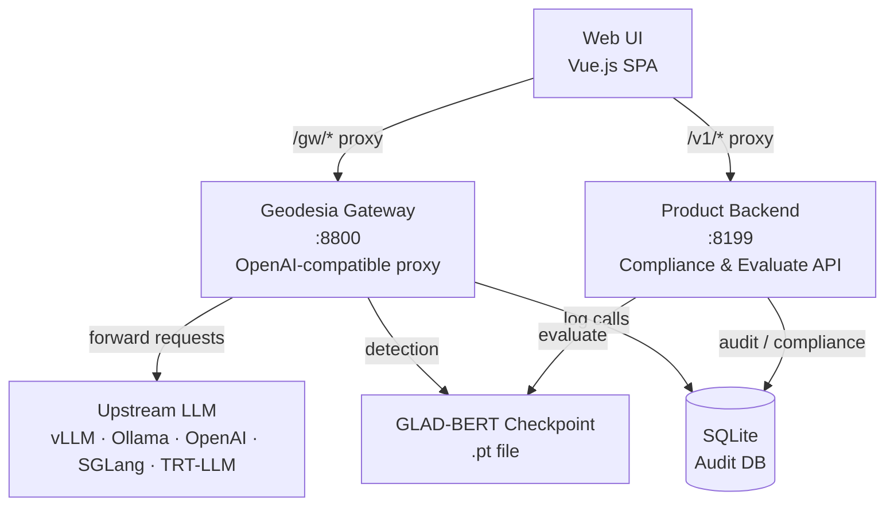

# Architecture

Geodesia G-1 is composed of two independent services that work together: the **Gateway** and the **Product Backend**. Both expose REST APIs; the web UI communicates with both.



---

## Service 1 — Geodesia Gateway

**Default port:** `8800`

The Gateway is the **real-time enforcement layer**. It receives every chat request from your application, screens it, forwards it to the upstream LLM, then validates the response — all before returning anything to the caller.

Key responsibilities:

| Responsibility | How |
|---|---|
| **Prompt screening** | Runs 2 input-region detection axes (prompt safety + jailbreak) on every incoming message before forwarding |
| **Response validation** | Runs 3 output-region axes (context faithfulness, closed-book fabrication, answer safety) on every generated response |
| **Streaming mid-brake** | Monitors every N tokens during streaming and can halt generation before it completes |
| **RAG / Knowledge Base** | Retrieves document chunks (LanceDB + BGE-M3), injects context, verifies claims cite-by-cite |
| **Causal XAI** | Computes token-level attribution entirely black-box (no model internals needed) |
| **Compliance logging** | Writes one row per request to the shared audit SQLite database |
| **Config persistence** | Saves the upstream backend selection, thresholds, and model to a JSON file so the setup survives restarts |

### What the Gateway does NOT do

The Gateway deliberately has no compliance pages, FRIA, reports, or audit exports. Those belong to the Product Backend, which can run on a separate machine without a GPU.

---

## Service 2 — Product Backend

**Default port:** `8199`

The Product Backend handles everything that does not need to happen in the real-time request path: compliance, audit, FRIA, kill switch, reports, threshold management, and the direct evaluate API for batch scoring.

Key responsibilities:

| Responsibility | How |
|---|---|
| **Direct evaluate** | `POST /glad/evaluate` — a single call that generates a response AND scores it (for batch workflows) |
| **Compliance dashboard** | Aggregates call metrics from the audit DB for the live dashboard |
| **FRIA** | Creates, manages, and exports EU AI Act Fundamental Rights Impact Assessment dossiers |
| **Human oversight** | Queues flagged calls for human review; tracks escalation decisions |
| **Kill switch** | Instant service suspension; enforced within the configured time window |
| **Audit chain** | Maintains the HMAC-linked append-only ledger; provides a verification endpoint |
| **Reports** | Generates PDF/DOCX audit bundles, deployer transparency manuals |
| **Threshold prefs** | Stores deployer-specific detection thresholds in the database |
| **Model catalog** | Lists available checkpoints; handles model switching |

### Running without a GPU

The Product Backend can run without a loaded language model. Compliance pages, dashboard, FRIA, and audit features do not require the AI model. Set `GLAD_DEVICE=cpu` and omit `MODEL_HOST_PATH` to start in compliance-only mode.

---

## The Detection Model (GLAD-BERT Companion)

Both services share a single **GLAD-BERT** checkpoint — a compact (~307 M parameter) model that runs entirely separately from the upstream LLM. It reads the prompt, context, and generated answer as plain text and produces five independent detection scores.

Because it operates on text alone (not on hidden states or logits from the LLM), it is **model-agnostic**: the same checkpoint works against any upstream, from a locally hosted 7B model to the OpenAI API.

The one exception is the **closed-book fabrication axis**, which additionally uses per-token log-probabilities from the upstream LLM to compute uncertainty signals. If the upstream does not expose log-probabilities (e.g., Ollama by default), this axis is automatically disabled and the gateway operates with 4 axes.

---

## Data Flow: A Single Chat Request

```
1. User → Gateway: POST /v1/chat/completions
   {messages, model, stream, context?, rag?, mode?, threshold_overrides?}

2. Gateway → GLAD-BERT: score prompt for prompt_safety and jailbreak
   → If flagged AND blocking mode: return block notice immediately (no LLM call)

3. Gateway → RAG (if rag.collection_id provided):
   → Retrieve top-K document chunks for the user's question
   → Append retrieved context to the request

4. Gateway → Upstream LLM: forward the (optionally enriched) request
   → If streaming: monitor each cadence_tokens chunk for early stopping

5. Upstream LLM → Gateway: stream / non-stream response

6. Gateway → GLAD-BERT: score answer for
   halluc_context, halluc_closedbook, answer_safety
   → If any axis flagged AND blocking mode: replace answer with block notice

7. Gateway → RAG claim verification (if RAG active):
   → Verify each claim in the answer against retrieved chunks
   → If all claims verified: suppress halluc_context flag regardless of score

8. Gateway → Audit DB: insert one row
9. Gateway → Caller: return OpenAI-compatible response + geodesia{} payload
```

---

## Persistence

| Store | Purpose | Location |
|---|---|---|
| **SQLite database** | Calls, sessions, human reviews, FRIA records, watermarks, kill-switch state | `./var/glad.sqlite3` (configurable via `database_path` in `config.yaml`) |
| **Gateway config JSON** | Upstream backend selection, thresholds, model — persisted across restarts | `runs/gateway_config.json` (configurable via `GW_CONFIG_FILE`) |
| **GLAD-BERT checkpoint** | Detection model weights | `.pt` file, path via `GW_V5_CKPT` |
| **RAG store** | Document embeddings (LanceDB) | `runs/rag_store/` (configurable via `GW_RAG_DIR`) |

---

## Nginx / Reverse Proxy Layout (Production)

In production, a single Nginx instance routes traffic to both services:

```nginx
location /gw/    { proxy_pass http://127.0.0.1:8800/; }
location /v1/    { proxy_pass http://127.0.0.1:8199/v1/; }
location /       { root /var/www/glad/dist; try_files $uri /index.html; }
```

The web UI talks to the gateway at `/gw/` and to the product backend at `/v1/`. Both are served under the same origin to avoid CORS issues.
