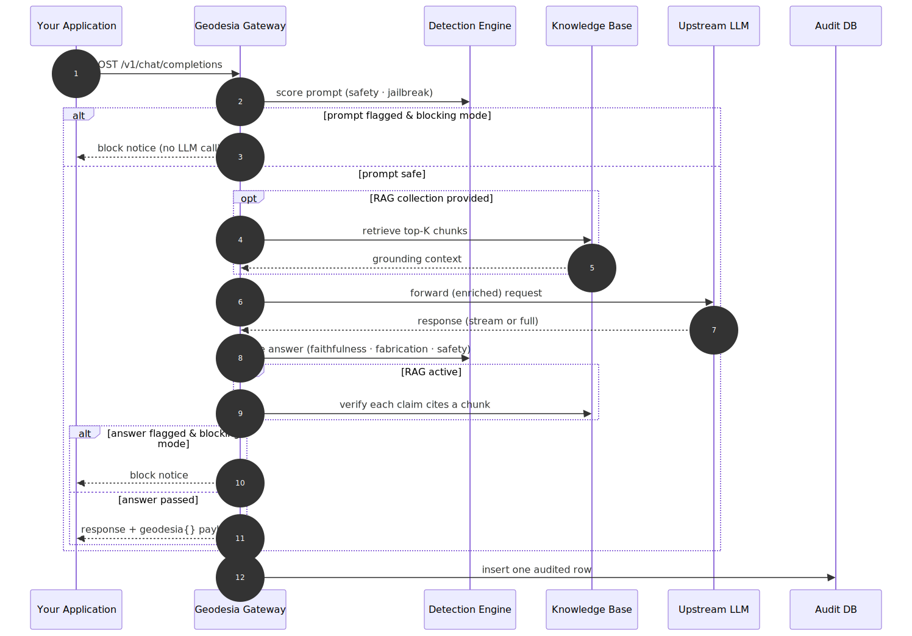

# Architecture

Geodesia G-1 is composed of two independent services that work together: the **Gateway** and the **Product Backend**. Both expose REST APIs; the web UI communicates with both.

{: .diagram }
<p class="diagram-caption">Two cooperating services share one detection engine and one audit database. The web UI talks to both through a reverse proxy.</p>

---

## Service 1 — Geodesia Gateway

**Default port:** `8800`

The Gateway is the **real-time enforcement layer**. It receives every chat request from your application, screens it, forwards it to the upstream LLM, then validates the response — all before returning anything to the caller.

Key responsibilities:

| Responsibility | How |
|---|---|
| **Prompt screening** | Runs 2 input-region detection axes (prompt safety + jailbreak) on every incoming message before forwarding |
| **Response validation** | Runs 3 output-region axes (context faithfulness, closed-book fabrication, answer safety) on every generated response |
| **Streaming mid-brake** | Monitors every N tokens during streaming and can halt generation before it completes |
| **RAG / Knowledge Base** | Retrieves document chunks (LanceDB + BGE-M3), injects context, verifies claims cite-by-cite |
| **Causal XAI** | Computes token-level attribution entirely black-box (no model internals needed) |
| **Compliance logging** | Writes one row per request to the shared audit SQLite database |
| **Config persistence** | Saves the upstream backend selection, thresholds, and model to a JSON file so the setup survives restarts |

### What the Gateway does NOT do

The Gateway deliberately has no compliance pages, FRIA, reports, or audit exports. Those belong to the Product Backend, which can run on a separate machine without a GPU.

---

## Service 2 — Product Backend

**Default port:** `8199`

The Product Backend handles everything that does not need to happen in the real-time request path: compliance, audit, FRIA, kill switch, reports, threshold management, and the direct evaluate API for batch scoring.

Key responsibilities:

| Responsibility | How |
|---|---|
| **Direct evaluate** | `POST /glad/evaluate` — a single call that generates a response AND scores it (for batch workflows) |
| **Compliance dashboard** | Aggregates call metrics from the audit DB for the live dashboard |
| **FRIA** | Creates, manages, and exports EU AI Act Fundamental Rights Impact Assessment dossiers |
| **Human oversight** | Queues flagged calls for human review; tracks escalation decisions |
| **Kill switch** | Instant service suspension; enforced within the configured time window |
| **Audit chain** | Maintains the HMAC-linked append-only ledger; provides a verification endpoint |
| **Reports** | Generates PDF/DOCX audit bundles, deployer transparency manuals |
| **Threshold prefs** | Stores deployer-specific detection thresholds in the database |
| **Model catalog** | Lists available checkpoints; handles model switching |

### Running without a GPU

The Product Backend can run without a loaded language model. Compliance pages, dashboard, FRIA, and audit features do not require the AI model. Set `GLAD_DEVICE=cpu` and omit `MODEL_HOST_PATH` to start in compliance-only mode.

---

## The Detection Engine

Both services share a single **Geodesia detection engine**, which comes in two cooperating tiers:

| Tier | Name | What it is | When it runs |
|---|---|---|---|
| **Always-on** | **GLAD-Hummingbird** | A compact (~300M-parameter) model-agnostic validator. Reads the prompt, context, and answer as plain text and produces the six independent [detection axes](gateway/detection-axes.md). Fast and lightweight — milliseconds per request on a small GPU (or CPU). | Every request |
| **Opt-in** | **GLAD-Tapestry** | A heavyweight 8B Apache-2.0 guardian (default IBM Granite Guardian 4.1 8B) loaded in-process in 4-bit. Reads the *full geometry* of the exchange and returns a confident second opinion that is blended into the safety and hallucination axes. Off by default — never loaded, zero overhead. | When **Deep Scan** is enabled (see [Deep Scan](gateway/deep-scan.md)) |

Because GLAD-Hummingbird operates on text alone (not on hidden states or logits from the LLM), it is **model-agnostic**: the same checkpoint works against any upstream, from a locally hosted 7B model to the OpenAI API.

The one exception is the **closed-book fabrication axis**, which additionally uses per-token log-probabilities from the upstream LLM to compute uncertainty signals. If the upstream does not expose log-probabilities (e.g., Ollama < 0.12, or cloud providers such as Bedrock/Vertex), this axis is automatically disabled and the gateway operates with 4 axes. Most OpenAI-compatible servers — and Ollama ≥ 0.12 — do expose them, so this axis is on by default.

GLAD-Tapestry is a **second opinion**, not a replacement: it can only *raise* risk, and only when it is confident. A confident Tapestry verdict dominates the blended axis; an unsure one barely moves the GLAD-Hummingbird score. This keeps the always-on path fast while letting high-stakes deployments pay for extra assurance only where they want it.

---

## Data Flow: A Single Chat Request

{: .diagram }
<p class="diagram-caption">The full lifecycle of one chat request: input screening, optional retrieval, generation, output validation, and audit logging.</p>

---

## Persistence

| Store | Purpose | Location |
|---|---|---|
| **SQLite database** | Calls, sessions, human reviews, FRIA records, watermarks, kill-switch state | configurable via `database_path` in `config.yaml` |
| **Gateway config** | Upstream backend selection, thresholds, model — persisted across restarts | JSON file, path via `GW_CONFIG_FILE` |
| **Detection engine** | Validator weights | bundled with the deployment |
| **RAG store** | Document embeddings (vector index) | configurable via the knowledge-base directory setting |

---

## Nginx / Reverse Proxy Layout (Production)

In production, a single Nginx instance routes traffic to both services:

```nginx
location /gw/    { proxy_pass http://127.0.0.1:8800/; }
location /v1/    { proxy_pass http://127.0.0.1:8199/v1/; }
location /       { root /var/www/glad/dist; try_files $uri /index.html; }
```

The web UI talks to the gateway at `/gw/` and to the product backend at `/v1/`. Both are served under the same origin to avoid CORS issues.
