# Audit Chain

The Audit Chain is a **tamper-evident, append-only log** that records every significant event in the Geodesia G-1 system. Each log entry is cryptographically linked to the previous one via HMAC-SHA256, making any retroactive modification detectable.

---

## Design

The audit chain is inspired by blockchain-style ledger design, but implemented as a simple hash-linked list stored in the SQLite database:

{: .diagram }

Each `entry_hash` is computed over: `prev_hash + timestamp + event_type + payload`. If any past entry is modified, the hash chain breaks, and `GET /v1/glad/chain/verify` reports the tampered entry.

---

## Two kinds of tamper evidence

The hash chain proves that a record **was not altered after the fact**. It cannot, on its own, prove that the record was *right* — a perfectly intact chain of unexplainable decisions is still unexplainable.

Geodesia pairs it with a second, independent property: the decision's explanation is **deterministic and recomputable**. [Causal explainability](../g1-proxy/causal-xai.md) is a measurement over a deterministic detector — no gradients, no sampling, no LLM in the loop — so the same request, against the same detector build, yields the same responsible tokens for anyone who runs it, including an auditor who does not trust you.

| Question an auditor asks | Answered by |
|---|---|
| *"Has this record been changed since it was written?"* | The hash chain — `GET /v1/glad/chain/verify` |
| *"Why was this specific request blocked?"* | The certified responsible tokens stored with the decision |
| *"Can I check that answer myself?"* | Re-running the attribution and getting the same tokens |

This is a property an LLM provider structurally cannot offer. An explanation *generated* by a language model is another sample — temperature-dependent, unverifiable, different tomorrow. An explanation *computed* by intervening on a deterministic function is arithmetic, and arithmetic can be repeated.

---

## What Gets Logged

Every entry in the chain has an `event_type`. The following events are automatically recorded:

| Event Type | When Recorded |
|---|---|
| `inference_call` | Every call through the evaluate endpoint or gateway |
| `prompt_blocked` | When a prompt is blocked by the safety or jailbreak detector |
| `answer_blocked` | When an answer is withheld by the safety or hallucination detector |
| `kill_switch_activated` | When the kill switch is engaged |
| `kill_switch_deactivated` | When the kill switch is disengaged |
| `oversight_review` | When a human reviewer records a decision |
| `oversight_escalation` | When a pending review is escalated |
| `fria_created` | When a FRIA dossier is created |
| `fria_approved` | When a FRIA dossier is approved |
| `model_switched` | When the active model checkpoint is changed |
| `threshold_changed` | When detection thresholds are updated |
| `watermark_verified` | When a watermark is verified |
| `config_changed` | When the gateway configuration is modified |

---

## Endpoints

Both endpoints live on **G-1 Studio** (`/v1/glad/...`). They take no parameters and no body — the ledger is global to the deployment.

---

### GET /v1/glad/chain/status

**What it does.** Returns a snapshot of the ledger: how many entries it holds, the first and last chain hashes, whether the chain currently verifies, and the newest entries in a UI-friendly shape. This is the call the **Audit & Chain** page polls.

=== "curl"

    ```bash
    curl -s http://localhost:8080/v1/glad/chain/status | jq
    ```

=== "Python"

    ```python
    import httpx

    st = httpx.get("http://localhost:8080/v1/glad/chain/status").json()
    print(st["total_entries"], "entries, integrity:", st["chain_integrity"])
    for e in st["entries"][:5]:
        print(e["entry_index"], e["timestamp"], e["event_type"], e["chain_hash"][:12])
    ```

=== "TypeScript"

    ```ts
    const st = await fetch("http://localhost:8080/v1/glad/chain/status").then(r => r.json())
    console.log(st.total_entries, "entries, integrity:", st.chain_integrity)
    ```

**What comes back**

```json
{
  "count": 14821,
  "total_entries": 14821,
  "first_hash": "7f2d4e1c…",
  "last_hash": "a8b3c1f0…",
  "chain_integrity": true,
  "broken_at": null,
  "verified_count": 14821,
  "entries": [
    {
      "index": 14820,
      "entry_index": 14820,
      "call_id": "call_xyz",
      "timestamp": "2026-06-10T10:23:45Z",
      "event_type": "call",
      "payload_hash": "3c9a…",
      "prev_chain_hash": "7f2d…",
      "chain_hash": "a8b3…",
      "metadata": {}
    }
  ],
  "recent": []
}
```

| Field | Description |
|---|---|
| `count` / `total_entries` | Total entries in the ledger. Same number, two names, for backwards compatibility. |
| `first_hash` / `last_hash` | Chain hash of the genesis and the newest entry. `null` on an empty ledger. |
| `chain_integrity` | `true` when a full re-verification passes. Computing this re-walks the whole chain — see the performance note under `/chain/verify`. |
| `broken_at` | `entry_index` of the first entry that failed verification, or `null`. |
| `verified_count` | How many entries verified before the walk stopped. |
| `entries` / `recent` | The newest **20** entries (same array under two keys). Each carries `entry_index`, `call_id`, `timestamp`, `event_type`, `payload_hash`, `prev_chain_hash`, `chain_hash`, `metadata`. |

!!! note "`event_type` comes from metadata"
    An entry's `event_type` is read from its stored metadata (`event_type`, then `type`, then `source`). Entries written without any of those report the literal string `"call"`.

---

### GET /v1/glad/chain/verify

**What it does.** Performs the full cryptographic verification: recomputes every entry HMAC from the genesis entry and checks that each `chain_hash` matches. Returns as soon as it finds a break, reporting where.

=== "curl"

    ```bash
    curl -s http://localhost:8080/v1/glad/chain/verify | jq
    ```

=== "Python"

    ```python
    import httpx

    v = httpx.get("http://localhost:8080/v1/glad/chain/verify", timeout=60).json()
    if not v["valid"]:
        raise SystemExit(f"ledger tampered at entry {v['broken_at']}")
    print(f"{v['verified_count']}/{v['total_count']} entries verified")
    ```

=== "TypeScript"

    ```ts
    const v = await fetch("http://localhost:8080/v1/glad/chain/verify").then(r => r.json())
    if (!v.valid) throw new Error(`ledger tampered at entry ${v.broken_at}`)
    ```

**What comes back**

```json
{
  "valid": true,
  "broken_at": null,
  "verified_count": 14821,
  "total_count": 14821
}
```

| Field | Description |
|---|---|
| `valid` | `true` if the whole chain re-verified. |
| `broken_at` | `entry_index` of the first entry whose recomputed hash did not match, or `null`. |
| `verified_count` | Entries verified before the walk stopped. On a valid chain this equals `total_count`. |
| `total_count` | Entries considered. `0` on an empty ledger, which verifies as `valid: true`. |

!!! warning "Performance"
    Verification reads and recomputes the HMAC of **every** entry — there is no partial-verification parameter. On very large deployments (> 100K entries) this takes several seconds. Run it on a schedule, not on every page load.

---

## Exporting the chain

There is **no** query/pagination endpoint on the ledger — `chain/status` returns the newest 20 entries and nothing else. To get a full, filtered export, use one of:

| You want | Use |
|---|---|
| Everything one Application ever saw, as a database file | `GET /v1/glad/apps/{app_id}/export?fmt=sqlite` (also `csv`, `jsonl`) — see [Managing Applications](../studio/applications.md) |
| A regulator-ready dossier with the chain snapshot, FRIA and call statistics | `POST /v1/glad/report` — see [Reports & Manuals](reports.md) |
| A per-call decision record | `GET /v1/glad/apps/{app_id}/messages` |

---

## Regulatory Mapping

| Requirement | Law | How the Audit Chain Covers It |
|---|---|---|
| Logging and record-keeping | EU AI Act Art. 12 | Every inference call logged with scores, timestamps, and call ID |
| Tamper-proof logs | EU AI Act Art. 12(3) | HMAC-SHA256 hash chain; any modification breaks verification |
| Post-market monitoring | EU AI Act Art. 72 | Call log forms the basis for monitoring trends and anomalies |
| Audit trail | SOC 2 CC7.2 | Append-only log with cryptographic verification |
| Accountability | ISO 42001 §6.1 | Complete event trail for AI system decisions |
| Data subject rights | GDPR Art. 22 | Inference calls include session and call ID for subject access requests |

---

## For regulatory submission

For a complete audit bundle including FRIA, chain snapshot and call statistics, use
[`POST /v1/glad/report`](reports.md). For the raw per-call records of one Application,
`GET /v1/glad/apps/{app_id}/export?fmt=sqlite`.
