# FRIA — Fundamental Rights Impact Assessment

EU AI Act Article 27 requires deployers of high-risk systems to assess the impact on fundamental rights
**before** going live. The API creates a dossier pre-filled from a deployment-context template, lets you
correct it section by section, attaches **measured** evidence from real traffic, and exports it as
PDF/DOCX/JSON for submission.

---

## Endpoints

Eleven routes on **G-1 Studio** under `/v1/glad/fria`. A dossier is identified by a **`FRIA-…`** id returned at creation.

---

### Create a dossier

**What it does.** `POST /v1/glad/fria` creates an Article 27 dossier, pre-filled from a **deployment context** template. Pick the context that matches your use and the rights matrix, affected-group list and narrative defaults come populated; every section can then be overridden with the matching object.

=== "curl"

    ```bash
    curl -s -X POST http://localhost:8080/v1/glad/fria \
      -H "Content-Type: application/json" \
      -d '{
        "deployer_id":        "acme-corp",
        "system_name":        "Customer Support AI",
        "deployment_context": "general",
        "risk_classification":"high",
        "assessor_name":      "Maria Rossi"
      }' | jq '{fria_id, status, created_at}'
    ```

=== "Python"

    ```python
    import httpx

    c = httpx.Client(base_url="http://localhost:8080", timeout=60)

    # Start from what the deployment already knows about itself.
    draft = c.get("/v1/glad/fria/auto-prefill",
                  params={"deployer_id": "acme-corp", "deployment_context": "general"}).json()

    fria = c.post("/v1/glad/fria", json={
        "deployer_id": "acme-corp",
        "system_name": "Customer Support AI",
        "deployment_context": "general",
        "risk_classification": "high",
        "assessor_name": "Maria Rossi",
        # Rich Art. 27 sub-objects — supplying them is what turns the
        # generated PDF from a template into a submission-grade dossier.
        "affected_persons": {"groups": ["customers", "minors"]},
        "human_oversight": {"escalation": "Level-1 operator, then AI responsible."},
    }).json()
    fria_id = fria["fria_id"]
    ```

=== "TypeScript"

    ```ts
    const fria = await fetch("http://localhost:8080/v1/glad/fria", {
      method: "POST",
      headers: { "Content-Type": "application/json" },
      body: JSON.stringify({
        deployer_id: "acme-corp",
        system_name: "Customer Support AI",
        deployment_context: "general",
        risk_classification: "high",
        assessor_name: "Maria Rossi",
      }),
    }).then(r => r.json())
    ```

**What comes back** — the stored record, including its `fria_id` and the full `record_json` dossier with every Article 27 section pre-filled.

#### Request fields

| Field | Type | Default | Description |
|---|---|---|---|
| `deployer_id` | `string` | `"default"` | Scopes the dossier. |
| `system_name` | `string` | — | The AI system being assessed. |
| `deployment_context` | `string` | `"general"` | Template selector — see below. |
| `risk_classification` | `string` | `"high"` | `minimal` \| `limited` \| `high` \| `unacceptable` \| `unknown`. |
| `assessor_name` | `string` | — | Who is performing the assessment. |
| `extra_fields` | `object` | — | Anything else you want carried on the record. |

Plus ten optional **Article 27 sub-objects**, each merged over its template defaults:

`deployer` · `system` · `provider_art13` · `process_description` · `deployment_period_frequency` · `affected_persons` · `risk_assessment` · `human_oversight` · `materialization_response` · `dpia_reference`

#### Deployment contexts

| Value | Pre-fills for |
|---|---|
| `employment` | Screening, ranking or monitoring of applicants and employees. |
| `healthcare` | Clinical or care-pathway support. |
| `finance` | Creditworthiness, pricing, fraud. |
| `education` | Admission, assessment, proctoring. |
| `law_enforcement` | Policing and investigative use. |
| `general` *(default)* | Anything else. |

An unrecognised value falls back to `general` rather than erroring.

!!! tip "Auto-prefill first"
    `GET /v1/glad/fria/auto-prefill?deployer_id=…&deployment_context=…` drafts the answers the deployment can already evidence — active detection axes, thresholds, oversight configuration, recent traffic. Starting there and correcting is faster, and more honest, than filling a blank form.

---

### Read and update

| Method | Path | What it does |
|---|---|---|
| `GET` | `/v1/glad/fria?deployer_id=…` | All dossiers for a deployer, newest first. `deployer_id` defaults to `"default"`; there is **no** status filter and **no** pagination — the endpoint returns the full list. |
| `GET` | `/v1/glad/fria/{fria_id}` | One dossier. |
| `PUT` | `/v1/glad/fria/{fria_id}` | Update. Accepts `system_name`, `deployment_context`, `risk_classification`, `assessor_name`, `next_review_date` and `record_json` — the whole dossier body goes under **`record_json`**. |

```bash
curl -s -X PUT http://localhost:8080/v1/glad/fria/FRIA-3F9A1C7B2E5D8046A1B2 \
  -H "Content-Type: application/json" \
  -d '{
    "next_review_date": "2027-06-10",
    "record_json": {
      "risk_assessment": {
        "right_to_privacy": {
          "probability": "medium",
          "severity": "low",
          "mitigation": "Data is pseudonymised and not stored beyond the session."
        }
      }
    }
  }'
```

---

### Approve and archive

| Method | Path | Body | What it does |
|---|---|---|---|
| `POST` | `/v1/glad/fria/{fria_id}/approve` | `{"assessor_name": "Maria Rossi"}` | Signs the dossier off and records who did it. |
| `POST` | `/v1/glad/fria/{fria_id}/archive` | `{}` | Retires the dossier. Still queryable. |

`assessor_name` is the **only** field the approve endpoint accepts — there is no `approver` and no `notes`. Record the reasoning in the dossier itself before approving.

---

### Evidence

Two **read** endpoints. Neither one accepts an upload: evidence is not attached to a FRIA, it is *derived* from what the deployment already holds.

| Method | Path | What it returns |
|---|---|---|
| `GET` | `/v1/glad/fria/{fria_id}/evidence` | The evidence declared inside the dossier. |
| `GET` | `/v1/glad/fria/{fria_id}/runtime-evidence?window_days=90` | **Measured** evidence, computed live from the call log: volumes, block rates, hallucination and safety flag rates, oversight activity over the window. |

=== "curl"

    ```bash
    curl -s "http://localhost:8080/v1/glad/fria/FRIA-3F9A…/runtime-evidence?window_days=90" | jq
    ```

=== "Python"

    ```python
    ev = c.get(f"/v1/glad/fria/{fria_id}/runtime-evidence", params={"window_days": 90}).json()
    ```

=== "TypeScript"

    ```ts
    const ev = await fetch(
      `http://localhost:8080/v1/glad/fria/${friaId}/runtime-evidence?window_days=90`,
    ).then(r => r.json())
    ```

`window_days` defaults to **90**.

!!! info "This is the half a questionnaire cannot fake"
    A declared control is a claim. Runtime evidence is a measurement of the same control on real traffic over a real window — which is what makes an Article 27 dossier a record rather than an intention.

---

### Export

Two ways to get the document out. Prefer the async one for anything real.

| Method | Path | Notes |
|---|---|---|
| `GET` | `/v1/glad/fria/{fria_id}/export?fmt=pdf` | Synchronous. `fmt` is `pdf` (default), `docx` or `json`. Fine for JSON; a full PDF render can outlive a proxy timeout. |
| `POST` | `/v1/glad/fria/{fria_id}/export/async?fmt=pdf` | Returns `{job_id, token}`; poll and download. |

=== "curl"

    ```bash
    # synchronous
    curl -s "http://localhost:8080/v1/glad/fria/FRIA-3F9A…/export?fmt=json" -o fria.json

    # async — survives a slow render
    read JOB TOKEN < <(curl -s -X POST \
      "http://localhost:8080/v1/glad/fria/FRIA-3F9A…/export/async?fmt=pdf" \
      | jq -r '"\(.job_id) \(.token)"')

    until [ "$(curl -s "http://localhost:8080/v1/glad/doc-jobs/$JOB/status?token=$TOKEN" | jq -r .status)" = "done" ]; do
      sleep 2
    done
    curl -s "http://localhost:8080/v1/glad/doc-jobs/$JOB/download?token=$TOKEN" -o fria.pdf
    ```

=== "Python"

    ```python
    import time

    job = c.post(f"/v1/glad/fria/{fria_id}/export/async", params={"fmt": "pdf"}).json()
    while True:
        st = c.get(f"/v1/glad/doc-jobs/{job['job_id']}/status",
                   params={"token": job["token"]}).json()
        if st["status"] == "error":
            raise RuntimeError(st.get("error", "render failed"))
        if st["status"] == "done":
            break
        time.sleep(2)

    pdf = c.get(f"/v1/glad/doc-jobs/{job['job_id']}/download", params={"token": job["token"]})
    open("fria.pdf", "wb").write(pdf.content)
    ```

=== "TypeScript"

    ```ts
    const job = await fetch(
      `http://localhost:8080/v1/glad/fria/${friaId}/export/async?fmt=pdf`, { method: "POST" },
    ).then(r => r.json())

    for (;;) {
      const st = await fetch(
        `http://localhost:8080/v1/glad/doc-jobs/${job.job_id}/status?token=${job.token}`,
      ).then(r => r.json())
      if (st.status === "error") throw new Error(st.error)
      if (st.status === "done") break
      await new Promise(r => setTimeout(r, 2000))
    }

    const blob = await fetch(
      `http://localhost:8080/v1/glad/doc-jobs/${job.job_id}/download?token=${job.token}`,
    ).then(r => r.blob())
    ```

The `token` is required on both follow-up calls. On failure, the job's `error` carries the real reason — read it rather than reporting a generic failure.

The generated PDF/DOCX contains the cover page and system identity, every Article 27 section, the risk and mitigation matrices, the approval block when approved, the runtime evidence, and the regulatory mapping appendix.

---

## What Is a FRIA?

A FRIA is a structured document that assesses the impact of deploying an AI system on the fundamental rights of individuals affected by it. It must be completed **before deployment** of high-risk AI systems and kept current throughout the system's operational life.

The FRIA dossier in Geodesia G-1 covers:

- The AI system being deployed and its purpose
- Categories of individuals affected
- Fundamental rights that could be impacted
- Probability and severity of each impact
- Mitigating measures taken
- Residual risk assessment
- Human oversight procedures
- Responsible persons and sign-off

---

## Status Values

{: .diagram }
<p class="diagram-caption">A FRIA dossier moves through three states. Only an approved dossier satisfies the EU AI Act Article 27 pre-deployment requirement.</p>

| Status | Set by | Description |
|---|---|---|
| `draft` | creation | The working state. Freely editable. |
| `approved` | `POST …/approve` | Signed off, with `assessor_name` and an `assessment_date` recorded. |
| `archived` | `POST …/archive` | Retired. Excluded from the "active FRIA" count the [dashboard](dashboard.md) checks, but still readable and exportable. |

!!! note "The API does not enforce the lifecycle"
    `PUT` still accepts an approved dossier, and there is no reviewer role gate. Immutability after approval is a process you enforce around the API — what the product guarantees is that every change is recorded in the [audit chain](audit-chain.md), so an edit after sign-off is visible rather than prevented.

---

## Dossier Section Reference

The dossier lives under `record_json` and follows the Article 27 structure. Each key is an object you can supply at creation, or patch later through `PUT …/{fria_id}` under `record_json`.

| Key | Content | Article |
|---|---|---|
| `deployer` | The organisation running the high-risk system. | Art. 26 |
| `system` | The AI system: what it is, what it decides, who it serves. | Art. 11 |
| `provider_art13` | The provider's instructions for use, which Art. 27(1)(d) requires the risk assessment to take into account. | Art. 13 |
| `process_description` | The deployer's own processes and intended use. | Art. 27 §1(a) |
| `deployment_period_frequency` | How long and how often the system runs. | Art. 27 §1(b) |
| `affected_persons` | Categories of people subject to the system's outputs. | Art. 27 §1(c) |
| `risk_assessment` | Per-right probability × severity, with mitigations. | Art. 27 §1(d) |
| `human_oversight` | How humans are integrated and how escalation works. | Art. 14, Art. 27 §1(e) |
| `materialization_response` | What happens if a risk actually materialises. | Art. 27 §1(f) |
| `dpia_reference` | Link to the GDPR Data Protection Impact Assessment, where one exists. | GDPR Art. 35 |

Every key is pre-filled from the [deployment-context template](#create-a-dossier) at creation; supplying your own object **merges over** the defaults rather than replacing the section wholesale, so you can correct one field without re-authoring the rest.

---

## EU AI Act Article Mapping

| FRIA Section | Article |
|---|---|
| System description | Art. 9 (Risk management), Art. 11 (Technical documentation) |
| Deployment context | Art. 26 (Deployer obligations) |
| Affected persons | Art. 27 §1(a) |
| Data processing | Art. 10 (Data governance), GDPR Chapter II |
| Impact assessment | Art. 27 §1(b) |
| Mitigation measures | Art. 27 §1(d) |
| Human oversight plan | Art. 14 (Human oversight) |
| Sign-off | Art. 27 §2 |
