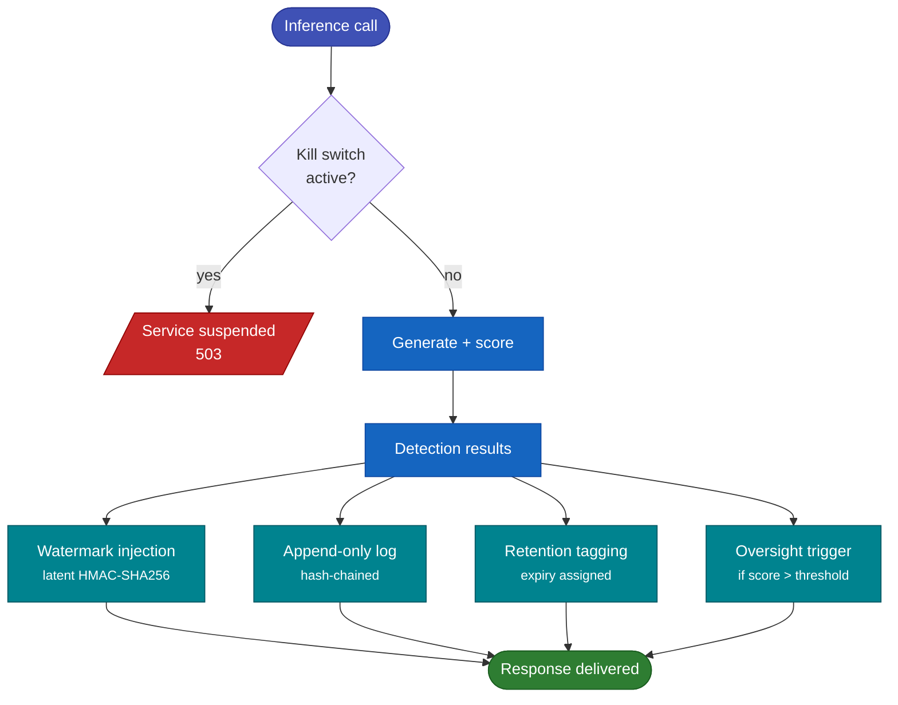

# Compliance Platform

The Geodesia G-1 Compliance Platform provides the complete toolchain to operate, audit, and govern an AI system in compliance with the EU AI Act and 12 other global regulatory frameworks. It is accessible via the **Product Backend API** (`/v1/glad/*`) and the built-in web interface.

---

## Platform Components

| Component | API prefix | Description |
|---|---|---|
| [Dashboard](dashboard.md) | `/v1/glad/dashboard` | Real-time operational metrics: call volume, passed/blocked/flagged counts, safety and hallucination rates |
| [FRIA](fria.md) | `/v1/glad/fria` | Fundamental Rights Impact Assessment — EU AI Act Article 27 dossier creation, management, and PDF/DOCX export |
| [Human Oversight](oversight.md) | `/v1/glad/oversight` | Queue of flagged calls requiring human review; tiered escalation (Operator → AI Responsible); decision recording |
| [Kill Switch](kill-switch.md) | `/v1/glad/kill-switch` | Instant service suspension; compliance-aware deactivation within configured time windows |
| [Audit Chain](audit-chain.md) | `/v1/glad/chain` | HMAC-linked append-only log; cryptographic integrity verification |
| [Watermark](watermark.md) | `/v1/glad/watermark` | HMAC-SHA256 latent AI watermark; verification endpoint |
| [Reports](reports.md) | `/v1/glad/report`, `/v1/glad/deployer-manual` | PDF/DOCX audit bundles and deployer transparency manuals |
| [Models](../models/index.md) | `/v1/glad/models` | Available checkpoint catalog; model switching |
| [Threshold Prefs](../reference/thresholds.md) | `/v1/glad/threshold-prefs` | Deployer-specific detection thresholds stored in the database |
| Retention | `/v1/glad/retention` | Data retention policy status and management |
| Provider Identity | `/v1/glad/provider-identity` | Machine-readable provider identity (for AI Act Article 13) |
| License Tokens | `/v1/glad/license-tokens` | Customer license token management |

---

## Compliance Architecture

Every inference call goes through the following compliance pipeline regardless of whether you use the gateway or the evaluate endpoint:

Every inference call passes through the same compliance pipeline — whether it arrives via the gateway or the evaluate endpoint.

All data is written to a single SQLite database (`var/glad.sqlite3` by default) that is shared between the gateway and the product backend.

---

## Supported Regulatory Frameworks

EU_AI_ACT
GDPR
ISO_42001
NIST_AI_RMF
CA_SB_942
ITALY_132_2025
UK_DUAA_2025
BRAZIL_2338
CANADA_AIDA
CHINA_GB45654
COLORADO_SB21_169
NYC_LL144
SOC2

See [Regulatory Coverage](../regulatory/index.md) for detailed mapping.

---

## Quick Reference: Common Compliance Tasks

| Task | Endpoint | Method |
|---|---|---|
| Check if the service is compliant | `GET /v1/glad/scorecard` | GET |
| Create a FRIA dossier | `POST /v1/glad/fria` | POST |
| Export a FRIA as PDF | `GET /v1/glad/fria/{id}/export?fmt=pdf` | GET |
| View pending human reviews | `GET /v1/glad/oversight/pending` | GET |
| Record a review decision | `POST /v1/glad/oversight/decide` | POST |
| Activate the kill switch | `POST /v1/glad/kill-switch/activate` | POST |
| Verify audit chain integrity | `GET /v1/glad/chain/verify` | GET |
| Verify a watermark | `POST /v1/glad/watermark/verify` | POST |
| Generate a compliance report | `POST /v1/glad/report` | POST |
| Generate a deployer manual | `POST /v1/glad/deployer-manual` | POST |
| Set detection thresholds | `POST /v1/glad/threshold-prefs` | POST |
| List available model checkpoints | `GET /v1/glad/models/available` | GET |
