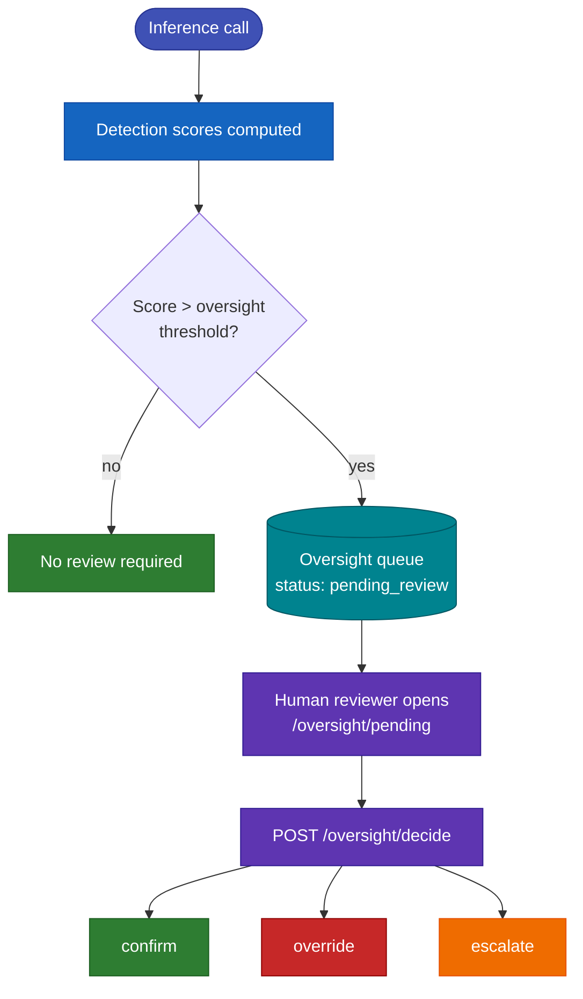

# Human Oversight

The Human Oversight module implements **EU AI Act Article 14** — the requirement that high-risk AI systems include mechanisms allowing human operators to monitor, understand, override, and intervene in the system's operation.

When a detection score exceeds the configured oversight threshold, the call is queued for human review. A human reviewer can approve or reject the system's decision, and the decision is permanently recorded in the audit trail.

---

## How Oversight Works


<p class="diagram-caption">Calls that exceed the oversight threshold are queued for a human, who confirms, overrides, or escalates — every decision is recorded in the audit chain.</p>

The oversight threshold is independent from the blocking threshold. You can configure the system to:

- **Block** calls above the blocking threshold AND queue for review
- **Pass through** borderline calls but still flag them for review
- **Review only** without any blocking (supervisory mode)

Oversight configuration is set in [config.yaml](../configuration/index.md#human-oversight) under `human_oversight`.

---

## Endpoints

### GET /v1/glad/oversight/pending

Returns all calls currently in the oversight queue awaiting human review.

```bash
curl "http://localhost:8199/v1/glad/oversight/pending?deployer_id=acme-corp"
```

#### Query Parameters

| Parameter | Default | Description |
|---|---|---|
| `deployer_id` | — | Filter to a specific deployer. |
| `severity` | — | Filter by severity: `"low"`, `"medium"`, `"high"`. |
| `limit` | `20` | Maximum results to return. |
| `offset` | `0` | Pagination offset. |
| `since` | — | ISO 8601 timestamp — return only calls flagged after this time. |

#### Response

```json
{
  "pending": [
    {
      "call_id": "call_abc123",
      "session_id": "sess_xyz",
      "timestamp": "2026-06-10T10:23:00Z",
      "prompt": "...",
      "response": "...",
      "trigger_axis": "answer_safety",
      "trigger_score": 0.61,
      "trigger_threshold": 0.50,
      "severity": "medium",
      "review_deadline": "2026-06-11T10:23:00Z",
      "escalation_level": "operator"
    }
  ],
  "total": 14,
  "oldest_pending_age_hours": 3.2
}
```

| Field | Description |
|---|---|
| `trigger_axis` | The detection axis that triggered the review queue |
| `trigger_score` | The score value that exceeded the oversight threshold |
| `trigger_threshold` | The oversight threshold that was exceeded |
| `severity` | Computed severity based on how far the score exceeds the threshold |
| `review_deadline` | Deadline for review (configurable in `human_oversight.review_deadline_hours`) |
| `escalation_level` | Current escalation level: `"operator"` → `"ai_responsible"` |

---

### GET /v1/glad/oversight/summary

Returns oversight statistics without individual call details — useful for dashboards.

```bash
curl "http://localhost:8199/v1/glad/oversight/summary?deployer_id=acme-corp"
```

#### Response

```json
{
  "pending_count": 14,
  "reviewed_today": 8,
  "overdue_count": 2,
  "avg_review_time_hours": 1.4,
  "by_axis": {
    "answer_safety": 5,
    "halluc_context": 7,
    "jailbreak": 2
  },
  "by_decision": {
    "confirmed_block": 3,
    "overridden_allow": 2,
    "confirmed_allow": 3
  }
}
```

---

### POST /v1/glad/oversight/decide

Record a human review decision for a queued call.

```bash
curl -X POST http://localhost:8199/v1/glad/oversight/decide \
  -H "Content-Type: application/json" \
  -d '{
    "call_id": "call_abc123",
    "reviewer_id": "maria.rossi@acme.com",
    "decision": "confirmed_block",
    "notes": "Confirmed jailbreak attempt. User account flagged for follow-up."
  }'
```

#### Request Fields

| Field | Type | Required | Description |
|---|---|---|---|
| `call_id` | `string` | ✅ | The call ID to review. Must be in the oversight queue. |
| `reviewer_id` | `string` | ✅ | Identifier of the human reviewer (email or user ID). Recorded permanently. |
| `decision` | `string` | ✅ | The reviewer's decision. See [Decision Values](#decision-values). |
| `notes` | `string` | — | Free-text justification for the decision. Stored in the audit trail. |
| `escalate` | `boolean` | — | If `true`, escalates to the next oversight level before the decision is final. |

#### Decision Values

| Value | Description |
|---|---|
| `confirmed_block` | Reviewer confirms the system's block decision was correct. |
| `confirmed_allow` | Reviewer confirms the system's pass decision was correct. |
| `overridden_allow` | Reviewer overrides a block — the response is released to the user. |
| `overridden_block` | Reviewer overrides a pass — marks the response as harmful in the audit trail. |
| `escalated` | Reviewer escalates to a higher oversight level without deciding. |
| `needs_more_info` | Reviewer cannot decide with available information; marks for follow-up. |

---

### GET /v1/glad/oversight/review/{call_id}

Retrieve the full review record for a call, including history of decisions and escalations.

```bash
curl http://localhost:8199/v1/glad/oversight/review/call_abc123
```

---

## Oversight Configuration

Oversight behavior is configured in [config.yaml](../configuration/index.md#human-oversight):

```yaml
human_oversight:
  enabled: true
  required: true                  # Whether oversight is required or optional
  tiers:                          # Escalation tiers
    - level: operator
      review_window_hours: 24     # Time before escalating
    - level: ai_responsible
      review_window_hours: 72
  oversight_threshold: 0.7        # Score above which calls enter the queue
  review_deadline_hours: 48       # Hard deadline before a call becomes "overdue"
  auto_escalate: true             # Automatically escalate overdue reviews
  notification_email: "compliance@acme.com"
```

---

## Escalation

When a review is not completed within `review_window_hours`, the call automatically escalates to the next tier:

1. **Operator** — First-level reviewer (typical: support team lead)
2. **AI Responsible** — Designated AI oversight officer (EU AI Act Article 26)

Escalated calls retain full history. Both the original flag and all escalation events are permanently recorded in the audit chain.

---

## EU AI Act Mapping

| Oversight Feature | Article |
|---|---|
| Human override capability | Art. 14(4)(a) — ability to interrupt the system |
| Queue visibility | Art. 14(4)(c) — interpreting outputs |
| Decision recording | Art. 14(1) — adequate oversight measures |
| Escalation chain | Art. 14(5) — AI literacy requirement |
| Deadline tracking | Art. 14(2) — appropriate time and resources |
