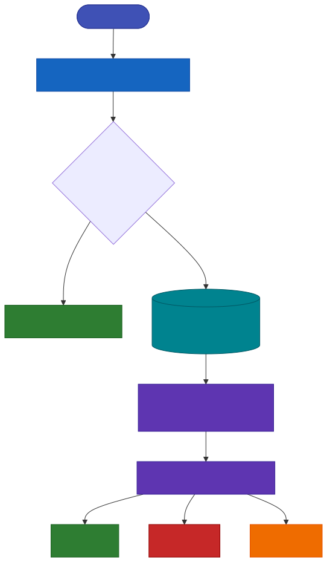

# Human Oversight

The Human Oversight module implements **EU AI Act Article 14** — the requirement that high-risk AI systems include mechanisms allowing human operators to monitor, understand, override, and intervene in the system's operation.

When a detection score exceeds the configured oversight threshold, the call is queued for human review. A human reviewer can approve or reject the system's decision, and the decision is permanently recorded in the audit trail.

---

## How Oversight Works

{: .diagram }
<p class="diagram-caption">Calls that exceed the oversight threshold are queued for a human, who confirms, overrides, or escalates — every decision is recorded in the audit chain.</p>

The oversight threshold is independent from the blocking threshold. You can configure the system to:

- **Block** calls above the blocking threshold AND queue for review
- **Pass through** borderline calls but still flag them for review
- **Review only** without any blocking (supervisory mode)

Oversight configuration is set in [config.yaml](../configuration/index.md#human-oversight) under `human_oversight`.

---

## Endpoints

All four live on **G-1 Studio** under `/v1/glad/oversight/…`.

A review is identified by its **`review_id`** (`REV-…`), not by the call it is about. One call can have several reviews — an escalation creates a new one at the next level, linked by `parent_review_id`.

---

### GET /v1/glad/oversight/pending

**What it does.** Returns the queue of reviews still awaiting a human, oldest first, each joined with a preview of the call it is about and the per-axis risk that put it there. This is what the **Oversight** page renders.

=== "curl"

    ```bash
    curl -s "http://localhost:8080/v1/glad/oversight/pending?application_id=support_bot&limit=50" | jq
    ```

=== "Python"

    ```python
    import httpx

    queue = httpx.get(
        "http://localhost:8080/v1/glad/oversight/pending",
        params={"application_id": "support_bot", "limit": 50},
    ).json()
    for r in queue:
        print(r["review_id"], r["review_level"], r["review_trigger"], r["prompt"][:60])
    ```

=== "TypeScript"

    ```ts
    const q = new URLSearchParams({ application_id: "support_bot", limit: "50" })
    const queue = await fetch(`http://localhost:8080/v1/glad/oversight/pending?${q}`).then(r => r.json())
    queue.forEach((r: any) => console.log(r.review_id, r.review_level, r.review_trigger))
    ```

**What comes back** — a bare JSON **array**, not an envelope:

```json
[
  {
    "review_id": "REV-9C1F2A7B4E0D6A18B3C1",
    "call_id": "call_abc123",
    "review_level": 1,
    "review_role": "operator",
    "review_trigger": "safety_score_high:0.812",
    "review_status": "pending",
    "created_at": "2026-06-10T10:23:00Z",
    "parent_review_id": null,
    "prompt": "…",
    "response_text": "…",
    "hallucination_score": 0.14,
    "safety_score": 0.81
  }
]
```

#### Query parameters

| Parameter | Default | Description |
|---|---|---|
| `review_level` | — | Only reviews at this escalation level (`1`, `2`, `3`). |
| `limit` | `50` | Maximum rows. |
| `application_id` | — | Scope the queue to one Application. The literal `all` is treated as "no filter". |

#### Notable fields

| Field | Description |
|---|---|
| `review_trigger` | Why this call queued, as `reason:score` — e.g. `safety_score_high:0.812`, `hallucination_score_high:0.774`, `prompt_blocked`, `combined_safety_triggered:…`, or `escalated_from:REV-…`. |
| `review_level` | `1` operator → `2` AI responsible → `3` (Italy Law 132/2025 notification level). |
| `prompt` / `response_text` | Stored previews of the call, joined from the call log. Empty strings when the call row is gone. |
| `hallucination_score` / `safety_score` | Per-axis risk in `[0,1]`, reconstructed from the call's stored axis probabilities. |

!!! note "Reviewer identity is hashed"
    `reviewer_id` and reviewer notes are **hashed before storage** — the queue returns `reviewer_id_hash`, never the plaintext. That is deliberate: the audit trail proves *that* a human decided without retaining their identity as personal data.

---

### GET /v1/glad/oversight/summary

**What it does.** Counters for a dashboard tile — no per-call detail, no parameters.

=== "curl"

    ```bash
    curl -s http://localhost:8080/v1/glad/oversight/summary | jq
    ```

=== "Python"

    ```python
    import httpx
    s = httpx.get("http://localhost:8080/v1/glad/oversight/summary").json()
    print(f"{s['pending']} pending / {s['total_reviews']} total")
    ```

=== "TypeScript"

    ```ts
    const s = await fetch("http://localhost:8080/v1/glad/oversight/summary").then(r => r.json())
    console.log(`${s.pending} pending / ${s.total_reviews} total`)
    ```

**What comes back**

```json
{
  "total_reviews": 142,
  "pending": 14,
  "completed": 126,
  "by_level": { "1": 120, "2": 20, "3": 2 },
  "italy_132_notified": 2,
  "italy_132_pending_notification": 0,
  "thresholds": { "safety": 0.70, "hallucination": 0.75 }
}
```

`by_level` is keyed by level as a **string**. `thresholds` echoes the oversight trigger thresholds currently in force — these are the thresholds that put calls *in the queue*, not the ones that block them.

---

### POST /v1/glad/oversight/review

**What it does.** Creates a pending review by hand. You rarely need this — reviews are created automatically when a call crosses an oversight threshold. Use it to queue a call for a second pair of eyes on demand.

=== "curl"

    ```bash
    curl -s -X POST http://localhost:8080/v1/glad/oversight/review \
      -H "Content-Type: application/json" \
      -d '{
        "call_id": "call_abc123",
        "review_trigger": "manual:customer_complaint",
        "review_level": 1
      }' | jq
    ```

=== "Python"

    ```python
    import httpx

    review = httpx.post(
        "http://localhost:8080/v1/glad/oversight/review",
        json={"call_id": "call_abc123", "review_trigger": "manual:customer_complaint", "review_level": 1},
    ).json()
    print(review["review_id"])
    ```

=== "TypeScript"

    ```ts
    const review = await fetch("http://localhost:8080/v1/glad/oversight/review", {
      method: "POST",
      headers: { "Content-Type": "application/json" },
      body: JSON.stringify({ call_id: "call_abc123", review_trigger: "manual:customer_complaint" }),
    }).then(r => r.json())
    ```

**What comes back** — the created review row, including the generated `review_id` you will need to decide it.

#### Request fields

| Field | Type | Required | Description |
|---|---|---|---|
| `call_id` | `string` | ✅ | The call to review. |
| `review_trigger` | `string` | ✅ | Free-text reason, stored verbatim in the audit trail. |
| `review_level` | `integer` | — | Default `1`. `1` operator, `2` AI responsible, `3` Italy 132 notification level. |
| `reviewer_id` | `string` | — | Pre-assign a reviewer. **Hashed** before storage. |

---

### POST /v1/glad/oversight/decide

**What it does.** Records a human decision on a pending review and closes it. Deciding `escalated` automatically opens a new review one level up (up to level 3), linked by `parent_review_id`.

=== "curl"

    ```bash
    curl -s -X POST http://localhost:8080/v1/glad/oversight/decide \
      -H "Content-Type: application/json" \
      -d '{
        "review_id": "REV-9C1F2A7B4E0D6A18B3C1",
        "decision": "approved",
        "reviewer_id": "maria.rossi@acme.com",
        "reviewer_notes": "Confirmed jailbreak attempt. Account flagged for follow-up."
      }' | jq
    ```

=== "Python"

    ```python
    import httpx

    r = httpx.post(
        "http://localhost:8080/v1/glad/oversight/decide",
        json={
            "review_id": "REV-9C1F2A7B4E0D6A18B3C1",
            "decision": "approved",
            "reviewer_id": "maria.rossi@acme.com",
            "reviewer_notes": "Confirmed jailbreak attempt.",
        },
    )
    r.raise_for_status()          # 404 when the review_id does not exist
    print(r.json()["review_status"])
    ```

=== "TypeScript"

    ```ts
    const res = await fetch("http://localhost:8080/v1/glad/oversight/decide", {
      method: "POST",
      headers: { "Content-Type": "application/json" },
      body: JSON.stringify({
        review_id: "REV-9C1F2A7B4E0D6A18B3C1",
        decision: "approved",
        reviewer_id: "maria.rossi@acme.com",
        reviewer_notes: "Confirmed jailbreak attempt.",
      }),
    })
    if (res.status === 404) throw new Error("unknown review_id")
    const updated = await res.json()
    ```

**What comes back** — the updated review row (`review_status` now `completed`, or `escalated`). **404** if the `review_id` does not exist.

#### Request fields

| Field | Type | Required | Description |
|---|---|---|---|
| `review_id` | `string` | ✅ | The review to close — *not* the `call_id`. |
| `decision` | `string` | ✅ | One of the four values below. |
| `reviewer_id` | `string` | — | Who decided. **Hashed** before storage. Alias: `reviewer`. |
| `reviewer_notes` | `string` | — | Justification. **Hashed** before storage. Alias: `notes`. |
| `override_justification` | `string` | — | Stored in clear. Use this when the human overrules the system and the reason itself must remain auditable. |

#### Decision values

| Value | Effect |
|---|---|
| `approved` | The system's decision stands. Review closes as `completed`. |
| `rejected` | The human overrules the system. Review closes as `completed`; pair it with `override_justification`. |
| `modified` | The outcome was changed by hand. Review closes as `completed`. |
| `escalated` | Review closes as `escalated` **and a new review is opened one level up** (no new review past level 3). |

---

## Configuration

Oversight behaviour is configured in [config.yaml](../configuration/index.md#human-oversight) under `human_oversight`. The whole block is four keys:

```yaml
human_oversight:
  safety_threshold: 0.70          # safety risk at/above which a call is queued
  halluc_threshold: 0.75          # hallucination risk at/above which a call is queued
  auto_trigger: true              # queue automatically; false = reviews only when created by API
  italy_132_level3_notify: true   # stamp level-3 reviews as notified (Italy Law 132/2025)
```

Per Application, the same three knobs live under `governance.human_oversight` in the app config and override the global default — see [Managing Applications](../studio/applications.md):

```json
{ "governance": { "human_oversight": { "auto_trigger": true, "safety_threshold": 0.70, "halluc_threshold": 0.75 } } }
```

!!! info "Oversight thresholds are not blocking thresholds"
    These decide what enters the **review queue**. What gets *blocked* is decided by the Application's per-axis policy thresholds ([Detection Thresholds](../reference/thresholds.md)). Setting the oversight threshold below the blocking threshold is the standard supervisory posture: borderline calls pass through to the user *and* land in the queue.

---

## Escalation

Escalation is **decision-driven, not time-driven**: there is no background job that ages a review out. A review moves up a level when a human decides `escalated` on it, which closes that review and opens a fresh one at the next level, linked by `parent_review_id`.

| Level | Role | Meaning |
|---|---|---|
| `1` | `operator` | First-line reviewer. Where automatic reviews are created. |
| `2` | `ai_responsible` | Designated AI oversight officer — EU AI Act Art. 26. |
| `3` | `ai_responsible` | Terminal level. Reaching it stamps the review as notified under Italy Law 132/2025; deciding `escalated` here creates no further review. |

Every level keeps its own row, so the full escalation history of a call is recoverable by walking `parent_review_id`. All of it is written to the [audit chain](audit-chain.md).

---

## EU AI Act Mapping

| Oversight Feature | Article |
|---|---|
| Human override capability | Art. 14(4)(a) — ability to interrupt the system |
| Queue visibility | Art. 14(4)(c) — interpreting outputs |
| Decision recording | Art. 14(1) — adequate oversight measures |
| Escalation chain | Art. 14(5) — AI literacy requirement |
| Escalation levels & roles | Art. 14(2) — appropriate competence and authority |
