# Live Web Search

Grounding an answer in the live internet means pulling untrusted text into the prompt — which is exactly
how indirect prompt injection works. G1-Proxy searches, then **screens every fetched page through the
detector** and grounds the answer only in the ones that pass. One boolean on the chat body turns it on.

---

## Use it

**What it does.** Set `web_search: true` on any chat request. The proxy searches, screens each fetched
page through the detector, keeps only the safe ones as grounding context, and cites them back in
`geodesia.rag`. On by default (`GW_WEBSEARCH_ENABLED=1`).

=== "curl"

    ```bash
    curl -s http://localhost:8080/gw/v1/chat/completions \
      -H "Content-Type: application/json" \
      -d '{
        "model": "my-model",
        "stream": false,
        "web_search": true,
        "messages": [{"role":"user","content":"What were the headline announcements at the latest Apple event?"}]
      }' | jq '{answer: .choices[0].message.content, sources: [.geodesia.rag.sources[]?.url]}'
    ```

=== "Python"

    ```python
    import httpx

    r = httpx.post("http://localhost:8080/gw/v1/chat/completions", json={
        "model": "my-model",
        "stream": False,
        "web_search": True,
        "messages": [{"role": "user", "content": "What were the headline announcements at the latest Apple event?"}],
    }, timeout=120).json()

    print(r["choices"][0]["message"]["content"])
    for s in (r["geodesia"].get("rag") or {}).get("sources", []):
        print(" •", s.get("url"))
    ```

=== "TypeScript"

    ```ts
    const r = await fetch("http://localhost:8080/gw/v1/chat/completions", {
      method: "POST",
      headers: { "Content-Type": "application/json" },
      body: JSON.stringify({
        model: "my-model",
        stream: false,
        web_search: true,
        messages: [{ role: "user", content: "What were the headline announcements at the latest Apple event?" }],
      }),
    }).then(r => r.json())

    console.log(r.choices[0].message.content)
    console.log(r.geodesia.rag?.sources?.map((s: any) => s.url))
    ```

**What comes back** — the ordinary chat response. The pages that were searched, read or blocked arrive as
[research events](#streaming-research-events) when `stream: true`, and the grounding sources under
`geodesia.rag`.

!!! info "A search that finds nothing usable does not become a refusal"
    If the engine is rate-limited, every page fails to fetch, or every page is blocked by the firewall,
    the proxy tells the model to answer from its own knowledge and append a one-line note that live
    results were unavailable — rather than emitting a flat *"I cannot search the web"*.

---

## Settings API

**What it does.** Two routes on **G1-Proxy** that read and set the search provider's API key out-of-band. The key is written to a file outside the image with mode `0600` and is **never returned in clear** — only a masked hint.

=== "curl"

    ```bash
    # read
    curl -s http://localhost:8080/gw/v1/glad/websearch/config | jq

    # set (or replace)
    curl -s -X POST http://localhost:8080/gw/v1/glad/websearch/config \
      -H "Content-Type: application/json" \
      -d '{"api_key": "tvly-abc…wxyz"}' | jq

    # remove
    curl -s -X POST http://localhost:8080/gw/v1/glad/websearch/config \
      -H "Content-Type: application/json" -d '{"api_key": ""}' | jq
    ```

=== "Python"

    ```python
    import httpx

    c = httpx.Client(base_url="http://localhost:8080/gw", timeout=30)

    cfg = c.get("/v1/glad/websearch/config").json()
    print(cfg["provider"], cfg["key_source"], cfg["key_hint"])

    if cfg["env_locked"]:
        raise SystemExit("key is pinned by the environment — change it there, not here")

    r = c.post("/v1/glad/websearch/config", json={"api_key": "tvly-abc…wxyz"})
    if r.status_code == 409:
        print(r.json()["error"])
    else:
        print("stored:", r.json()["key_hint"])
    ```

=== "TypeScript"

    ```ts
    const BASE = "http://localhost:8080/gw"

    const cfg = await fetch(`${BASE}/v1/glad/websearch/config`).then(r => r.json())
    if (cfg.env_locked) throw new Error("key is pinned by the environment")

    const res = await fetch(`${BASE}/v1/glad/websearch/config`, {
      method: "POST",
      headers: { "Content-Type": "application/json" },
      body: JSON.stringify({ api_key: "tvly-abc…wxyz" }),
    })
    if (res.status === 409) console.warn((await res.json()).error)
    ```

**What comes back**

```json
{
  "enabled": true,
  "provider": "tavily",
  "has_key": true,
  "key_hint": "tvly-ab…wxyz",
  "key_source": "file",
  "env_locked": false
}
```

| Field | Description |
|---|---|
| `enabled` | Master switch (`GW_WEBSEARCH_ENABLED`). `false` → the per-request `web_search` flag is a no-op. |
| `provider` | The engine that will actually be used: `tavily` when a key is present, else `duckduckgo`. |
| `has_key` | Whether any key is configured, from any source. |
| `key_hint` | A masked fragment, enough to tell two keys apart. Never the key. |
| `key_source` | `env` · `file` · `none`. |
| `env_locked` | `true` when the key comes from the environment. |

### Routes

| Method · Path | Body | Returns |
|---|---|---|
| `GET /v1/glad/websearch/config` | — | The object above. |
| `POST /v1/glad/websearch/config` | `{"api_key": "tvly-…"}` sets or replaces; `{"api_key": ""}` removes | `{ok: true, has_key, key_hint, provider}` |

!!! warning "409 when the environment owns the key"
    If `GW_WEBSEARCH_API_KEY` (or `TAVILY_API_KEY`) is set at deploy time, it always wins, and `POST` refuses with **409** and `{"ok": false, "error": "…"}` rather than silently doing nothing. Change it where it is set. A filesystem failure returns **500** with the same `{ok, error}` shape — branch on `ok`, not only on the status code.

---

## How it works

{: .diagram }

1. **Search** — the gateway queries a search provider (see below).
2. **Fetch** — each result page is downloaded and its readable text extracted (scripts/nav/boilerplate stripped).
3. **Screen** — each page is scored on the firewall axes. A page is **blocked** if it trips `rag_jailbreak`, `answer_safety`, `prompt_safety`, or `jailbreak`.
4. **Ground** — the surviving safe pages become the grounding context (verified again by the normal `halluc_context` pass), and the model answers from them with `Source 1`, `Source 2`, … citations.
5. **Stream events** — in the chat UI you see, in real time, which pages were *read* vs *blocked* and **why**.

---

## Search providers

| Provider | Key needed | When used | Notes |
|---|---|---|---|
| **Tavily** *(recommended)* | yes | when a Tavily API key is configured | Reliable, rate-limit-free, returns clean extracted page content + an optional synthesised answer that nails factual lookups (prices, dates, names). |
| **DuckDuckGo** *(fallback)* | no | when no key is set, or Tavily errors | Free and key-less, but the public HTML endpoint is throttled and can intermittently return nothing. Fine for demos; not for production load. |

The provider is chosen automatically: **if a Tavily key is present, Tavily is used; otherwise DuckDuckGo.** If a Tavily call fails for any reason, the gateway transparently falls back to DuckDuckGo rather than failing the whole feature.

---

## Setting it up with a Tavily API key

### 1. Get a Tavily key

Create a free account at **[tavily.com](https://tavily.com)** and copy your API key — it looks like `tvly-xxxxxxxxxxxxxxxxxxxx`. The free tier is enough for evaluation; paid tiers raise the monthly search quota.

### 2. Provide the key to the gateway

There are **three** ways to configure the key. They are checked in this precedence order:

=== "A. From the UI (recommended)"

    In **G-1 Studio → Settings → Web search**, paste the key into the **Tavily API key** field and click **Save**.

    - The key is stored **out-of-band on the server** (a `0600` file, never in the image, env, git, or the API response).
    - After saving, the panel shows a masked hint (e.g. `tvly-ab…wxyz`) and a **Premium key set** badge. You can **Remove** it at any time.
    - This is the right path for a running container or a customer install — no restart needed.

    !!! note
        If the key was set via the environment at deploy time, the UI field is **locked** and shows *"configured via the server environment and cannot be changed here"* — the env var always wins (see option B).

=== "B. Environment variable"

    Set the key when starting the gateway. This is best for automated / IaC deployments and **takes precedence over a UI-set key**:

    ```bash
    GW_WEBSEARCH_API_KEY=tvly-xxxxxxxxxxxxxxxxxxxx \
      python -m glad_minimal.gateway.geodesia_gateway --host 0.0.0.0 --port 8800 ...
    ```

    `TAVILY_API_KEY` is accepted as an alias. In Docker Compose, add it to your `.env` file:

    ```dotenv
    GW_WEBSEARCH_API_KEY=tvly-xxxxxxxxxxxxxxxxxxxx
    ```

=== "C. Key file"

    Drop the key into a file the gateway reads at request time. The default path lives under the container's writable `var/` dir; override it with `GW_WEBSEARCH_KEY_FILE`:

    ```bash
    mkdir -p /app/var
    printf '%s' 'tvly-xxxxxxxxxxxxxxxxxxxx' > /app/var/websearch_tavily.key
    chmod 600 /app/var/websearch_tavily.key
    ```

    This is what the UI writes under the hood, and it survives restarts as long as the `var/` volume is persisted.

### 3. (Optional) tune the provider

Force a provider or adjust limits with the [environment variables](#environment-variables) below. Leaving everything unset gives the sensible defaults (Tavily when a key exists, 5 results, screen 6 pages).

### 4. Confirm it is live

```bash
curl -s http://localhost:8080/gw/v1/glad/websearch/config
# {"enabled": true, "provider": "tavily", "has_key": true, "key_hint": "tvly-ab…wxyz", "key_source": "file", "env_locked": false}
```

Then send a request with `web_search: true` — see [Use it](#use-it).

---

## Streaming research events

When `stream: true`, the gateway emits research events before the answer so the UI can narrate the search:

| Event | Meaning |
|---|---|
| `search_started` | The query was sent; carries the `provider` actually used. |
| `page_found` | A result URL/title was returned by the search. |
| `page_read` | The page passed the firewall and is grounding the answer (carries per-axis scores + an excerpt). |
| `page_blocked` | The page tripped a firewall axis — carries `axes`, `dominant`, and a human-readable `reason`. |
| `page_skipped` | The page could not be fetched (anti-bot 403, timeout, non-HTML). |
| `search_done` | Summary counts: `found`, `read`, `blocked`. |

If the search returns nothing usable (engine rate-limited, all pages unfetchable, or all blocked), the gateway instructs the model to answer from its own knowledge and append a one-line note that live results weren't available — rather than emitting a flat *"I cannot search the web"* refusal.

---

## Environment variables

| Variable | Default | Description |
|---|---|---|
| `GW_WEBSEARCH_ENABLED` | `1` | Master switch. `1` = available; `0` = the `web_search` flag is a no-op. |
| `GW_WEBSEARCH_API_KEY` | — | Tavily API key. **Wins over a UI/file-set key.** `TAVILY_API_KEY` is an accepted alias. |
| `GW_WEBSEARCH_KEY_FILE` | `/app/var/websearch_tavily.key` | Path to the out-of-band key file (what the UI writes). |
| `GW_WEBSEARCH_PROVIDER` | auto | Force `tavily` or `duckduckgo`. Default: `tavily` if a key is present, else `duckduckgo`. |
| `GW_WEBSEARCH_MAX_RESULTS` | `5` | Number of search results requested. |
| `GW_WEBSEARCH_MAX_READ` | `6` | Maximum number of safe pages used as grounding context. |
| `GW_WEBSEARCH_TIMEOUT` | `12` | Per-request HTTP timeout (seconds) for search + page fetches. |
| `GW_WEBSEARCH_SCREEN_CHARS` | `4000` | Chars of each page text screened by the firewall (head, where injections sit). |
| `GW_WEBSEARCH_GROUND_CHARS` | `2200` | Chars of each safe page kept as grounding context. |
| `GW_WEBSEARCH_RJ_THR` | calibrated | Override the `rag_jailbreak` firewall threshold for page screening. Leave unset to use the model's per-axis calibrated threshold. |

!!! tip "Self-contained — no new dependencies"
    Web search uses only `httpx` + `bs4`, already shipped with the gateway. Tavily is reached over HTTPS; DuckDuckGo needs no key. The Tavily key is the **only** secret involved and is never persisted into the image.
