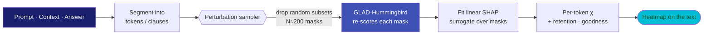

# Causal Explainability

The Causal Explainability (XAI) feature lets you understand *why* Geodesia flagged — or passed — a particular response. It computes **token-level attribution**: a score for each word in the input that indicates how much that word contributed to the detection outcome.

This is done **entirely black-box** — no access to the upstream model's internals, no GPU memory from the generator, no autograd. Geodesia perturbs the input and re-scores the output with its own compact detection model, which makes causal XAI available regardless of which upstream LLM you are using.

---

## How it works — visualized

Attribution never opens the upstream model. Instead Geodesia treats detection as a function `f(text) → risk` and asks a simple causal question: **if I remove this word, how much does the risk change?** Do that over many random subsets and you recover a per-token contribution — the same idea as SHAP, but computed against GLAD-Hummingbird instead of the generator.



<p class="diagram-caption">Black-box causal attribution: perturb → re-score with the detector → fit a surrogate → paint each token by its contribution χ. No upstream-model gradients, no internals.</p>

### The heatmap on the text

Every token is painted by its attribution χ — **how much it pushed the detection score**. Deeper red = it *increased* risk (a fabrication, an unsafe span, an injection); teal = it *reduced* risk (grounding evidence). Hover a token to read its exact values.

*Example — a closed-book hallucination. The document says the Eiffel Tower was built **1887–1889**; the model answered "1885".*

<div class="xai-heatmap">
  <span class="xai-label">Answer · axis <code>halluc_context</code> · base score 0.71 🔴 flagged</span>
  <div class="xai-sentence">
    <span class="tok" style="background:rgba(244,67,54,0.03)" title="χ 0.02 · neutral">The</span>
    <span class="tok" style="background:rgba(244,67,54,0.06)" title="χ 0.05 · neutral">Eiffel</span>
    <span class="tok" style="background:rgba(244,67,54,0.06)" title="χ 0.05 · neutral">Tower</span>
    <span class="tok" style="background:rgba(244,67,54,0.04)" title="χ 0.03 · neutral">was</span>
    <span class="tok pos" style="background:rgba(244,67,54,0.22)" title="χ 0.18 · positive — asserts a construction fact">built</span>
    <span class="tok" style="background:rgba(244,67,54,0.04)" title="χ 0.03 · neutral">in</span>
    <span class="tok pos" style="background:rgba(244,67,54,0.78)" title="χ 0.62 · positive — the fabricated date, top attributed token">1885</span><span class="tok" style="background:rgba(244,67,54,0.02)" title="χ 0.01">.</span>
  </div>
  <div class="xai-legend">
    <span>reduces risk</span>
    <span class="bar"></span>
    <span>increases risk</span>
    <span style="margin-left:auto">underline = signed effect (<span style="color:#f44336">■</span> positive · <span style="color:#00bcd4">■</span> negative)</span>
  </div>
</div>

The single token **`1885`** carries χ ≈ 0.62 of the 0.71 flag: remove it and the answer stops looking like a fabrication. That is the causal explanation — not "the answer is 71% hallucinated", but *"this one date is why."*

### What the values mean

For each top token the attribution carries three numbers. Together they separate *"important because it swings the score"* from *"important because it is consistently part of every risky reading"*:

<div class="xai-values">
  <div class="xai-value">
    <div class="k">importance · χ</div>
    <div class="v">0.62</div>
    <div class="d">SHAP-style signed contribution to the detection score. Positive raises risk, negative lowers it. This is the color intensity.</div>
  </div>
  <div class="xai-value">
    <div class="k">retention_frequency</div>
    <div class="v">0.71</div>
    <div class="d">Fraction of the high-score perturbation subsets that <em>kept</em> this token. High → the token is reliably present whenever the answer scores as risky.</div>
  </div>
  <div class="xai-value">
    <div class="k">conditional_goodness</div>
    <div class="v">0.88</div>
    <div class="d">Mean detection score across the subsets where this token was retained. High → whenever it is present, the risk is present too.</div>
  </div>
</div>

!!! tip "Reading them together"
    A token that is **high on all three** is a genuine causal driver (like `1885`). High χ but low retention can be a sampling artefact; high retention but low χ is usually a common word that rides along. The UI ranks `top_tokens` by χ and surfaces the other two so you can sanity-check the ranking.

### How it appears in the chat

In [G-1 Studio](../studio/index.md) every assistant answer ships with the per-axis detection chart. Each bar is **one independent risk signal** with its own calibrated threshold tick (▏) — you read each axis on its own, not as a blended score. A bar past its tick is *flagged*; depending on the Application's policy the answer is annotated or blocked. Click the message → **Compute** to overlay the token heatmap above on that answer.

<div class="chat-mock">
  <div class="bubble user"><span class="who">You</span>According to the document, when was the Eiffel Tower built?</div>
  <div class="bubble"><span class="who">Assistant · via Geodesia G-1</span>The Eiffel Tower was built in 1885.</div>
  <div class="axis-bars">
    <div class="axis-bar"><span class="name">context faith.</span><span class="track"><span class="fill bad" style="width:71%"></span><span class="tick" style="left:30%"></span></span><span class="pct">0.71</span></div>
    <div class="axis-bar"><span class="name">closed-book</span><span class="track"><span class="fill warn" style="width:38%"></span><span class="tick" style="left:57%"></span></span><span class="pct">0.38</span></div>
    <div class="axis-bar"><span class="name">prompt safety</span><span class="track"><span class="fill ok" style="width:6%"></span><span class="tick" style="left:90%"></span></span><span class="pct">0.06</span></div>
    <div class="axis-bar"><span class="name">answer safety</span><span class="track"><span class="fill ok" style="width:9%"></span><span class="tick" style="left:57%"></span></span><span class="pct">0.09</span></div>
    <div class="axis-bar"><span class="name">jailbreak</span><span class="track"><span class="fill ok" style="width:4%"></span><span class="tick" style="left:57%"></span></span><span class="pct">0.04</span></div>
  </div>
</div>

<p class="diagram-caption">The context-faithfulness bar (0.71) is past its threshold tick → flagged. Causal XAI then explains that verdict token by token: the date <code>1885</code> is the cause.</p>

---

## Two Attribution Methods

### Occlusion (`gradient_causal`)

Occlusion removes one text segment at a time from the input (prompt or context) and re-scores the answer with each perturbation. The importance of a segment is proportional to the change in the detection score when that segment is removed.

- **Speed:** ~3–8 seconds per response (depends on the number of segments and the answer length)
- **Interpretation:** A high positive score means "removing this segment would have reduced the detection flag" — i.e., this segment contributed to the problem.
- **Best for:** Short inputs with a clear structure, or when you need a quick explanation without Monte Carlo sampling.

### MuPAX (`mupax_causal`)

MuPAX (Monte Carlo Perturbation Attribution via Exclusion) draws random subsets of input segments, scores the answer with each subset, and fits a linear surrogate model over the results. This gives a statistically robust attribution via kernel SHAP.

- **Speed:** ~0.4–2 seconds for default settings (batched scoring)
- **Interpretation:** Each segment's χ (chi) value is its SHAP-style contribution to the detection score. Positive values increase the score; negative values reduce it.
- **Best for:** Longer inputs, more reliable attribution, interactive exploration in the UI.
- **Configurable:** You can adjust the number of samples (`mupax_n_samples`) and the acceptance threshold (`mupax_threshold_percentile`) to trade speed for precision.

---

## API Endpoint

<div class="endpoint"><span class="method method-post">POST</span><span class="path">/v1/glad/causal-explainability/analyze</span></div>

### Request Body

| Field | Type | Required | Description |
|---|---|---|---|
| `prompt` | `string` | ✅ | The user's prompt. Do **not** include the system/constitutional prompt here — it is automatically excluded from attribution. |
| `response` / `full_response` | `string` | ✅ | The model's generated answer that you want to explain. |
| `context` | `string` | — | The grounding context (RAG chunks, document text). When provided, attribution is computed over the context rather than the prompt. |
| `method` | `string` | — | `"gradient_causal"` for occlusion (default), `"mupax_causal"` for Monte Carlo MuPAX. |
| `mupax_n_samples` / `mupax_samples` / `mc_samples` | `integer` | — | Number of Monte Carlo samples for MuPAX. Default `200`. More samples = more accurate attribution but slower. |
| `mupax_threshold_percentile` | `float` | — | Acceptance threshold percentile for MuPAX sampling (0–1). Default `0.2`. Lower = stricter (more samples rejected, slower). |

### Response Body

```json
{
  "prompt": "What is the capital of France?",
  "full_response": "The capital of France is Paris.",
  "detection_type": "halluc_context",
  "base_score": 0.12,
  "xai": {
    "method": "mupax_causal",
    "mupax_halluc_causal": {
      "detection_type": "halluc_context",
      "base_score": 0.12,
      "units": [
        {"text": "What is", "importance": 0.02, "effect": "neutral"},
        {"text": "the capital of France?", "importance": 0.48, "effect": "positive"}
      ],
      "top_tokens": [
        {"token": "capital", "position": 2, "importance": 0.48, "retention_frequency": 0.62, "conditional_goodness": 0.87},
        {"token": "France", "position": 4, "importance": 0.39, "retention_frequency": 0.58, "conditional_goodness": 0.82}
      ],
      "threshold_W": 0.14,
      "n_accepted": 187,
      "n_total": 200
    }
  }
}
```

### Response Fields

| Field | Description |
|---|---|
| `detection_type` | Which detection axis the attribution is for (e.g., `halluc_context`, `answer_safety`) |
| `base_score` | The detection score for the full, unperturbed input (matches the score in the regular chat response) |
| `xai.mupax_halluc_causal` | Full MuPAX attribution result (present when `method="mupax_causal"`) |
| `xai.gradient_causal` | Full occlusion attribution result (present when `method="gradient_causal"`) |

### Per-unit attribution (`units`)

Each entry in `units` represents one text segment (typically a sentence or clause):

| Field | Description |
|---|---|
| `text` | The text of this segment |
| `importance` | Absolute attribution score [0, 1]. Higher = more important to the detection outcome |
| `effect` | `"positive"` (increased the score), `"negative"` (decreased it), or `"neutral"` |

### Per-token attribution (`top_tokens`)

The top-K most important individual tokens:

| Field | Description |
|---|---|
| `token` | The token text (e.g., a word or subword) |
| `position` | Token position in the input sequence |
| `importance` | χ attribution value |
| `retention_frequency` | Proportion of samples in which this token was included in "high-score" configurations |
| `conditional_goodness` | Mean detection score in samples where this token was retained |

---

## Usage Example

```bash
curl -s -X POST http://localhost:8800/v1/glad/causal-explainability/analyze \
  -H "Content-Type: application/json" \
  -d '{
    "prompt": "According to the document, when was the Eiffel Tower built?",
    "context": "The Eiffel Tower was constructed between 1887 and 1889.",
    "response": "The Eiffel Tower was built in 1885.",
    "method": "mupax_causal",
    "mupax_n_samples": 200
  }'
```

This will show that the date *"1885"* is the most attributable token for the hallucination flag — because removing the date assertion from the answer (or the date context from the document) most strongly changes the detection score.

---

## Configuration

The following gateway environment variables control XAI behaviour:

| Variable | Default | Description |
|---|---|---|
| `GW_XAI_MAXLEN` | `512` | Maximum token length for XAI scoring passes. Lower values reduce memory usage and latency but may miss long-context attribution. |
| `GW_XAI_SRC_CHARS` | `2400` | Maximum characters of source text (context + prompt) submitted for attribution. Longer inputs are truncated from the beginning. |
| `GW_ANALYZE_MIN_MAXLEN` | `512` | Minimum maxlen when the gateway auto-halves on OOM. The gateway retries with half the maxlen if it hits a GPU out-of-memory error. |

---

## In the Web UI

The **Causal Intelligence** page in the web UI provides an interactive view of token attribution:

1. Select any assistant message in the chat history
2. Click **Compute** to run attribution on that message
3. Toggle between **Outcome view** (aggregated per-axis scores) and **Token→Token view** (MuPAX causal graph showing which prompt tokens caused which answer tokens)
4. Adjust **Samples** and **W% percentile** to trade speed for accuracy

!!! note "Causal XAI is off by default"
    The UI's "Causal XAI ready" toggle is off by default to avoid unexpected latency. Enable it in Settings before using the Causal Intelligence page.
