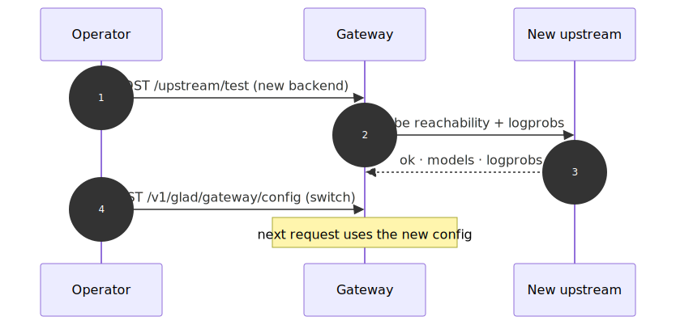

# Framework Compatibility & DevOps Guide

Geodesia G-1 is **model-agnostic and framework-agnostic**. It sits in front of your inference server as a thin, stateless validation layer and inspects every request and response — it does not care *how* the tokens are produced, only that the server speaks a protocol it understands.

> **The golden rule:** if your serving stack exposes an OpenAI-compatible `/v1/chat/completions` endpoint (or the Ollama API), Geodesia G-1 drops in front of it with zero changes to your application — you only change the `base_url` your client points at.

This page is the operator's reference: the **compatibility matrix**, **per-framework setup**, and the **production deployment, scaling, observability, security, and troubleshooting** playbook.

---

## At a Glance

<div class="feature-grid">

<div class="feature-card">
<span class="feature-icon">🧩</span>
<h3>Drop-in</h3>
<p>Stateless proxy on port <code>8800</code>. Point your OpenAI client at it; point it at your model. No retraining, no app changes.</p>
</div>

<div class="feature-card">
<span class="feature-icon">📈</span>
<h3>Horizontally scalable</h3>
<p>The gateway holds no per-request state. Run N replicas behind a load balancer; share one audit database.</p>
</div>

<div class="feature-card">
<span class="feature-icon">🩺</span>
<h3>Probe-friendly</h3>
<p><code>/health</code> reports upstream reachability, log-prob support, and active axes — wire it straight into liveness/readiness probes.</p>
</div>

<div class="feature-card">
<span class="feature-icon">🔐</span>
<h3>Hardening-ready</h3>
<p>API-key passthrough, TLS at the edge, blocking-mode enforcement, and a tamper-evident audit chain out of the box.</p>
</div>

</div>

---

## The One Rule That Decides Everything: Log-Probabilities

There is exactly one upstream capability that changes how many detection axes you get:

> **Does the upstream return per-token log-probabilities?**

Log-probabilities express how confident the model was when it chose each word. Geodesia uses them for the **closed-book fabrication** axis (catching confidently-invented facts when there is no grounding context).

| Upstream returns log-probs | Active axes | What you lose without them |
|---|---|---|
| ✅ Yes | **5 axes** | nothing |
| ❌ No | **4 axes** | closed-book fabrication only — context faithfulness, prompt safety, answer safety, and jailbreak all still run |

No setting toggles this — the gateway probes it on the first request and `/health` reports the result. You can recover the 5th axis later with a [log-prob sidecar](#ollama).

!!! tip "Make `axes` an alerting signal"
    Treat an unexpected drop from `axes: 5` to `axes: 4` in `/health` as a **degradation alert** — it means your upstream stopped returning log-probabilities (model change, tier change, flag dropped).

---

## Compatibility Matrix

| Framework | `upstream_type` | Protocol | Log-probs | Axes | Best for |
|---|---|---|---|---|---|
| [vLLM](#vllm) | `vllm` | OpenAI | ✅ | 5 | Production on NVIDIA GPUs |
| [SGLang](#sglang) | `sglang` | OpenAI | ✅ | 5 | High-throughput production |
| [TensorRT-LLM](#tensorrt-llm) | `trtllm` | OpenAI | ✅ | 5 | Maximum NVIDIA performance |
| [llama.cpp](#llamacpp) | `openai` | OpenAI | ✅ | 5 | CPU / Apple Silicon / GGUF |
| [Ollama](#ollama) | `ollama` | Ollama | ✅ native (≥ 0.12) | 5 (older: 4, or sidecar) | Local dev, easiest setup |
| [OpenAI API](#openai-api-and-hosted-services) | `openai` | OpenAI | ✅ | 5 | Managed frontier models |
| [Azure · Together · Groq · Mistral · Fireworks · OpenRouter](#openai-api-and-hosted-services) | `openai` | OpenAI | ✅* | 5* | Hosted open models |
| [TGI (Hugging Face)](#text-generation-inference-tgi) | `openai` | OpenAI | ✅ | 5 | Hugging Face stack |
| [LM Studio](#lm-studio) | `openai` | OpenAI | ✅ | 5 | Desktop / local GUI |
| [LocalAI](#localai) | `openai` | OpenAI | ✅ | 5 | Self-hosted drop-in |
| [Internal (self-managed)](#internal-self-managed-vllm) | `internal` | OpenAI | ✅ | 5 | Single-GPU, gateway owns lifecycle |

<small>* Hosted providers expose log-probabilities on most—but not all—models and tiers; the gateway falls back to 4 axes automatically when they are absent.</small>

---

## Where Geodesia Sits

{: .diagram }
<p class="diagram-caption">The gateway is the only thing your application talks to. It is stateless; all durable state lives in the shared audit database.</p>

---

## Choosing the Right Type

{: .diagram }
<p class="diagram-caption">Anything OpenAI-compatible that is not vLLM / SGLang / TensorRT-LLM uses <code>type: openai</code>.</p>

---

## Configure It — Three Equivalent Ways

Every framework below is configured identically; only the values change.

=== "Gateway API (runtime, hot-reload)"

    ```bash
    curl -X POST http://localhost:8800/v1/glad/gateway/config \
      -H "Content-Type: application/json" \
      -d '{
        "upstream_type": "vllm",
        "upstream_base_url": "http://generator:8000",
        "upstream_model": "meta-llama/Llama-3-8B-Instruct",
        "upstream_api_key": ""
      }'
    ```
    Changes take effect on the next request — no restart.

=== "Environment variables (declarative)"

    ```bash
    GW_UPSTREAM_TYPE=vllm
    GW_UPSTREAM_URL=http://generator:8000
    GW_UPSTREAM_MODEL=meta-llama/Llama-3-8B-Instruct
    GW_API_KEY=                 # only for hosted services
    GW_BLOCK_INPUT=1            # enforce on input
    GW_BLOCK_OUTPUT=1           # enforce on output
    ```
    The canonical way for Docker / Kubernetes — config is reproducible from your manifests.

=== "Web UI"

    **Settings → Service Connection** → choose type, enter URL (and API key if hosted), **Test connection**, pick the model, **Save**.

| Config field | Env var | Meaning |
|---|---|---|
| `upstream_type` | `GW_UPSTREAM_TYPE` | `vllm` · `sglang` · `trtllm` · `openai` · `ollama` · `internal` |
| `upstream_base_url` | `GW_UPSTREAM_URL` | Base URL of the server (no trailing `/v1`) |
| `upstream_model` | `GW_UPSTREAM_MODEL` | Model name as the upstream knows it |
| `upstream_api_key` | `GW_API_KEY` | Bearer token; empty for local servers |
| — | `GW_MAXLEN` | Max tokens the detector reads (latency vs recall) |
| — | `GW_BLOCK_INPUT` / `GW_BLOCK_OUTPUT` | `1` = block flagged content, `0` = annotate only |

!!! info "Always verify after configuring"
    Run `POST /upstream/test` (or the **Test connection** button) — it reports reachability, latency, the model list, and whether log-probabilities are available. See [Upstream Backends](backends.md#testing-a-connection).

---

## Per-Framework Setup

### vLLM

The recommended production backend on NVIDIA GPUs. Returns log-probabilities natively → 5 axes.

=== "Bare process"

    ```bash
    python -m vllm.entrypoints.openai.api_server \
      --model meta-llama/Llama-3-8B-Instruct --port 8000
    ```

=== "Docker"

    ```bash
    docker run --gpus all -p 8000:8000 \
      vllm/vllm-openai:latest \
      --model meta-llama/Llama-3-8B-Instruct
    ```

**Configure:**
```bash
curl -X POST http://localhost:8800/v1/glad/gateway/config \
  -d '{"upstream_type":"vllm","upstream_base_url":"http://localhost:8000",
       "upstream_model":"meta-llama/Llama-3-8B-Instruct"}'
```

### SGLang

OpenAI-compatible, log-probabilities supported → 5 axes. Default port `30000`.

```bash
python -m sglang.launch_server \
  --model-path meta-llama/Llama-3-8B-Instruct --port 30000

curl -X POST http://localhost:8800/v1/glad/gateway/config \
  -d '{"upstream_type":"sglang","upstream_base_url":"http://localhost:30000",
       "upstream_model":"meta-llama/Llama-3-8B-Instruct"}'
```

### TensorRT-LLM

NVIDIA's maximum-performance engine, fronted by an OpenAI-compatible server (TensorRT-LLM serving frontend or Triton). Log-probabilities supported → 5 axes.

```bash
curl -X POST http://localhost:8800/v1/glad/gateway/config \
  -d '{"upstream_type":"trtllm","upstream_base_url":"http://localhost:8000",
       "upstream_model":"llama-3-8b"}'
```

!!! warning "Build with log-probs enabled"
    Ensure the engine is built so the serving frontend can request `logprobs`. If absent, the gateway runs in 4-axis mode.

### llama.cpp

`llama-server` is OpenAI-compatible **and returns log-probabilities** → 5 axes, even on CPU or Apple Silicon. Use `type: openai`.

```bash
./llama-server -m ./models/llama-3-8b-instruct.Q4_K_M.gguf \
  --host 0.0.0.0 --port 8080

curl -X POST http://localhost:8800/v1/glad/gateway/config \
  -d '{"upstream_type":"openai","upstream_base_url":"http://localhost:8080",
       "upstream_model":"llama-3-8b-instruct","upstream_api_key":""}'
```

!!! info "Why `openai` and not a `llamacpp` type"
    `llama.cpp` speaks the OpenAI protocol, so it uses the generic `openai` type — the same as TGI, LM Studio, and LocalAI. Anything OpenAI-compatible you host yourself is `openai` with an empty API key.

### Ollama

The easiest local runtime. **Ollama ≥ 0.12 exposes per-token log-probabilities** on its OpenAI-compatible `/v1/chat/completions` endpoint, so Geodesia runs in **full 5-axis mode automatically** — the gateway probes that endpoint on the first request and turns the closed-book fabrication axis on with no extra configuration.

```bash
curl -X POST http://localhost:8800/v1/glad/gateway/config \
  -d '{"upstream_type":"ollama","upstream_base_url":"http://localhost:11434",
       "upstream_model":"llama3.2"}'
```

!!! tip "Check the probe result"
    `GET /health` reports `axes: 5` once the log-prob probe succeeds. If you see `axes: 4` on a recent Ollama, make sure you're on **0.12 or newer** (older builds did not expose log-probs).

#### Older Ollama — recover the closed-book axis with a log-prob sidecar

On **Ollama < 0.12** (no native log-probs) you stay in 4-axis mode. You can recover the closed-book axis by running a **second server for the same model that does expose log-probabilities** — typically `llama.cpp` on the same GGUF. The gateway re-derives the answer through the sidecar to recover the signal (only used when native log-probs are absent).

{: .diagram }

```bash
./llama-server -m ./models/llama3.2.gguf --port 8080   # the sidecar

curl -X POST http://localhost:8800/v1/glad/gateway/config \
  -d '{"upstream_type":"ollama","upstream_base_url":"http://localhost:11434",
       "upstream_model":"llama3.2",
       "ollama_logprob_sidecar_url":"http://localhost:8080",
       "ollama_logprob_sidecar_model":"llama3.2"}'
```

### OpenAI API and Hosted Services

Use `type: openai` for the OpenAI API and any hosted OpenAI-compatible provider.

```bash
curl -X POST http://localhost:8800/v1/glad/gateway/config \
  -d '{"upstream_type":"openai","upstream_base_url":"https://api.openai.com",
       "upstream_api_key":"sk-...","upstream_model":"gpt-4o"}'
```

| Provider | `upstream_base_url` |
|---|---|
| OpenAI | `https://api.openai.com` |
| Azure OpenAI | `https://<resource>.openai.azure.com` |
| Together AI | `https://api.together.xyz` |
| Groq | `https://api.groq.com/openai` |
| Mistral AI | `https://api.mistral.ai` |
| Fireworks | `https://api.fireworks.ai/inference` |
| OpenRouter | `https://openrouter.ai/api` |

!!! warning "Secrets belong in a secret store"
    Never bake `upstream_api_key` into an image or commit it. Inject it via `GW_API_KEY` from a Kubernetes `Secret`, Docker secret, or your vault. See [Security Hardening](#security-hardening).

### Text Generation Inference (TGI)

Hugging Face TGI exposes an OpenAI route and returns log-probabilities → 5 axes. `type: openai`, default port `8080`.

```bash
curl -X POST http://localhost:8800/v1/glad/gateway/config \
  -d '{"upstream_type":"openai","upstream_base_url":"http://localhost:8080",
       "upstream_model":"tgi"}'
```

### LM Studio

Local OpenAI-compatible server (default port `1234`) with log-probabilities → 5 axes.

```bash
curl -X POST http://localhost:8800/v1/glad/gateway/config \
  -d '{"upstream_type":"openai","upstream_base_url":"http://localhost:1234",
       "upstream_model":"local-model"}'
```

### LocalAI

Self-hosted OpenAI drop-in (default port `8080`). `type: openai`.

```bash
curl -X POST http://localhost:8800/v1/glad/gateway/config \
  -d '{"upstream_type":"openai","upstream_base_url":"http://localhost:8080",
       "upstream_model":"gpt-3.5-turbo"}'
```

### Internal (self-managed vLLM)

The gateway **launches and manages its own vLLM subprocess**, starting it on selection and freeing the GPU when you switch away — ideal for single-GPU hosts.

```bash
curl -X POST http://localhost:8800/v1/glad/gateway/config \
  -d '{"upstream_type":"internal",
       "internal_vllm_cmd":"python -m vllm.entrypoints.openai.api_server --model my-model --port 8000",
       "internal_vllm_url":"http://localhost:8000",
       "upstream_model":"my-model"}'
```

---

## Production Topologies

### 1 · Single node — Docker Compose

The simplest production unit: the model server and the gateway side by side.

{: .diagram }

The repository ships `deploy/docker-compose.gateway.yml` with two services — `generator` (the model) and `glad-gateway` (the validator) — and two profiles:

```bash
# Fixed checkpoint
docker compose -f deploy/docker-compose.gateway.yml --profile fixed up -d

# New model / new customer
docker compose -f deploy/docker-compose.gateway.yml --profile customer up -d
```

A minimal `.env` to drive it:

```bash
# .env
GW_UPSTREAM_TYPE=vllm
GW_UPSTREAM_URL=http://generator:8000
GW_UPSTREAM_MODEL=meta-llama/Llama-3-8B-Instruct
GW_BLOCK_INPUT=1
GW_BLOCK_OUTPUT=1
GW_MAXLEN=2048
```

### 2 · Kubernetes

The gateway is stateless → run it as a `Deployment` with `N` replicas behind a `Service`, mount the upstream as another `Service`, keep secrets in a `Secret`, and wire `/health` to probes.

{: .diagram }

```yaml
apiVersion: apps/v1
kind: Deployment
metadata:
  name: geodesia-gateway
spec:
  replicas: 3
  selector: { matchLabels: { app: geodesia-gateway } }
  template:
    metadata: { labels: { app: geodesia-gateway } }
    spec:
      containers:
        - name: gateway
          image: registry.geodesia.ai/gateway:1.0   # your licensed image
          ports: [{ containerPort: 8800 }]
          env:
            - { name: GW_UPSTREAM_TYPE,  value: "vllm" }
            - { name: GW_UPSTREAM_URL,   value: "http://model:8000" }
            - { name: GW_UPSTREAM_MODEL, value: "meta-llama/Llama-3-8B-Instruct" }
            - { name: GW_BLOCK_INPUT,    value: "1" }
            - { name: GW_BLOCK_OUTPUT,   value: "1" }
            - name: GW_API_KEY
              valueFrom: { secretKeyRef: { name: geodesia-secrets, key: upstream-api-key } }
          readinessProbe:
            httpGet: { path: /health, port: 8800 }
            initialDelaySeconds: 10
            periodSeconds: 10
          livenessProbe:
            httpGet: { path: /health, port: 8800 }
            initialDelaySeconds: 30
            periodSeconds: 20
---
apiVersion: v1
kind: Service
metadata: { name: geodesia-gw }
spec:
  selector: { app: geodesia-gateway }
  ports: [{ port: 8800, targetPort: 8800 }]
---
apiVersion: autoscaling/v2
kind: HorizontalPodAutoscaler
metadata: { name: geodesia-gateway }
spec:
  scaleTargetRef: { apiVersion: apps/v1, kind: Deployment, name: geodesia-gateway }
  minReplicas: 2
  maxReplicas: 10
  metrics:
    - type: Resource
      resource: { name: cpu, target: { type: Utilization, averageUtilization: 70 } }
```

!!! tip "Keep the GPU pool separate"
    Run the **gateway** on cheap CPU nodes and the **model** on GPU nodes. The validator is lightweight; only the upstream needs a GPU. This lets you scale the two independently and pack GPUs efficiently.

### 3 · systemd (bare metal / VM)

```ini
# /etc/systemd/system/geodesia-gateway.service
[Unit]
Description=Geodesia G-1 Gateway
After=network-online.target

[Service]
Environment=GW_UPSTREAM_TYPE=vllm
Environment=GW_UPSTREAM_URL=http://127.0.0.1:8000
Environment=GW_UPSTREAM_MODEL=my-model
Environment=GW_BLOCK_INPUT=1
EnvironmentFile=-/etc/geodesia/gateway.env       # secrets here
ExecStart=/opt/geodesia/bin/start-gateway --host 0.0.0.0 --port 8800
Restart=always
RestartSec=3

[Install]
WantedBy=multi-user.target
```

```bash
systemctl enable --now geodesia-gateway
systemctl status geodesia-gateway
```

---

## Health, Readiness & Probes

The gateway's `/health` is designed to be both a **liveness** and a **readiness** signal.

```bash
curl http://localhost:8800/health
```

```json
{
  "ok": true,
  "upstream_type": "vllm",
  "upstream": "http://localhost:8000",
  "internal_vllm": "stopped",
  "logprobs": true,
  "axes": 5
}
```

| Field | Use it for |
|---|---|
| `ok` | Liveness — process is up and serving |
| `upstream` / `upstream_type` | Confirm the configured backend |
| `logprobs` | Readiness for full validation — `false` means 4-axis mode |
| `axes` | Capability gauge — alert on an unexpected `5 → 4` drop |
| `internal_vllm` | Lifecycle state when `type: internal` (`running` / `stopped`) |

The product backend exposes its own lightweight check at `GET /v1/glad/health` for the compliance plane.

| Probe | Endpoint | Recommended timing |
|---|---|---|
| Readiness | `GET :8800/health` | `initialDelay 10s · period 10s` |
| Liveness | `GET :8800/health` | `initialDelay 30s · period 20s` |
| Compliance plane | `GET :8199/v1/glad/health` | `period 30s` |

---

## Observability

Every response carries a `geodesia{}` block — your richest telemetry source. Ship it to your logging pipeline and build dashboards on it.

| Source | What you get | How |
|---|---|---|
| **`geodesia{}` payload** | Per-call axis scores, brake decision, dominant axis, latency | Parse from each API response (see [Response Format](../reference/response-format.md)) |
| **`/health`** | Liveness, upstream, log-prob mode, active axes | Poll on an interval; alert on `ok=false` or `axes` drop |
| **Compliance dashboard** | Aggregated pass / block / flag counts, per-axis rates | `GET :8199/v1/glad/dashboard` |
| **Audit chain** | Tamper-evident per-call ledger | `GET :8199/v1/glad/chain/entries` |
| **Container logs** | Startup, log-prob probe, upstream errors | `docker logs` / `kubectl logs` |

**Alerts worth wiring:**

- `/health` `ok=false` for > 1 probe → gateway down
- `axes` drops `5 → 4` unexpectedly → upstream stopped returning log-probs
- block rate spikes on `prompt_safety` or `jailbreak` → possible attack / misconfig
- block rate spikes on `halluc_context` → upstream model or RAG regression
- audit-chain verification failing (`GET /v1/glad/chain/verify`) → integrity incident

---

## Security Hardening

{: .diagram }

- **Terminate TLS at the edge** (nginx / ingress); keep the gateway and the model on a private network. Never expose the model port publicly — the gateway is the only intended entry point.
- **Inject secrets, never bake them.** `GW_API_KEY` and any license token come from a Kubernetes `Secret`, Docker secret, or vault — not from the image or git.
- **Turn on enforcement in production:** `GW_BLOCK_INPUT=1` and `GW_BLOCK_OUTPUT=1`. In `passthrough` mode the gateway annotates but does not withhold — appropriate for monitoring, not for protection.
- **Lock down the compliance plane** (`:8199`) to operators only; it exposes the kill switch, FRIA, and audit exports.
- **Verify the audit chain on a schedule** (`GET /v1/glad/chain/verify`) and alert on any failure.

---

## Scaling & Performance

| Lever | Effect | Guidance |
|---|---|---|
| **Gateway replicas** | Throughput, HA | Stateless — add replicas freely behind a load balancer |
| **`GW_MAXLEN`** | Detector latency vs recall | `2048` for long-context RAG faithfulness; drop to `512` to cut latency on short prompts |
| **Blocking vs streaming** | Time-to-first-token | Streaming with the mid-stream brake adds minimal overhead; the brake halts at token-cadence boundaries |
| **Log-prob sidecar (older Ollama < 0.12)** | +1 axis, +1 re-derivation | Only needed pre-0.12 (≥ 0.12 has native log-probs). Costs one extra generation per call — size the sidecar accordingly or accept 4-axis mode |
| **GPU placement** | Cost | Gateway on CPU nodes, model on GPU nodes — scale independently |
| **Shared audit DB** | Consistency | All replicas point at one database (managed Postgres-class store or shared volume) so the dashboard and chain stay coherent |

!!! note "The gateway is not the bottleneck"
    The validator is small and fast relative to the upstream LLM. Capacity planning should start from your **model server's** throughput; the gateway scales horizontally and cheaply to match it.

---

## Zero-Downtime Model / Framework Switch

The gateway hot-reloads configuration — you can repoint it without dropping traffic.

{: .diagram }

1. **Test** the new backend first (`/upstream/test`) — confirm reachability and log-prob support.
2. **Switch** (`POST /v1/glad/gateway/config` or roll new env vars). The closed-book axis is cross-model and needs no per-model step — it works on the new upstream immediately.

In Kubernetes, prefer a rolling update of the `Deployment` with the new env vars; the readiness probe keeps traffic on healthy pods throughout.

---

## Troubleshooting Runbook

| Symptom | Likely cause | Fix |
|---|---|---|
| `/health` `ok=false` | Upstream unreachable | Check `upstream_base_url`, network policy, and that the model server is up |
| `axes: 4` when you expected 5 | Upstream returns no log-probs | Upgrade to **Ollama ≥ 0.12** (native log-probs), use a model/tier that supports `logprobs`, or add a [log-prob sidecar](#ollama) for older Ollama |
| `connection refused` on switch | Wrong port or `/v1` appended | Use the **base** URL (no trailing `/v1`); the gateway adds the path |
| Hosted API → 4 axes | Provider/model omits log-probs | Try another model on the provider, or accept 4-axis mode |
| First request very slow | Model cold-loading on first boot | Expected once per boot — the gateway warms the upstream proactively; subsequent requests are fast |
| `internal_vllm: stopped` with `type: internal` | Subprocess failed to start | Check `internal_vllm_cmd` and GPU availability in container logs |
| 5xx from the gateway under load | Upstream saturated | Scale the **model server**; the gateway itself is rarely the limit |
| Benign prompts blocked | Thresholds too aggressive | Tune per-axis thresholds — see [Detection Thresholds](../reference/thresholds.md) |

---

## See Also

- [Upstream Backends](backends.md) — the connection test and upstream-adapter mechanics
- [Gateway Configuration](configuration.md) — every `GatewayConfig` field
- [Environment Variables](../configuration/env-vars.md) — the full `GW_*` reference
- [Enforcement Modes](enforcement-modes.md) — blocking vs passthrough
- [Detection Thresholds](../reference/thresholds.md) — per-axis tuning
- [API Response Format](../reference/response-format.md) — the `geodesia{}` payload
