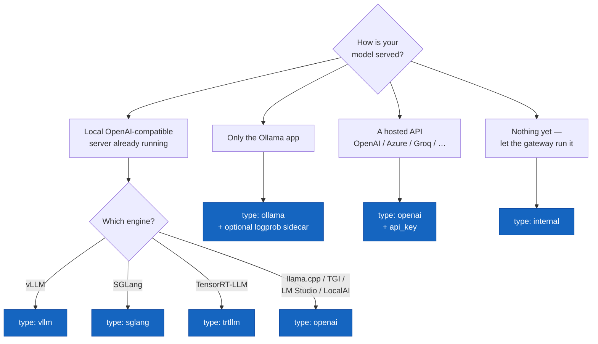

# Framework Compatibility

Geodesia G-1 is **model-agnostic and framework-agnostic**. It sits in front of your inference server and validates every request and response — it does not care *how* the tokens are produced, only that the server speaks a protocol it understands.

In practice this means: **if your serving framework exposes an OpenAI-compatible `/v1/chat/completions` endpoint (or the Ollama API), Geodesia G-1 works with it.** That covers essentially every modern LLM serving stack.

---

## The One Rule That Matters: Log-Probabilities

There is exactly one capability that changes how many detection axes you get:

> **Does the upstream return per-token log-probabilities?**

Log-probabilities are a number, attached to each generated token, that expresses how confident the model was when it chose that word. Geodesia uses them for the **closed-book fabrication** axis (detecting confidently-stated but invented facts when there is no grounding context).

| Upstream returns log-probs | Active axes |
|---|---|
| ✅ Yes | **5 axes** — context faithfulness, closed-book fabrication, prompt safety, answer safety, jailbreak |
| ❌ No | **4 axes** — the closed-book fabrication axis is disabled automatically; everything else is unaffected |

No configuration is needed to switch between the two — the gateway detects it on the first request and the `/health` endpoint reports which mode is active. You can always enable the 5th axis later (see [Ollama](#ollama) for the sidecar pattern).

---

## Compatibility Matrix

| Framework | `upstream_type` | Protocol | Log-probs | Axes | Best for |
|---|---|---|---|---|---|
| [vLLM](#vllm) | `vllm` | OpenAI | ✅ | 5 | Production on NVIDIA GPUs |
| [SGLang](#sglang) | `sglang` | OpenAI | ✅ | 5 | High-throughput production |
| [TensorRT-LLM](#tensorrt-llm) | `trtllm` | OpenAI | ✅ | 5 | Max NVIDIA performance |
| [llama.cpp](#llamacpp) | `openai` | OpenAI | ✅ | 5 | CPU / Apple Silicon / GGUF |
| [Ollama](#ollama) | `ollama` | Ollama | ⚠️ sidecar | 4 (5 w/ sidecar) | Local dev, easy setup |
| [OpenAI API](#openai-api-and-hosted-services) | `openai` | OpenAI | ✅ | 5 | Managed frontier models |
| [Azure / Together / Groq / Mistral / Fireworks / OpenRouter](#openai-api-and-hosted-services) | `openai` | OpenAI | ✅* | 5* | Hosted open models |
| [Text Generation Inference (TGI)](#text-generation-inference-tgi) | `openai` | OpenAI | ✅ | 5 | Hugging Face stack |
| [LM Studio](#lm-studio) | `openai` | OpenAI | ✅ | 5 | Desktop / local GUI |
| [LocalAI](#localai) | `openai` | OpenAI | ✅ | 5 | Self-hosted drop-in |
| [Internal (self-managed)](#internal-self-managed-vllm) | `internal` | OpenAI | ✅ | 5 | Single-GPU, gateway owns lifecycle |

<small>* Hosted providers expose log-probabilities on most—but not all—models and tiers. The gateway falls back to 4 axes automatically if they are absent.</small>

---

## Choosing the Right Type


<p class="diagram-caption">Pick the type that matches how your model is served. Everything OpenAI-compatible that is not vLLM/SGLang/TensorRT-LLM uses <code>type: openai</code>.</p>

---

## How to Configure (the two ways)

Every framework below is configured the same way — only the values change.

=== "Via the gateway API"

    ```bash
    curl -X POST http://localhost:8800/v1/glad/gateway/config \
      -H "Content-Type: application/json" \
      -d '{
        "upstream_type": "vllm",
        "upstream_base_url": "http://localhost:8000",
        "upstream_model": "meta-llama/Llama-3-8B-Instruct",
        "upstream_api_key": ""
      }'
    ```

=== "Via environment variables"

    ```bash
    export GW_UPSTREAM_TYPE=vllm
    export GW_UPSTREAM_URL=http://localhost:8000
    export GW_UPSTREAM_MODEL=meta-llama/Llama-3-8B-Instruct
    export GW_API_KEY=          # only for hosted services
    ```

=== "Via the web UI"

    **Settings → Service Connection** → choose the type, enter the URL (and API key if hosted), click **Test connection**, pick the model, then **Save**.

After configuring, always run **Test connection** (`POST /upstream/test`) to confirm reachability and whether log-probabilities are available. See [Upstream Backends](backends.md#testing-a-connection) for the test and calibration mechanics.

| Config field | Env var | Meaning |
|---|---|---|
| `upstream_type` | `GW_UPSTREAM_TYPE` | One of `vllm`, `sglang`, `trtllm`, `openai`, `ollama`, `internal` |
| `upstream_base_url` | `GW_UPSTREAM_URL` | Base URL of the server (no trailing `/v1`) |
| `upstream_model` | `GW_UPSTREAM_MODEL` | Model name as the upstream knows it |
| `upstream_api_key` | `GW_API_KEY` | Bearer token; leave empty for local servers |

---

## vLLM

The recommended backend for production on NVIDIA GPUs. Returns log-probabilities natively → all 5 axes.

**Start vLLM:**
```bash
python -m vllm.entrypoints.openai.api_server \
  --model meta-llama/Llama-3-8B-Instruct \
  --port 8000
```

**Point Geodesia at it:**
```bash
curl -X POST http://localhost:8800/v1/glad/gateway/config \
  -d '{"upstream_type":"vllm",
       "upstream_base_url":"http://localhost:8000",
       "upstream_model":"meta-llama/Llama-3-8B-Instruct"}'
```

No special flags are required — vLLM returns log-probabilities whenever the gateway requests them.

---

## SGLang

Fully OpenAI-compatible, log-probabilities supported → 5 axes. SGLang typically serves on port `30000`.

**Start SGLang:**
```bash
python -m sglang.launch_server \
  --model-path meta-llama/Llama-3-8B-Instruct \
  --port 30000
```

**Configure:**
```bash
curl -X POST http://localhost:8800/v1/glad/gateway/config \
  -d '{"upstream_type":"sglang",
       "upstream_base_url":"http://localhost:30000",
       "upstream_model":"meta-llama/Llama-3-8B-Instruct"}'
```

---

## TensorRT-LLM

NVIDIA's maximum-performance engine. It is fronted by an OpenAI-compatible server (the TensorRT-LLM serving frontend or NVIDIA Triton with the OpenAI endpoint). Log-probabilities are supported → 5 axes.

**Configure:**
```bash
curl -X POST http://localhost:8800/v1/glad/gateway/config \
  -d '{"upstream_type":"trtllm",
       "upstream_base_url":"http://localhost:8000",
       "upstream_model":"llama-3-8b"}'
```

!!! tip "Build with log-probs enabled"
    When building the TensorRT-LLM engine, make sure the engine is built to return generation log-probabilities (the serving frontend must be allowed to request `logprobs`). If they are absent, the gateway runs in 4-axis mode.

---

## llama.cpp

`llama.cpp` ships an OpenAI-compatible server (`llama-server`) that **does** return log-probabilities — so you get all 5 axes, even on CPU or Apple Silicon. Use `upstream_type: openai`.

**Start the server:**
```bash
# from a llama.cpp build
./llama-server \
  -m ./models/llama-3-8b-instruct.Q4_K_M.gguf \
  --host 0.0.0.0 --port 8080
```

**Configure (note the `/v1` is added by the gateway, point at the base):**
```bash
curl -X POST http://localhost:8800/v1/glad/gateway/config \
  -d '{"upstream_type":"openai",
       "upstream_base_url":"http://localhost:8080",
       "upstream_model":"llama-3-8b-instruct",
       "upstream_api_key":""}'
```

!!! info "Why type `openai` and not a `llamacpp` type"
    `llama.cpp` speaks the OpenAI protocol, so it uses the generic `openai` type. The same applies to TGI, LM Studio, and LocalAI below. There is no separate type to remember — anything OpenAI-compatible that you host yourself is `openai` with an empty API key.

---

## Ollama

Ollama is the easiest way to run open models locally. Its chat API does **not** expose per-token log-probabilities, so the gateway runs in **4-axis mode** by default. Everything except closed-book fabrication detection works.

**Configure:**
```bash
curl -X POST http://localhost:8800/v1/glad/gateway/config \
  -d '{"upstream_type":"ollama",
       "upstream_base_url":"http://localhost:11434",
       "upstream_model":"llama3.2"}'
```

### Enabling the 5th axis (log-prob sidecar)

To get closed-book fabrication detection with Ollama, run a **second server for the same model that does expose log-probabilities** — the most common choice is `llama.cpp`'s `llama-server` pointing at the same GGUF file. The gateway re-derives the answer through the sidecar to recover the missing signal.

```bash
# 1. Run a llama.cpp sidecar on the same GGUF, WITH logprobs
./llama-server -m ./models/llama3.2.gguf --port 8080

# 2. Tell the gateway about it
curl -X POST http://localhost:8800/v1/glad/gateway/config \
  -d '{"upstream_type":"ollama",
       "upstream_base_url":"http://localhost:11434",
       "upstream_model":"llama3.2",
       "ollama_logprob_sidecar_url":"http://localhost:8080",
       "ollama_logprob_sidecar_model":"llama3.2"}'
```

| Field | Description |
|---|---|
| `ollama_logprob_sidecar_url` | Base URL of an OpenAI-compatible server serving the same model **with** log-probabilities. |
| `ollama_logprob_sidecar_model` | Model name on the sidecar. Defaults to `upstream_model`. |

---

## OpenAI API and Hosted Services

Use `upstream_type: openai` for the real OpenAI API and for any hosted OpenAI-compatible provider — **Azure OpenAI, Together AI, Groq, Mistral AI, Fireworks, OpenRouter, Anyscale, DeepInfra**, and others.

```bash
curl -X POST http://localhost:8800/v1/glad/gateway/config \
  -d '{"upstream_type":"openai",
       "upstream_base_url":"https://api.openai.com",
       "upstream_api_key":"sk-...",
       "upstream_model":"gpt-4o"}'
```

**Examples of base URLs:**

| Provider | `upstream_base_url` |
|---|---|
| OpenAI | `https://api.openai.com` |
| Azure OpenAI | `https://<resource>.openai.azure.com` |
| Together AI | `https://api.together.xyz` |
| Groq | `https://api.groq.com/openai` |
| Mistral AI | `https://api.mistral.ai` |
| Fireworks | `https://api.fireworks.ai/inference` |
| OpenRouter | `https://openrouter.ai/api` |

!!! warning "Log-probabilities on hosted APIs"
    The gateway requests `logprobs: true` automatically. Most models support it and you get 5 axes; a few models or tiers do not, and the gateway transparently falls back to 4 axes. Check the `/health` endpoint or the **Test connection** result to see which mode you are in.

---

## Text Generation Inference (TGI)

Hugging Face's TGI exposes an OpenAI-compatible route and returns log-probabilities → 5 axes. Use `type: openai`.

```bash
# TGI default port is 8080
curl -X POST http://localhost:8800/v1/glad/gateway/config \
  -d '{"upstream_type":"openai",
       "upstream_base_url":"http://localhost:8080",
       "upstream_model":"tgi"}'
```

---

## LM Studio

LM Studio's local server is OpenAI-compatible (default port `1234`) and returns log-probabilities → 5 axes.

```bash
curl -X POST http://localhost:8800/v1/glad/gateway/config \
  -d '{"upstream_type":"openai",
       "upstream_base_url":"http://localhost:1234",
       "upstream_model":"local-model"}'
```

---

## LocalAI

LocalAI is a self-hosted, OpenAI drop-in replacement (default port `8080`). Use `type: openai`.

```bash
curl -X POST http://localhost:8800/v1/glad/gateway/config \
  -d '{"upstream_type":"openai",
       "upstream_base_url":"http://localhost:8080",
       "upstream_model":"gpt-3.5-turbo"}'
```

---

## Internal (self-managed vLLM)

With `upstream_type: internal`, the gateway **launches and manages its own vLLM subprocess**. It starts vLLM when selected and frees the GPU when you switch away — ideal for single-GPU machines where you want the gateway to own the whole lifecycle.

```bash
curl -X POST http://localhost:8800/v1/glad/gateway/config \
  -d '{"upstream_type":"internal",
       "internal_vllm_cmd":"python -m vllm.entrypoints.openai.api_server --model my-model --port 8000",
       "internal_vllm_url":"http://localhost:8000",
       "upstream_model":"my-model"}'
```

| Field | Description |
|---|---|
| `internal_vllm_cmd` | Full shell command the gateway runs to start vLLM. |
| `internal_vllm_url` | URL where the internal vLLM becomes reachable after startup. |

---

## After Switching Frameworks

Two things to remember when you point Geodesia at a new framework or model:

1. **Test the connection** — `POST /upstream/test` (or the **Test connection** button) confirms reachability and log-prob support.
2. **Recalibrate the closed-book axis** — the fabrication detector is tuned to a model's vocabulary and style. Recalibrate when you switch to a *different base model* (e.g., Llama → Qwen). Different quantizations of the *same* model can share a calibration. See [Closed-Book Calibration](backends.md#closed-book-calibration).

```bash
# one call, streams progress until done
curl -X POST http://localhost:8800/calibrate
```

The gateway hot-reloads the new configuration and calibration on the next request — no restart required.
