# Deep Scan — GLAD-Tapestry

**GLAD-Tapestry** is Geodesia's optional *deep-scan* tier: a heavyweight 8B guardian that reads the full geometry of a prompt/answer exchange and returns a confident **second opinion** on the safety and hallucination axes. It runs *behind* the always-on [GLAD-Hummingbird](detection-axes.md) detector and is **off by default** — when disabled it is never loaded and adds zero overhead.

!!! abstract "When to use it"
    Use Deep Scan for **high-stakes** Applications — medical, legal, financial, or any deployment where a missed jailbreak or hallucination is expensive — and where the extra latency and a larger GPU are acceptable. For everything else, GLAD-Hummingbird alone is the fast default.

---

## How it works

GLAD-Tapestry is built on an **8B Apache-2.0 guardian model** (default **IBM Granite Guardian 4.1 8B**) loaded **in-process** in 4-bit (bnb nf4, ~5 GB of VRAM). The gateway runs it *after* the GLAD-Hummingbird verdict and blends its scores into the matching axes:

| Tapestry score | Blended into axis | Phase |
|---|---|---|
| `p_prompt_safety` | `prompt_safety` | Input |
| `p_jailbreak` | `jailbreak` | Input |
| `p_safety` | `answer_safety` | Output |
| `p_halluc` | `halluc_context` | Output |
| `p_closedbook` | `halluc_closedbook` | Output |

The blend is a **confidence-weighted, risk-only** merge — Tapestry can only ever *raise* a score, never lower it:

- A **confident** second opinion (probability far from `0.5`) dominates the blended axis.
- An **unsure** opinion (near `0.5`) barely moves the GLAD-Hummingbird score.

This is the same confidence-weighting used by the numeric solver. The net effect: the fast path stays authoritative on the easy cases, and Tapestry decisively catches the hard ones (for example, terse benign-looking prompts whose true intent only the full-geometry read resolves).

{: .diagram }

### Two flavours

| Flavour | Loaded when | Behaviour |
|---|---|---|
| **Trained Tapestry** *(preferred)* | `GW_DEEP_SCAN_DIR` points at a trained export directory | Reads the model's **geometry heads** → continuous per-axis scores. This is the GLAD symbiont fine-tuned on closed-book / grounded corpora. |
| **Zero-shot guardian** *(fallback)* | only `GW_DEEP_SCAN_MODEL` is set | Invokes the stock guardian as a yes/no risk classifier and reads the probability mass on the affirmative token → a calibrated score in `[0, 1]`. |

---

## Enabling Deep Scan

Deep Scan requires **two** switches — a platform-level availability switch *and* a per-request opt-in:

1. **Platform switch** — set `GW_DEEP_SCAN=on` when starting the gateway. This makes the judge *available* (it is still lazily loaded only on first use).
2. **Per-request** — set `deep_scan: true` on the request (and optionally `deep_scan_scope`). In G-1 Studio this is the **Deep Scan** toggle in the chat panel / Application policy.

```bash
# start the gateway with deep scan available, using the trained Tapestry export
GW_DEEP_SCAN=on \
GW_DEEP_SCAN_DIR=/app/runs/glad_bert/tapestry_export \
  python -m glad_minimal.gateway.geodesia_gateway --host 0.0.0.0 --port 8800 ...
```

```bash
# per request — ask for a deep scan on both the input and the output
curl -s http://localhost:8800/v1/chat/completions \
  -H "Content-Type: application/json" \
  -d '{
    "model": "my-model",
    "stream": false,
    "deep_scan": true,
    "deep_scan_scope": "both",
    "messages": [{"role": "user", "content": "..."}]
  }'
```

### Scope

`deep_scan_scope` controls which pass Tapestry runs on:

| Scope | Runs Tapestry on | Axes blended |
|---|---|---|
| `prompt` | the **input** pass (before the LLM) | `prompt_safety`, `jailbreak` |
| `answer` | the **output** pass (after the answer) | `answer_safety`, `halluc_context`, `halluc_closedbook` |
| `both` *(default)* | each axis on its own pass | all five |

---

## Reading the result

When Deep Scan runs, the response payload carries a `deep_scan` object alongside the blended `axis_energy`:

```json
{
  "deep_scan": {
    "model": "GLAD-Tapestry",
    "p_prompt_safety": 0.07,
    "p_jailbreak": 0.04,
    "p_safety": 0.91,
    "p_halluc": 0.66,
    "p_closedbook": null
  }
}
```

These are the **raw** second-opinion probabilities. Each axis in `axis_energy` shows the *blended* `p_detector` (Hummingbird ⊕ Tapestry); `deep_scan` preserves what Tapestry alone reported so you can audit the contribution. A field is `null` when that axis did not apply to the request (e.g. `p_halluc` is undefined without grounding context; `p_closedbook` is undefined when context *is* present).

---

## Environment variables

| Variable | Default | Description |
|---|---|---|
| `GW_DEEP_SCAN` | `off` | Platform availability switch. `on` makes the judge loadable; `off` → never loaded, zero overhead. |
| `GW_DEEP_SCAN_DIR` | *(unset)* | Path to a **trained GLAD-Tapestry export** directory (preferred). When set, the geometry-head scorer is used. |
| `GW_DEEP_SCAN_MODEL` | `ibm-granite/granite-guardian-4.1-8b` | Guardian model id for the zero-shot fallback (used when `GW_DEEP_SCAN_DIR` is unset). |
| `GW_DEEP_SCAN_QUANT` | `4bit` | `4bit` (bnb nf4, ~5 GB) or empty for bf16 (~16 GB). 4-bit needs CUDA. |
| `GW_DEEP_SCAN_DEVICE` | `auto` | `auto` picks CUDA → MPS → CPU. Pin to e.g. `cuda:0`. |
| `GW_DEEP_SCAN_LORA` | *(unset)* | Optional QLoRA symbiont adapter directory layered on the zero-shot guardian. |

!!! warning "Hardware"
    The 8B guardian needs roughly **5 GB of VRAM in 4-bit** (CUDA), or ~16 GB in bf16. On Apple Silicon it runs on MPS; on CPU it loads but is slow. Plan for it to share the GPU with GLAD-Hummingbird and (if co-located) the upstream model.
