# Human Feedback Loop

Geodesia G-1 turns everyday chat usage into a **continuous improvement flywheel**. When a user spots a bad answer — a hallucination that slipped through, or a benign message that was wrongly flagged — they raise a one-click **feedback flag** directly in the chat. A reviewer (the *curator*) triages the flag in a queue, and the approved incidents feed two loops:

- a **fast loop** — an opt-in, non-parametric [episodic exemplar bank](#episodic-exemplar-bank-fast-loop) that the live detector consults at scoring time, giving exact recall of the corrected pattern **without retraining**;
- a **slow loop** — a labelled **JSONL corpus** you export and aggregate for the next detector fine-tune.

!!! abstract "Why it matters"
    The detector geometry is validated out-of-distribution and must not be disturbed by ad-hoc tweaks. The feedback loop lets a deployment *memorize* rare, deployment-specific incidents — a particular jailbreak phrasing, a domain term the model over-flags — without smearing that validated manifold. **Memorize, don't retrain** for the cases that matter today; fold them into the weights later, deliberately.

{: .diagram }

The whole system is **additive and model-agnostic**: flags live in one extra SQLite table on the database the gateway already uses (no new datastore), and the canonical incident record is shared by both detectors — **GLAD-Hummingbird** (6 axes) and **GLAD-Tapestry** (the first 5). A flag whose axis a given model does not have is simply skipped when that model builds its bank.

---

## Flagging from chat

Every message in the chat carries a small **flag** control. A flag is **region-scoped**:

- flag an **assistant** message → `region: "answer"`
- flag a **user** message → `region: "prompt"`

The user then picks a **plain-language problem** (no ML jargon). The system maps that choice to a *suggested* detection axis, which the curator can later override:

| Region | Plain-language problem | Suggested axis |
|---|---|---|
| `answer` | *"It's made up / not true"* | `halluc_closedbook` |
| `answer` | *"Contradicts the sources / the document"* | `halluc_context` |
| `answer` | *"Contains dangerous or harmful content"* | `answer_safety` |
| `prompt` | *"Dangerous request that wasn't blocked"* | `prompt_safety` |
| `prompt` | *"Attempt to bypass the rules"* | `jailbreak` |
| `prompt` | *"Document with hidden instructions"* | `rag_jailbreak` |
| either | *"Other"* (free text) | *curator assigns* |

The flag snapshots the surrounding context — the `prompt`, any RAG `context`, the `answer`, and the detector `scores` at flag time — so the curator has the full picture and the corpus is self-contained. The new row starts as `status: "pending"` and is scoped to the active Application (resolved from `application_id` in the body or the `X-Geodesia-App` header, falling back to `default`).

---

## The review queue

Curators work the queue in the **Feedback** view of the web UI (or directly via the [API](#rest-api)). For each pending flag a curator can:

- **Approve** — confirm the incident, set the final **axis** and the **verdict**:
    - `false_negative` — the detector *should* have flagged this and didn't (a miss). Becomes a **positive** training example.
    - `false_positive` — the detector flagged a benign message (an over-flag). Becomes a **negative** example.
- **Reject** — noise or abuse. Rejected rows train nothing.
- **Re-open** — move a row back to `pending`.

Only **approved** rows with a resolved axis feed the export and the exemplar bank. The default verdict for an approved flag is `false_negative` (something slipped through), and the default axis is the one suggested from the user's problem — the curator overrides either as needed.

### Contrastive safety memory (optional)

The review form also accepts the fields of the **v2 Contrastive Safety Memory (Membrane)** — a benign *twin* of the flagged incident plus a cell `weight` and an `attack_family` label. When present these let the exemplar bank reason contrastively (a benign counterpart right next to the dangerous one), sharpening the boundary instead of just pushing it. These fields are optional; omit them and the bank behaves as a plain episodic memory.

---

## Episodic exemplar bank (fast loop)

The approved corpus can be turned into a live, **non-parametric memory** that nudges detection at scoring time. It is **opt-in** and **off by default** — when disabled, no bank is built or consulted and detection is **byte-identical** to today.

At scoring time the detector embeds the current input onto its manifold (`q_sphere`) and compares it against the stored exemplars for the axes of that region:

- a close match to a **false-negative** exemplar **raises** the axis probability (*we missed this before — never again*);
- a close match to a **false-positive** exemplar **suppresses** it (*a known benign pattern we over-flagged*);
- a danger match always wins over a benign one — the bank never suppresses something that also resembles a known dangerous case.

The match is a cosine similarity on the unit sphere with a high floor (`τ`, default `0.88`): this is **exact-pattern recall**, not fuzzy generalization (that is the slow-loop fine-tune's job). Each detector builds its **own** bank from the same shared corpus using its own embedding function, and a bank is rebuilt only when the corpus version changes.

When a bank match moves a score, the affected axis carries an `exemplar_match` annotation in the response so the contribution is auditable:

```json
{
  "axis_energy": {
    "jailbreak": {
      "p_detector": 0.94,
      "threshold": 0.5,
      "flag": true,
      "exemplar_match": { "verdict": "false_negative", "sim": 0.93 }
    }
  }
}
```

### Enabling the bank

| Variable | Default | Description |
|---|---|---|
| `GW_FEEDBACK_BANK` | `off` | Master switch. `on` builds and consults the per-model bank from approved feedback. `off` → never built, zero overhead, byte-identical detection. |
| `GW_BANK_V2` | `off` | Use the **Contrastive Safety Memory** bank (kNN-LM-style vote over dangerous/benign twins). Requires `GW_FEEDBACK_BANK=on`. |
| `GW_FEEDBACK_BANK_TAU` | `0.88` | Cosine-similarity floor below which an exemplar is ignored. Higher = stricter exact-pattern recall. |
| `GW_FEEDBACK_BANK_GAIN` | `1.0` | How hard a perfect match pushes the probability (`1.0` = all the way to 0/1 at `sim == 1`, `weight == 1`). |

```bash
# start the gateway with the episodic exemplar bank enabled
GW_FEEDBACK_BANK=on \
  python -m glad_minimal.gateway.geodesia_gateway --host 0.0.0.0 --port 8800 ...
```

!!! note "Storage"
    Feedback lives in the `feedback` table of the gateway's existing SQLite database (`var/glad.sqlite3` by default, or `GW_DB_PATH`). Creating it never touches existing tables, so any deployment picks it up automatically.

---

## Export for fine-tuning (slow loop)

The approved corpus downloads as **JSONL** — one training example per line — ready to aggregate across Applications (and, for a vendor, across customers) for the next detector fine-tune:

```bash
curl -s "http://localhost:8800/v1/glad/feedback/export?status=approved&application_id=acme" \
  -o feedback_approved_acme.jsonl
```

Each line is self-contained:

```json
{
  "id": "fb_9c1f2a7b4e0d6a18",
  "region": "prompt",
  "axis": "jailbreak",
  "label": 1,
  "verdict": "false_negative",
  "prompt": "...",
  "context": "",
  "answer": "",
  "problem": "jailbreak_attempt",
  "note": "slipped past the input screen",
  "application_id": "acme",
  "created_at": "2026-06-26T10:14:33+00:00",
  "source": "human_feedback"
}
```

`label` is derived from the verdict: a `false_negative` on a danger axis → `1` (positive), a `false_positive` → `0` (negative).

---

## REST API

All routes are mounted under **`/v1/glad/feedback`** on the gateway, alongside the rest of the control plane. The active Application is resolved from `application_id` in the body/query or the `X-Geodesia-App` header (default `default`).

| Method | Path | Purpose |
|---|---|---|
| `GET` | `/v1/glad/feedback/schema` | Axis vocabulary + plain-language `problem → axis` map (keeps the UI in sync with the backend). |
| `POST` | `/v1/glad/feedback` | Create a flag from chat (`status=pending`). |
| `GET` | `/v1/glad/feedback` | List / filter the queue (`status`, `application_id`, `axis`, `region`, `limit`, `offset`). |
| `GET` | `/v1/glad/feedback/stats` | Pending / approved / rejected counts. |
| `POST` | `/v1/glad/feedback/{id}/review` | Curator action — approve (axis + verdict), reject, or re-open. |
| `DELETE` | `/v1/glad/feedback/{id}` | Drop a row. |
| `GET` | `/v1/glad/feedback/export` | Download the approved corpus as JSONL. |
| `GET` | `/v1/glad/feedback/bank/status` | Exemplar-bank version + approved count. |

### Create a flag

```bash
curl -s http://localhost:8800/v1/glad/feedback \
  -H "Content-Type: application/json" \
  -H "X-Geodesia-App: acme" \
  -d '{
    "region": "answer",
    "problem": "fabricated",
    "note": "invented a citation",
    "prompt": "Who won the 1923 Paris Review prize?",
    "answer": "The 1923 Paris Review prize went to ...",
    "message_id": "msg_42",
    "session_id": "sess_7"
  }'
```

### Review a flag (curator)

```bash
curl -s http://localhost:8800/v1/glad/feedback/fb_9c1f2a7b4e0d6a18/review \
  -H "Content-Type: application/json" \
  -d '{
    "status": "approved",
    "axis": "halluc_closedbook",
    "verdict": "false_negative",
    "reviewer": "anna@acme.com"
  }'
```

To record a contrastive benign twin at review time, add `weight`, `twin_prompt` / `twin_answer`, and `attack_family` (consumed by the [v2 bank](#contrastive-safety-memory-optional)).

---

## Privacy & governance

- Feedback is **scoped per Application** — one tenant never sees another's flags or corpus.
- Nothing leaves the deployment: flags, the queue, the bank, and the export are all local to the gateway's own database.
- Approval is a **human-in-the-loop** gate — only a curator's explicit approval lets an incident influence scoring or training, which is exactly the human-oversight control the [Compliance Platform](../compliance/oversight.md) records.
