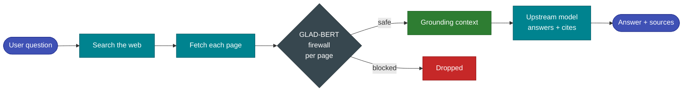

# Live Web Search

Geodesia G-1 can answer a chat turn from the **live internet**. When web search is enabled and a request asks for it, the gateway searches the web, **screens every page through the GLAD-BERT firewall**, keeps only the safe pages as grounding context, and then answers from them — citing the sources. Blocked pages (prompt-injection, manipulation, or unsafe content) are never shown to the model.

!!! abstract "Why it's safe by default"
    The web is the single richest source of [prompt-injection](detection-axes.md) attacks. Every fetched page is scored on the **`rag_jailbreak`** (context-injection firewall), **`answer_safety`**, **`prompt_safety`** and **`jailbreak`** axes using the model's calibrated thresholds *before* a single token reaches the upstream model. A page that trips any axis is dropped, so a poisoned page can neither hijack the prompt nor surface harmful content in the answer. Ordinary informative pages score low and pass through (low false-positive).

---

## How it works



1. **Search** — the gateway queries a search provider (see below).
2. **Fetch** — each result page is downloaded and its readable text extracted (scripts/nav/boilerplate stripped).
3. **Screen** — each page is scored on the firewall axes. A page is **blocked** if it trips `rag_jailbreak`, `answer_safety`, `prompt_safety`, or `jailbreak`.
4. **Ground** — the surviving safe pages become the grounding context (verified again by the normal `halluc_context` pass), and the model answers from them with `Source 1`, `Source 2`, … citations.
5. **Stream events** — in the chat UI you see, in real time, which pages were *read* vs *blocked* and **why**.

---

## Search providers

| Provider | Key needed | When used | Notes |
|---|---|---|---|
| **Tavily** *(recommended)* | yes | when a Tavily API key is configured | Reliable, rate-limit-free, returns clean extracted page content + an optional synthesised answer that nails factual lookups (prices, dates, names). |
| **DuckDuckGo** *(fallback)* | no | when no key is set, or Tavily errors | Free and key-less, but the public HTML endpoint is throttled and can intermittently return nothing. Fine for demos; not for production load. |

The provider is chosen automatically: **if a Tavily key is present, Tavily is used; otherwise DuckDuckGo.** If a Tavily call fails for any reason, the gateway transparently falls back to DuckDuckGo rather than failing the whole feature.

---

## Setting it up with a Tavily API key

### 1. Get a Tavily key

Create a free account at **[tavily.com](https://tavily.com)** and copy your API key — it looks like `tvly-xxxxxxxxxxxxxxxxxxxx`. The free tier is enough for evaluation; paid tiers raise the monthly search quota.

### 2. Provide the key to the gateway

There are **three** ways to configure the key. They are checked in this precedence order:

=== "A. From the UI (recommended)"

    In **G-1 Studio → Settings → Web search**, paste the key into the **Tavily API key** field and click **Save**.

    - The key is stored **out-of-band on the server** (a `0600` file, never in the image, env, git, or the API response).
    - After saving, the panel shows a masked hint (e.g. `tvly-ab…wxyz`) and a **Premium key set** badge. You can **Remove** it at any time.
    - This is the right path for a running container or a customer install — no restart needed.

    !!! note
        If the key was set via the environment at deploy time, the UI field is **locked** and shows *"configured via the server environment and cannot be changed here"* — the env var always wins (see option B).

=== "B. Environment variable"

    Set the key when starting the gateway. This is best for automated / IaC deployments and **takes precedence over a UI-set key**:

    ```bash
    GW_WEBSEARCH_API_KEY=tvly-xxxxxxxxxxxxxxxxxxxx \
      python -m glad_minimal.gateway.geodesia_gateway --host 0.0.0.0 --port 8800 ...
    ```

    `TAVILY_API_KEY` is accepted as an alias. In Docker Compose, add it to your `.env` file:

    ```dotenv
    GW_WEBSEARCH_API_KEY=tvly-xxxxxxxxxxxxxxxxxxxx
    ```

=== "C. Key file"

    Drop the key into a file the gateway reads at request time. The default path lives under the container's writable `var/` dir; override it with `GW_WEBSEARCH_KEY_FILE`:

    ```bash
    mkdir -p /app/var
    printf '%s' 'tvly-xxxxxxxxxxxxxxxxxxxx' > /app/var/websearch_tavily.key
    chmod 600 /app/var/websearch_tavily.key
    ```

    This is what the UI writes under the hood, and it survives restarts as long as the `var/` volume is persisted.

### 3. (Optional) tune the provider

Force a provider or adjust limits with the [environment variables](#environment-variables) below. Leaving everything unset gives the sensible defaults (Tavily when a key exists, 5 results, screen 6 pages).

### 4. Use it

The feature is **on by default** (`GW_WEBSEARCH_ENABLED=1`). Enable it per request:

- **In the chat UI** — toggle **Web search** on, then ask your question.
- **Via the API** — set `web_search: true` on the chat request:

```bash
curl -s http://localhost:8800/v1/chat/completions \
  -H "Content-Type: application/json" \
  -d '{
    "model": "my-model",
    "stream": true,
    "web_search": true,
    "messages": [{"role": "user", "content": "What were the headline announcements at the latest Apple event?"}]
  }'
```

Confirm the key is live without sending a chat:

```bash
curl -s http://localhost:8800/v1/glad/websearch/config
# {"enabled": true, "provider": "tavily", "has_key": true, "key_hint": "tvly-ab…wxyz", "key_source": "file", "env_locked": false}
```

---

## Settings API

The same panel the UI uses is exposed for scripting. The key is **never returned in clear** — only a masked hint.

| Method · Path | Purpose |
|---|---|
| `GET /v1/glad/websearch/config` | Report `enabled`, `provider`, `has_key`, `key_hint`, `key_source` (`env` / `file` / `none`), `env_locked`. |
| `POST /v1/glad/websearch/config` | Body `{"api_key": "tvly-…"}` to set/replace the key; `{"api_key": ""}` to remove it. Returns `409` if a key is locked by the environment. |

---

## Streaming research events

When `stream: true`, the gateway emits research events before the answer so the UI can narrate the search:

| Event | Meaning |
|---|---|
| `search_started` | The query was sent; carries the `provider` actually used. |
| `page_found` | A result URL/title was returned by the search. |
| `page_read` | The page passed the firewall and is grounding the answer (carries per-axis scores + an excerpt). |
| `page_blocked` | The page tripped a firewall axis — carries `axes`, `dominant`, and a human-readable `reason`. |
| `page_skipped` | The page could not be fetched (anti-bot 403, timeout, non-HTML). |
| `search_done` | Summary counts: `found`, `read`, `blocked`. |

If the search returns nothing usable (engine rate-limited, all pages unfetchable, or all blocked), the gateway instructs the model to answer from its own knowledge and append a one-line note that live results weren't available — rather than emitting a flat *"I cannot search the web"* refusal.

---

## Environment variables

| Variable | Default | Description |
|---|---|---|
| `GW_WEBSEARCH_ENABLED` | `1` | Master switch. `1` = available; `0` = the `web_search` flag is a no-op. |
| `GW_WEBSEARCH_API_KEY` | — | Tavily API key. **Wins over a UI/file-set key.** `TAVILY_API_KEY` is an accepted alias. |
| `GW_WEBSEARCH_KEY_FILE` | `/app/var/websearch_tavily.key` | Path to the out-of-band key file (what the UI writes). |
| `GW_WEBSEARCH_PROVIDER` | auto | Force `tavily` or `duckduckgo`. Default: `tavily` if a key is present, else `duckduckgo`. |
| `GW_WEBSEARCH_MAX_RESULTS` | `5` | Number of search results requested. |
| `GW_WEBSEARCH_MAX_READ` | `6` | Maximum number of safe pages used as grounding context. |
| `GW_WEBSEARCH_TIMEOUT` | `12` | Per-request HTTP timeout (seconds) for search + page fetches. |
| `GW_WEBSEARCH_SCREEN_CHARS` | `4000` | Chars of each page text screened by the firewall (head, where injections sit). |
| `GW_WEBSEARCH_GROUND_CHARS` | `2200` | Chars of each safe page kept as grounding context. |
| `GW_WEBSEARCH_RJ_THR` | calibrated | Override the `rag_jailbreak` firewall threshold for page screening. Leave unset to use the model's per-axis calibrated threshold. |

!!! tip "Self-contained — no new dependencies"
    Web search uses only `httpx` + `bs4`, already shipped with the gateway. Tavily is reached over HTTPS; DuckDuckGo needs no key. The Tavily key is the **only** secret involved and is never persisted into the image.
