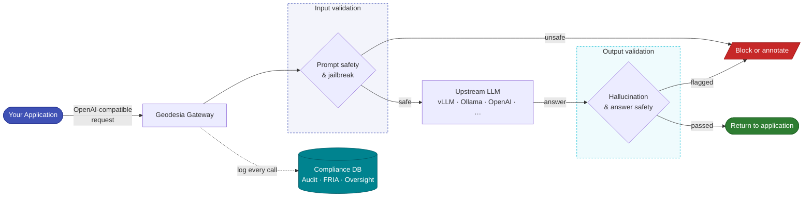

<h1>Geodesia G-1</h1>

The AI Validation Gateway — hallucination detection, safety enforcement, and regulatory compliance in a single drop-in layer.

  🛡️ 6-Axis Detection
  ⚖️ EU AI Act Ready
  🔌 OpenAI Compatible
  📋 13 Regulatory Frameworks
  🔍 Causal Explainability

# Welcome to Geodesia G-1

**Geodesia G-1** is a **validating gateway** that sits in front of any large language model (LLM) and provides a comprehensive quality and compliance layer. It is fully **OpenAI-compatible** — your existing application sends requests to Geodesia G-1 exactly as it would to OpenAI, and the gateway forwards them to your chosen underlying model (vLLM, Ollama, SGLang, OpenAI, TensorRT-LLM, and others) after enriching both the input and output with safety and reliability signals.

The platform is now **Application-oriented** — with **G-1 Studio**, one shared LLM and GLAD-BERT detector can serve many isolated Applications, each with its own policy, calibration, RAG collection, compliance posture, and cost center.

You do not need to retrain your model. You do not need to change your application code. You plug Geodesia G-1 in, and your LLM immediately gains:

- **Hallucination detection** — five independent signals that tell you whether the model's answer is grounded in the provided context or is a fabrication.
- **Safety enforcement** — real-time prompt screening and answer inspection to block unsafe, harmful, or jailbreak requests before they reach the model or the user.
- **Regulatory compliance** — a full audit trail, EU AI Act impact assessments, GDPR data retention, kill-switch, human oversight escalation, and more — across 13 global frameworks.
- **Causal explainability** — token-level attribution that shows exactly *which* words in the input caused the model's output, with no access to model internals required.

🌐
<h3>Any LLM, Any Provider</h3>

Works with vLLM, SGLang, TensorRT-LLM, Ollama, OpenAI, and any OpenAI-compatible endpoint. Switch backends from the UI without restarting.

🔬
<h3>6-Axis Detection</h3>

Context faithfulness, closed-book fabrication, prompt safety, answer safety, jailbreak, and <code>rag_jailbreak</code> (RAG / context-injection firewall) — each scored independently with calibrated thresholds.

📚
<h3>Knowledge Base / RAG</h3>

Upload PDFs, Word documents, slides, and more. Geodesia retrieves relevant passages and verifies claim-by-claim that the answer stays within the documents.

🏢
<h3>G-1 Studio</h3>

Multi-Application platform — one LLM + GLAD-BERT serves many isolated Applications, each with its own policy, calibration, RAG, compliance posture, and <strong>cost center / FinOps</strong> budget.

⚖️
<h3>13 Regulatory Frameworks</h3>

EU AI Act, GDPR, ISO 42001, NIST AI RMF, California SB 942, Italy Law 132/2025, Canada AIDA, Brazil 2338, UK DUAA 2025, China GB 45654, and more.

📊
<h3>Live Compliance Dashboard</h3>

Real-time bar charts of passed, blocked, hallucinated, and unsafe calls. FRIA dossier generation for the EU AI Act. Deployer transparency manual in one click.

🔑
<h3>Cryptographic Audit Chain</h3>

Every inference is hashed and chained (Merkle-style) into an append-only ledger. Run a single API call to prove no record has been tampered with.

---

## How It Works

Every request flows through input validation → the LLM you choose → output validation, with each call written to the compliance ledger.

Every chat message goes through this pipeline:

1. **Input validation** — the prompt and conversation history are scored across prompt safety and jailbreak detection axes. If a threshold is exceeded in blocking mode, the request is refused before the model sees it.
2. **Context injection** — if you supplied a grounding context (or uploaded documents to the knowledge base), it is injected into the upstream request.
3. **Generation** — the upstream LLM produces a response. For streaming requests, Geodesia monitors every 32 tokens (configurable cadence) and can halt generation mid-stream if dangerous content emerges.
4. **Output validation** — the completed answer is scored for hallucination and unsafe content. RAG answers additionally go through claim-level citation verification.
5. **Compliance logging** — the call is written to the audit database, watermarked, and linked to the running hash chain.
6. **Response delivery** — the original OpenAI-compatible response is returned with an additional `geodesia` field containing the full detection payload.

---

## Quick Navigation

| I want to… | Go to… |
|---|---|
| Connect my first LLM backend | [Upstream Backends](gateway/backends.md) |
| Understand the detection axes | [Detection Axes](gateway/detection-axes.md) |
| Set up multiple Applications | [G-1 Studio](studio/index.md) |
| Track cost & budgets | [Cost & FinOps](studio/cost.md) |
| Call the chat endpoint | [Chat API](gateway/chat-api.md) |
| Upload documents for RAG | [Knowledge Base](rag/index.md) |
| Set up compliance for the EU AI Act | [FRIA](compliance/fria.md) |
| Configure detection thresholds | [Detection Thresholds](reference/thresholds.md) |
| See all environment variables | [Environment Variables](configuration/env-vars.md) |
| Understand the response format | [API Response Format](reference/response-format.md) |
| Run the system | [Quick Start](quickstart.md) |
