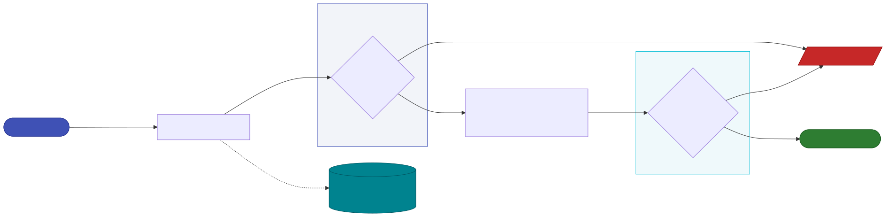

<h1>Geodesia G-1</h1>

The AI Validation Gateway — hallucination detection, safety enforcement, and regulatory compliance in a single drop-in layer.

  🛡️ 9-Axis Detection
  🎙️ Realtime Voice Guard
  🔌 MCP Security Layer
  🔍 Causal Explainability
  ⚖️ EU AI Act Ready
  📋 13 Regulatory Frameworks

# Welcome to Geodesia G-1

**Geodesia G-1** is a **validating gateway** that sits in front of any large language model (LLM) and provides a comprehensive quality and compliance layer. It is fully **OpenAI-compatible** — your existing application sends requests to Geodesia G-1 exactly as it would to OpenAI, and the gateway forwards them to your chosen underlying model (vLLM, Ollama, SGLang, OpenAI, TensorRT-LLM, and others) after enriching both the input and output with safety and reliability signals.

The platform is now **Application-oriented** — with **G-1 Studio**, one shared LLM and G1-Hummingbird detector can serve many isolated Applications, each with its own policy, thresholds, RAG collection, compliance posture, and cost center.

You do not need to retrain your model. You do not need to change your application code. You plug Geodesia G-1 in, and your LLM immediately gains:

- **Hallucination detection** — independent, separately calibrated signals that tell you whether the model's answer is grounded in the provided context or is a fabrication.
- **Safety enforcement** — real-time prompt screening and answer inspection to block unsafe, harmful, or jailbreak requests before they reach the model or the user.
- **Regulatory compliance** — a full audit trail, EU AI Act impact assessments, GDPR data retention, kill-switch, human oversight escalation, and more — across 13 global frameworks.
- **Causal explainability** — token-level attribution that shows exactly *which* words in the input caused the model's output, with no access to model internals required — painted as a [heatmap on the text](g1-proxy/causal-xai.md#how-it-works-visualized).
- **Realtime voice guard** — a streaming-Whisper layer in front of the detector screens *spoken* jailbreaks and unsafe prompts as they are said, and brakes mid-sentence.
- **MCP security** — starting the proxy starts an [MCP security layer](mcp/index.md) that vets every tool description, tool-call argument and tool result before an agent can act.
- **Token & cost control** — off-topic requests are refused before the upstream call (zero tokens billed) and easy prompts are [routed to a cheaper model](g1-proxy/cost-control.md) than hard ones, from the same detector pass.
- **A security policy that evolves with you** — [Policy Lens](studio/policy-lens.md) simulates a threshold change on your own real traffic before you apply it, and every human correction feeds back into the detector.

🌐
<h3>Any LLM, Any Provider</h3>

Works with vLLM, SGLang, TensorRT-LLM, Ollama, OpenAI, and any OpenAI-compatible endpoint. Switch backends from the UI without restarting.

🔬
<h3>9-Axis Detection</h3>

<strong>G1-Hummingbird</strong> scores context faithfulness, closed-book fabrication, prompt safety, answer safety, jailbreak, <code>rag_jailbreak</code> (context-injection firewall), profanity, out-of-scope and prompt complexity — nine independent axes, calibrated thresholds, <strong>one forward pass</strong>.

💸
<h3>Token &amp; Cost Control</h3>

Two axes that pay for themselves: <a href="g1-proxy/cost-control/"><code>out_of_scope</code></a> refuses off-topic traffic <em>before</em> the upstream call (zero tokens billed), and <code>prompt_complexity</code> routes easy prompts to the cheap model and hard ones to the capable one — no extra latency, no extra model call.

🎚️
<h3>Policy Lens</h3>

Security is relative to <em>your</em> policy. <a href="studio/policy-lens/">Simulate a threshold change</a> against your own real traffic — exactly which requests would flip, and which flips your reviewers already confirmed — then apply it with one click and a hot reload.

🎙️
<h3>Realtime Voice Guard</h3>

A streaming <strong>Whisper</strong> layer (sliding window · LocalAgreement-2) transcribes speech incrementally and re-scores it on the input axes — a <a href="g1-proxy/audio-input/">brake on the microphone</a> that stops spoken jailbreaks mid-sentence. <code>tiny</code> baked in, real-time on CPU.

🔌
<h3>MCP Security Layer</h3>

Starting G1-Proxy starts an <a href="mcp/">MCP security gateway</a>: G1-Hummingbird vets every tool description, tool-call argument and tool <em>result</em> — stopping tool poisoning, rug-pulls, indirect injection and exfiltration before an agent acts.

🔍
<h3>Causal Explainability</h3>

<strong>Deterministic</strong> <a href="g1-proxy/causal-xai/#how-it-works-visualized">token-level attribution</a> painted as a heatmap on the answer — DCA and MuPAX&nbsp;LLM over the detector, no upstream-model internals, no gradients, no sampling. Shows the one token that caused the flag, and proves it by removing it.

🪡
<h3>Thinking Levels</h3>

A per-request dial — <code>thinking_level</code> <code>0</code>–<code>3</code> — that buys a stricter verdict on borderline or high-stakes turns, up to <strong>MAX</strong> at level 3. Off by default; zero overhead until requested.

📚
<h3>Knowledge Base / RAG</h3>

Upload PDFs, Word documents, slides, and more. Geodesia retrieves relevant passages and verifies claim-by-claim that the answer stays within the documents.

🏢
<h3>G-1 Studio</h3>

Multi-Application platform — one LLM + G1-Hummingbird serves many isolated Applications, each with its own policy, thresholds, RAG, compliance posture, and <strong>cost center / FinOps</strong> budget.

⚖️
<h3>13 Regulatory Frameworks</h3>

EU AI Act, GDPR, ISO 42001, NIST AI RMF, California SB 942, Italy Law 132/2025, Canada AIDA, Brazil 2338, UK DUAA 2025, China GB 45654, and more.

📊
<h3>Live Compliance Dashboard</h3>

Real-time bar charts of passed, blocked, hallucinated, and unsafe calls. FRIA dossier generation for the EU AI Act. Deployer transparency manual in one click.

🔑
<h3>Cryptographic Audit Chain</h3>

Every inference is hashed and chained (Merkle-style) into an append-only ledger. Run a single API call to prove no record has been tampered with.

---

## How It Works

{: .diagram }

Every request flows through input validation → the LLM you choose → output validation, with each call written to the compliance ledger.

Every chat message goes through this pipeline:

1. **Input validation** — the prompt and conversation history are scored across prompt safety and jailbreak detection axes. If a threshold is exceeded in blocking mode, the request is refused before the model sees it. **Spoken** input is transcribed by a [streaming Whisper layer](g1-proxy/audio-input.md) and scored on the same axes, mid-utterance.
2. **Context injection** — if you supplied a grounding context (or uploaded documents to the knowledge base), it is injected into the upstream request.
3. **Generation** — the upstream LLM produces a response. For streaming requests, Geodesia monitors every 32 tokens (configurable cadence) and can halt generation mid-stream if dangerous content emerges.
4. **Output validation** — the completed answer is scored for hallucination and unsafe content. RAG answers additionally go through claim-level citation verification.
5. **Compliance logging** — the call is written to the audit database, watermarked, and linked to the running hash chain.
6. **Response delivery** — the original OpenAI-compatible response is returned with an additional `geodesia` field containing the full detection payload.

---

## Quick Navigation

| I want to… | Go to… |
|---|---|
| **Install Geodesia G-1 (one command)** | [Installer (install.sh)](installer.md) |
| Configure & operate the stack | [Installation & Configuration](installation.md) |
| Create an API key & make my first call | [Developer Quickstart](developer-quickstart.md) |
| Connect my first LLM backend | [Upstream Backends](g1-proxy/backends.md) |
| Understand the detection axes | [Detection Axes](g1-proxy/detection-axes.md) |
| **Cut my token bill** | [Token & Cost Control](g1-proxy/cost-control.md) |
| **Tune a threshold on my own traffic** | [Policy Lens](studio/policy-lens.md) |
| **Guard realtime voice input** | [Audio Input (Realtime Voice)](g1-proxy/audio-input.md) |
| **See how explainability works** | [Causal XAI — visualized](g1-proxy/causal-xai.md#how-it-works-visualized) |
| Secure MCP tools & agents | [MCP Security Gateway](mcp/index.md) |
| Set up multiple Applications | [G-1 Studio](studio/index.md) |
| Track cost & budgets | [Cost & FinOps](studio/cost.md) |
| Call the chat endpoint | [Chat API](g1-proxy/chat-api.md) |
| **See every G1-Proxy endpoint** | [G1-Proxy API Map](g1-proxy/api-reference.md) |
| **See every G-1 Studio endpoint** | [Studio API Map](studio/api-reference.md) |
| **Find the API behind a Studio UI control** | [UI Component Reference](studio/ui-reference.md) |
| Upload documents for RAG | [Knowledge Base](rag/index.md) |
| Set up compliance for the EU AI Act | [FRIA](compliance/fria.md) |
| Configure detection thresholds | [Detection Thresholds](reference/thresholds.md) |
| See all environment variables | [Environment Variables](configuration/env-vars.md) |
| Understand the response format | [API Response Format](reference/response-format.md) |
| Run the system | [Quick Start](quickstart.md) |
