# MCP Security Gateway

The **Model Context Protocol (MCP)** lets an AI host (Claude Desktop, an IDE, an agent runtime) connect to external **tools**, **resources** and **prompts** over JSON-RPC. That power is also a new attack surface: the model no longer just *answers* — it *calls tools*, *reads untrusted data*, and *acts*. The MCP specification is explicit that it **cannot enforce security at the protocol level** and leaves consent, tool safety and data-egress control to the implementer.

Geodesia G-1 fills exactly that gap. Starting G1-Proxy starts an **MCP security layer** alongside the LLM chat gateway: the same always-on [GLAD-Hummingbird](../gateway/detection-axes.md) detector (and the optional [GLAD-Tapestry](../gateway/deep-scan.md) deep scan) now vets **every MCP surface** — tool descriptions, tool-call arguments, tool/resource *results* and final answers — before they can act, and explains *why* it flagged something with [Causal XAI](../gateway/causal-xai.md).

!!! abstract "One sentence"
    Geodesia turns "trust the tool" into a **measurable, per-axis, per-tool, per-application verdict** — with an optional signed certificate — that any MCP host can consult or that the gateway can enforce inline.

---

## The threats it stops

| MCP threat | What it is | Geodesia control |
|---|---|---|
| **Indirect prompt injection** | hidden instructions inside a tool result / file the model reads | `rag_jailbreak` axis (axis-6) + `prompt_safety` on the result content |
| **Tool poisoning** | malicious instructions hidden in a tool *description* or schema | scan every tool description on `tools/list` |
| **Rug-pull** | a server changes a tool's definition *after* you approved it | HMAC toolset signing → any change is blocked until re-approved |
| **Exfiltration / confused deputy** | read untrusted content, then send it to an attacker domain | deterministic intent policy: *taint ∧ egress-tool ∧ new-domain → block* |
| **Ungrounded answers** | the agent fabricates beyond what the tools returned | grounding verdict against the tool results |

---

## How a surface maps to a detection axis

Each MCP message carries untrusted content in a specific *role*. Geodesia places it in the slot the matching [axis](../gateway/detection-axes.md) reads:

| MCP surface | Untrusted content | Region | Primary axes |
|---|---|---|---|
| `tools/list` description / schema | tool poisoning / rug-pull | prompt + context | `jailbreak`, `prompt_safety`, `rag_jailbreak` (+ signature diff) |
| `tools/call` **arguments** | model intent / exfil payload | answer | `answer_safety`, `jailbreak` + intent policy |
| `tools/call` / `resources/read` **result** | indirect injection | context | `rag_jailbreak`, `prompt_safety` (+ deep scan) |
| final answer (post-tool) | fabrication / unsafe output | answer | `halluc_context`, `answer_safety`, `halluc_closedbook` |

---

## Three deployment modalities

Geodesia exposes MCP security in three complementary forms. They share one scoring core, so a verdict is identical however you reach it.

{: .diagram }

-   :material-shield-check: **[A · Guard Server](guard-server.md)**

    G1-Proxy *is* an MCP server whose tools are the detectors (`glad.verify_tool_call`, `glad.scan_resource`, `glad.scan_toolset`, `glad.verify_answer`, `glad.analyze`, `glad.explain`). Any host calls them as policy tools. Advisory.

-   :material-transit-connection-variant: **[B · Interceptor](interceptor.md)**

    G1-Proxy sits inline between host and downstream MCP server. Every message is scanned **before** it re-enters the model. Poisoned tools are stripped, exfiltration is blocked. Enforcing.

-   :material-message-text: **[C · Tool-aware chat](chat-aware.md)**

    The existing OpenAI-compatible `/v1/chat/completions` learns to read the `tools` list and emitted `tool_calls`, blocking poisoned tools and exfiltration in-band. No new transport.

-   :material-tune: **[Policy: per-app · per-axis · per-tool](policy.md)**

    Configure enforcement at three levels from G-1 Studio — per Application, per GLAD axis, and per individual tool (trust / block / egress).

---

## Always-on, configurable

The MCP layer is **on by default** and configured from **G-1 Studio → Settings → MCP** (platform-wide: ports, modalities, deep-scan) and **Applications → *app* → MCP** (per-application enforcement policy). When disabled, chat behaviour is byte-identical to a gateway without MCP.

| Port (default) | Service |
|---|---|
| `8800` | LLM chat gateway (`/v1/chat/completions`) — Modality C runs here |
| `8810` | MCP **Guard Server** (`/mcp`) — Modality A |
| per-server | MCP **Interceptor** — Modality B (one listen port per brokered downstream server) |

See [Guard Server](guard-server.md) to connect your first host.
