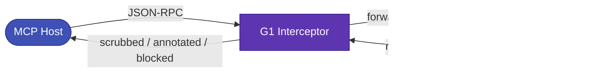

# Interceptor (Modality B)

The **Interceptor** is the *enforcing* modality. G1-Proxy sits as a trusted man-in-the-middle between an MCP host and a downstream MCP server. Every JSON-RPC message is scanned **before** its content can re-enter the model's context — so indirect injection and tool poisoning are stopped at the source, not merely reported.



---

## What it scans

| Intercepted message | Action |
|---|---|
| `tools/list` **result** | `scan_toolset` → poisoned tools are **dropped** from the list; rug-pulls are blocked. Surviving tools are annotated and their signatures approved. |
| `tools/call` / `resources/read` **result** | `scan_resource` → a flagged result **taints the session**; depending on the action it is annotated (`_meta.glad`) or withheld. |
| `tools/call` **request** | `verify_tool_call` → a tainted session calling an egress tool to a new domain is **blocked before it reaches the server**. |

A blocked message becomes a JSON-RPC error so the malicious content never reaches the model:

```jsonc
{ "jsonrpc": "2.0", "id": 7,
  "error": { "code": -32001, "message": "GLAD_BLOCKED: tool call refused",
             "data": { "reasons": ["egress_after_untrusted_read"], "surface": "tool_args" } } }
```

Annotated (non-blocked) messages carry a `_meta.glad` block so a host can still see the verdict:

```jsonc
"_meta": { "glad": { "verdict": "warn", "reasons": ["rag_jailbreak"], "rag_jailbreak_p": 0.61 } }
```

!!! note "Session taint"
    The Interceptor tracks taint and approved tool hashes **per MCP session** (`Mcp-Session-Id`). Reading one poisoned result this session is what arms the exfiltration block on a *later* tool call — the temporal correlation a prompt-only filter cannot see.

---

## Configuring an interceptor

Interceptors are configured via **env/CLI only** — never the remote config API — because a downstream spec may carry a stdio spawn command (a subprocess is an RCE vector). Each entry brokers one downstream server on its own listen port:

```jsonc
// mcp_interceptors (in the gateway config / env)
[
  { "name": "github-broker",
    "listen_port": 8901,
    "upstream_url": "http://127.0.0.1:8950/mcp",
    "transport": "http",
    "application_id": "support-bot",          // optional: apply this app's policy
    "actions": { "tool_description": "block", // optional per-surface overrides
                 "tool_result": "annotate",
                 "tool_args": "policy" } }
]
```

Point your host at the interceptor (`http://localhost:8901/mcp`) instead of the real server. Studio → Settings → MCP lists every active interceptor (read-only).

---

## Enforcement actions

Each surface has an action that decides what a flagged verdict *does*:

| Action | Tool description | Tool/resource result | Tool-call arguments |
|---|---|---|---|
| `block` | drop the tool | withhold the result | refuse the call |
| `annotate` | keep + `_meta.glad` | keep + `_meta.glad`, taint session | allow + annotate |
| `off` | skip | skip | skip |
| `policy` | — | — | run the exfiltration intent policy |

These defaults, plus per-axis and per-tool refinements, are set per Application — see [Policy](policy.md).
