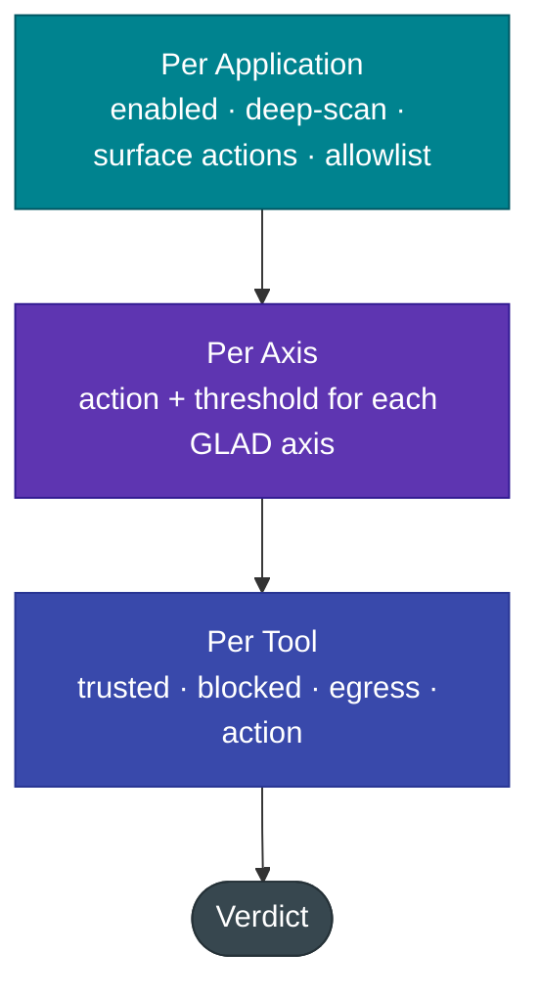

# MCP Policy — per-App · per-Axis · per-Tool

MCP enforcement is configured at **three levels of granularity**, all from G-1 Studio. Platform-wide settings (ports, modalities, deep-scan availability) live in **Settings → MCP**; everything that decides *what gets blocked* is **per Application**, under **Applications → *app* → MCP**.



Because policy is per Application, scoring uses that Application's **bound model**, so the per-model SLEDGE/axis calibration applies to MCP exactly as it does to chat.

---

## 1 · Per Application

| Setting | Meaning |
|---|---|
| **enabled** | MCP guard active for this Application |
| **deep_scan** | escalate this app's MCP scans to [GLAD-Tapestry](../gateway/deep-scan.md) |
| **scan tool descriptions / results · verify args** | toggle each scan family |
| **toolset signing** | anti rug-pull (approved-hash diff) |
| **action_tool_description / _result / _args** | the default action per surface (`block` / `annotate` / `off` / `policy`) |
| **domain allowlist** | trusted egress destinations for the exfiltration policy |
| **egress tools** | extra tool-name substrings to treat as data sinks |

## 2 · Per Axis

Override the action and threshold for each of the six GLAD axes *within MCP scans*. The table in the MCP tab has one row per axis:

| Field | Values | Effect |
|---|---|---|
| **action** | `default` · `block` · `annotate` · `off` | `default` = use the surface action; `annotate` downgrades a would-be block to a warning; `off` silences that axis |
| **threshold** | `0…1` (blank = calibrated default) | the decision threshold for that axis in MCP scoring |

!!! example "Per-axis in action"
    With `jailbreak = annotate`, the same poisoned tool description that an unmodified app **blocks** is instead returned as a **warn** for this Application — useful when an internal toolset legitimately uses imperative language.

## 3 · Per Tool

Add rules keyed by tool name. Per-tool always wins over per-axis and surface policy.

| Rule | Effect |
|---|---|
| **trusted** | skip scanning this tool entirely — *but a rug-pull is still caught* |
| **blocked** | always block this tool |
| **egress** | `auto` / `yes` / `no` — force (or clear) treating it as a data sink for the exfiltration policy |
| **action** | override this tool's verdict (`block` / `annotate` / `off` / `policy`) |

!!! example "Per-tool in action"
    Mark your internal `kb.search` tool **trusted** so its imperative description never trips a flag, and mark a custom `my_uploader` tool **egress: yes** so it triggers the exfiltration block even though it isn't in the built-in sink list.

---

## The exfiltration intent policy

The `policy` action (default for tool-call arguments) blocks the OWASP *"read untrusted content, then send it to an unknown destination"* pattern. It fires only when **all three** hold:

```
prior_untrusted   (an untrusted tool/resource result was read this session/turn)
∧ egress tool     (the call targets a sink: http.post, send_email, fs.write, db.write, …, or a per-tool egress=yes)
∧ new destination (the destination domain is not in the Application's allowlist)
→ BLOCK  (reasons: egress_after_untrusted_read, new_destination_domain)
```

This is the temporal correlation a content-only classifier misses: the arguments alone look benign — it is the *sequence* (tainted read → egress to a new domain) that is malicious.

---

## Anti rug-pull (toolset signing)

When **toolset signing** is on, Geodesia stores an HMAC of each approved tool definition (`name ‖ description ‖ inputSchema`). On every reconnect or `notifications/tools/list_changed`, the hash is recomputed; any change to a previously-approved tool is reported as a **rug-pull** and the tool is blocked until re-approved — even if its new content scores clean, and even if the tool is marked **trusted**.

---

## Configuration summary

| Where | Scope |
|---|---|
| **Studio → Settings → MCP** | platform: enable, Guard Server port, chat-aware, deep-scan, listening endpoints |
| **Studio → Applications → *app* → MCP** | per-app surface actions, **per-axis** table, **per-tool** rules, allowlist, egress |
| env/CLI | interceptors (`mcp_interceptors`), deep-scan model paths — security-sensitive, not remotely settable |

See [Detection Axes](../gateway/detection-axes.md) for what each axis detects and [Enforcement Modes](../gateway/enforcement-modes.md) for how block vs annotate behaves end-to-end.
