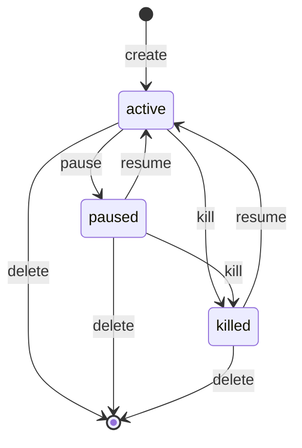

# Managing Applications

In Geodesia G-1 **Studio**, an **Application** is the unit you manage: one upstream LLM with GLAD-BERT in the middle, owning its own **policy** (6-axis thresholds + enforcement), **calibration profile**, **RAG knowledge base**, **cost center**, and **governance** record. You select the active Application from the topbar App switcher, and every other surface — Dashboard, Oversight, FRIA, Reports, Knowledge Base, Cost — scopes to it.

Studio is a backward-compatible evolution of the single-upstream gateway: an existing deployment surfaces as a single Application named `default`, with zero behaviour change.

!!! info "Two planes, one engine"
    Applications live on the **control plane** (`/v1/glad/apps/*` — Applications, orgs, keys, policy, cost, metrics). The **data plane** is chat: resolve the Application, score the 6 axes, route to the Application's LLM, then log and cost the call. See the [Control Plane API](control-plane-api.md) for the underlying routes.

---

## Lifecycle states

Every Application is in exactly one of three states, stored in the `status` column:

| State | Meaning | Effect on traffic |
|---|---|---|
| `active` | Normal operation. | Requests are scored and routed to the upstream. |
| `paused` | Temporarily halted. | Use to suspend an Application without losing its configuration, keys, or history. |
| `killed` | Hard-stopped (kill-switch). | The Application is retained for audit but treated as stopped. |

State transitions go through `set_status`, which only accepts `active`, `paused`, or `killed`. Pausing and resuming are the same operation with a different target state.

!!! warning "The `default` Application"
    The `default` Application is synthesised on first boot from your existing `runs/gateway_config.json` so a pre-existing single-upstream deployment keeps working unchanged. Treat it as your fallback Application — do **not** delete it. Deleting an Application also deletes all of its API keys.

---

## Configuration model

Each Application stores a validated `AppConfig` JSON document (`config_json`), versioned by `config_version` (incremented on every config update). The document has four sections — `binding`, `policy`, `cost`, `governance` — plus two top-level fields. Missing axes are always back-filled with the defaults, so the 6-axis contract always holds downstream.

| Top-level field | Type | Default | Meaning |
|---|---|---|---|
| `schema_version` | `int` | `1` | Config document schema version. |
| `calibration_profile` | `string` | `"default"` | Calibration profile id for this Application's thresholds (set to the model key when seeded). |
| `binding` | object | see below | Upstream LLM binding. |
| `policy` | object | see below | Detection policy: thresholds + enforcement + options. |
| `cost` | object | see below | Cost rates and budget (FinOps). |
| `governance` | object | see below | Compliance and human-oversight settings. |

### `binding` — the upstream LLM

| Field | Type | Default | Meaning |
|---|---|---|---|
| `upstream_type` | `string` | `"openai"` | Backend type. One of the allowed types below. |
| `base_url` | `string` | `""` | Base URL of the upstream (no trailing slash). |
| `model` | `string` | `""` | Model name to request from the upstream. |
| `region` | `string` \| `null` | `null` | Cloud region (e.g. for Bedrock / Vertex). |
| `api_key_ref` | `string` \| `null` | `null` | Reference to the upstream credential as `secret://…` — **never** a plaintext key. |
| `request_overrides` | `dict[str, float]` | `{}` | Per-request upstream parameter overrides (e.g. `temperature`). |
| `logprobs` | `string` | `"auto"` | Log-probability handling: `auto`, `require`, or `off`. |

**Allowed `upstream_type` values:** `openai`, `ollama`, `vllm`, `sglang`, `trtllm`, `bedrock`, `vertex`, `azure-openai`, `internal`.

!!! danger "Credentials are never stored in plaintext"
    `api_key_ref` holds a **reference**, not a secret: `secret://app/<name>`. The secrets provider resolves it at request time (environment variable → file → AWS Secrets Manager). Bedrock and Vertex use the host's IAM role / Application Default Credentials and need no key at all. The plaintext upstream key is never persisted in the Application config.

The `logprobs` setting governs the closed-book fabrication axis: `require` forces a logprob-capable path, `off` disables it, and `auto` (default) uses logprobs when the upstream offers them. See [Detection Axes](../gateway/detection-axes.md) for why `halluc_closedbook` depends on per-token log-probabilities.

### `policy` — detection thresholds and enforcement

The policy is scored across the **six** GLAD-BERT axes. Each axis has its own threshold (probability space, `0.0`–`1.0`) and its own enforcement mode.

| Field | Type | Default | Meaning |
|---|---|---|---|
| `thresholds` | `dict[str, float]` | see table | Per-axis flag threshold; a score `≥` threshold flags the axis. |
| `enforcement` | `dict[str, str]` | see table | Per-axis action: `block`, `annotate`, or `off`. |
| `block_input` | `bool` | `true` | If `true`, a flagged prompt is refused before the upstream is called. |
| `inject_system` | `bool` | `true` | If `true`, the Constitutional Intelligence system prompt is prepended to every request. |
| `ci_prompt_ref` | `string` | `"docs/G1_Constitutional_Prompt_Compact.md"` | Reference to the CI system prompt to inject. |
| `rag_collection` | `string` \| `null` | `null` | RAG knowledge-base collection bound to this Application. |
| `optional_detectors` | `dict[str, bool]` | `{causal_xai: false, self_consistency: false}` | Opt-in extra detectors. |
| `streaming_brake` | `dict` | `{enabled: true, cadence_tokens: 32}` | Mid-stream re-scoring: whether the brake is on and how often (in tokens) it fires. |

**Default thresholds** (`DEFAULT_THRESHOLDS` — serving-calibrated for gemma4-e2b at FPR ≈ 0.07, plus the `rag_jailbreak` firewall):

| Axis | Region | Default threshold |
|---|---|---|
| `prompt_safety` | prompt | `0.70` |
| `jailbreak` | prompt | `0.50` |
| `rag_jailbreak` | prompt / context | `0.05` |
| `halluc_context` | answer | `0.32` |
| `halluc_closedbook` | answer | `0.58` |
| `answer_safety` | answer | `0.90` |

**Default enforcement** (`DEFAULT_ENFORCEMENT`):

| Axis | Default enforcement |
|---|---|
| `prompt_safety` | `block` |
| `jailbreak` | `block` |
| `rag_jailbreak` | `block` |
| `halluc_context` | `annotate` |
| `halluc_closedbook` | `annotate` |
| `answer_safety` | `annotate` |

!!! note "Threshold direction"
    A **higher** threshold is more permissive (fewer flags); a **lower** threshold is stricter. The prompt-region axes default to `block` enforcement, while the answer-region hallucination/safety axes default to `annotate` so you can observe before you block. Validation rejects thresholds outside `[0, 1]`, unknown axis names, and enforcement modes other than `block` / `annotate` / `off`.

The two `optional_detectors` are off by default: `causal_xai` adds causal token attribution (see [Causal XAI](../gateway/causal-xai.md)), and `self_consistency` draws multiple samples to reduce closed-book fabrication false positives.

### `cost` — rates and budget (FinOps)

| Field | Type | Default | Meaning |
|---|---|---|---|
| `currency` | `string` | `"EUR"` | Currency for all rates and budgets. |
| `input_per_mtok` | `float` | `0.0` | Cost per **million input tokens**. |
| `output_per_mtok` | `float` | `0.0` | Cost per **million output tokens**. |
| `glad_compute_per_mtok` | `float` | `0.0` | Cost per million tokens for GLAD scoring compute. |
| `budget_month` | `float` | `0.0` | Monthly budget for this Application. |
| `alert_pct` | `list[float]` | `[0.8, 1.0]` | Budget-fraction alert points; **must be ascending**. |
| `on_budget_exceeded` | `string` | `"alert"` | Action when the budget is exceeded: `alert` or `block`. |
| `alert_recipients` | `list[string]` | `[]` | Addresses carried **inside** the budget alert/block webhook payload — never SMTP, never a URL. Your relay at the other end of `GEODESIA_ALERT_WEBHOOK` turns them into email / Slack / PagerDuty. See [Cost & Budget](cost.md). |

All rate fields must be `≥ 0`; `alert_pct` is rejected if not ascending; `on_budget_exceeded` must be `alert` or `block`. The cost rate is **snapshotted at call time** so historical costs stay stable when you later change rates.

!!! tip "FinOps engine"
    These fields feed the per-Application usage ledger, daily roll-ups, and budget forecasting. See [Cost & Budget](cost.md) for the FinOps engine and the forecasting models.

### `governance` — compliance and oversight

| Field | Type | Default | Meaning |
|---|---|---|---|
| `fria_id` | `string` \| `null` | `null` | Linked Fundamental Rights Impact Assessment record. |
| `applicable_laws` | `list[string]` | `["EU_AI_ACT", "GDPR"]` | Legal frameworks this Application reports against. |
| `retention_months` | `int` | `6` | Audit-data retention period in months. |
| `risk_classification` | `string` | `"high"` | EU-AI-Act-style risk class for this Application. |
| `human_oversight` | `dict` | `{auto_trigger: true, safety_threshold: 0.70, halluc_threshold: 0.75}` | Auto-escalation to human review. |

**Allowed `risk_classification` values** (`RISK_CLASSES`): `minimal`, `limited`, `high`, `unacceptable`, `unknown`.

The `human_oversight` object controls when a call is auto-escalated for human review: `auto_trigger` enables it, and `safety_threshold` / `halluc_threshold` set the scores above which a call is routed to the oversight queue. See [Human Oversight](../compliance/oversight.md) and [FRIA](../compliance/fria.md).

---

## API keys

Each Application has its own API keys. A key is the Application's **runtime identity on the data plane**: an `invoke` key sent as `Authorization: Bearer g1k_live_…` on a chat or RAG request now **routes that request to its Application and scopes** the request's policy, cost, quota, and compliance to it — even when no `X-Geodesia-App` header or `application_id` is supplied. (Previously an `invoke` key was control-plane-only — a read-only credential; it is now also the data-plane routing identity.) An explicit `application_id` / `X-Geodesia-App` still wins over the key. See [Data-plane routing](control-plane-api.md#data-plane-routing-header).

| Property | Value |
|---|---|
| Format | `g1k_live_…` (prefix `g1k_live_` + URL-safe random) |
| Storage | Only the **SHA-256 hash** is persisted (`key_hash`). |
| Preview | A non-reversible preview is stored: `g1k_***<last4>`. |
| Plaintext | Returned **exactly once**, at creation time. It is never stored and cannot be retrieved again. |
| Roles | `invoke` (call the Application) or `admin` (manage the Application). Defaults to `invoke`; an unknown role falls back to `invoke`. |
| Expiry | Optional `expires_at`; an expired key fails verification. |

!!! danger "Copy the key immediately"
    The plaintext `g1k_live_…` key is shown **once** when you create it. If you lose it, you cannot recover it — revoke the lost key and create a new one.

**Operations:**

- **Create** — generates a new key, returns the plaintext once along with `key_id`, `app_id`, `key_preview`, and `role`.
- **List** — returns key metadata (`key_id`, `key_preview`, `role`, `active`, `created_at`, `last_used_at`, `expires_at`) for an Application — never the plaintext or the hash.
- **Revoke** — sets `active = 0`. Revoked and expired keys fail verification immediately.

A request authenticates by presenting the plaintext key; verification hashes it, looks up the active, unexpired record, touches `last_used_at`, and resolves it to `{app_id, role}`. The full create/list/revoke routes are documented in the [Control Plane API](control-plane-api.md).

---

## Creating an Application from the UI

Open **Applications** (`ApplicationsView`) and click **New Application** to open the creation modal. The modal performs **live model discovery** against the upstream you choose, so you pick a real model instead of typing one:

| Upstream | Discovery source |
|---|---|
| Ollama | `GET /api/tags` |
| vLLM / OpenAI (and OpenAI-compatible) | `GET /v1/models` |
| Bedrock | Curated AWS Bedrock model catalog |
| Vertex | Curated Google Vertex model catalog |

Discovery is served by the control-plane endpoint **`POST /v1/glad/apps/upstream/models`**, which returns the model list and its `source` (or an `error` you can act on).

In the same modal you set the **cost** for the Application — `€/Mtok` for input and output tokens — so the cost center is configured from the start.

Once created, the Application opens to its detail view, organised into tabs:

| Tab | What you configure |
|---|---|
| **Model** | Upstream type, base URL, model, region, `logprobs`, and credential reference — with **live model discovery**, a **Test connection** probe, and **Calibrate closed-book** (see below). |
| **Policy** | The six-axis threshold sliders plus per-axis enforcement (`block` / `annotate` / `off`), `block_input`, CI injection, and the streaming brake. |
| **Cost & Budget** | Per-Mtok rates, monthly budget, alert percentages, and the budget-exceeded action. See [Cost & Budget](cost.md). |
| **Governance** | Applicable laws, risk classification, retention, FRIA link, and human-oversight thresholds. |
| **API Keys** | Create, list, and revoke the Application's `g1k_live_…` keys. |

Saving any tab validates the full `AppConfig`, bumps `config_version`, and takes effect on the next request.

### Read-only Overview, then edit with auto-save

The detail view opens on a **read-only Overview tab** — a safe summary of the Application's binding, policy, cost, and governance that you can't change by accident. To make changes, click **Modifica**, which switches to the editable settings tabs: **Model**, **Policy**, **Cost & Budget**, **Governance**, and **API Keys**.

There is **no "Save" button**. Every change in those tabs is **saved automatically**, debounced shortly after you stop editing — adjust a threshold slider, change the budget, edit `alert_recipients`, and it persists on its own. An inline status indicator shows where each edit stands: **"Saving…"** while the debounced write is in flight, then **"Saved ✓"** once it lands (and the underlying `config_version` bumps). Because saving is automatic, dependent UI — such as the Cost & Budget projection chart — redraws immediately against the new values.

### The Model tab: discover, test, calibrate

The editable **Model** tab (under **Modifica**) does more than hold the binding fields — it lets you bind to a real upstream model with confidence:

- **Live model discovery.** The **Model** field is an input backed by a `datalist`, so you can **pick a discovered model or type your own**. Models are discovered from the chosen upstream — Ollama (`/api/tags`), vLLM / OpenAI-compatible (`/v1/models`), or the curated Bedrock / Vertex catalogs — via `POST /v1/glad/apps/upstream/models`. Discovery runs **automatically and debounced** whenever you change the upstream type or the base URL (so a URL typed character-by-character only fires one query when you pause), and a **↻ discover** button re-runs it on demand. An inline hint shows how many models were found, the source, or an actionable error if the upstream couldn't be listed.

- **Test connection.** A **Test connection** button probes the bound upstream for **reachability** (with a latency reading) and runs a **logprob probe** that reports whether the **closed-book** axis is *available* or *unavailable* for that model — since `halluc_closedbook` depends on per-token log-probabilities. A reachable upstream also refreshes the discovered-model list.

- **Calibrate closed-book.** A **Calibrate closed-book** button re-fits the closed-book detector for *this specific generator model* (quick, logprob-based mode), streaming its progress log into the panel. Use it after binding to a new model so the closed-book threshold reflects that model's logprob behaviour.

!!! note "These controls are now per-Application"
    Test connection, model discovery, and closed-book calibration used to live in the **global** Settings → Gateway card. In Studio they are **per-Application**, on the Model tab, so each Application is discovered, tested, and calibrated against its own bound upstream.

### Where each setting lives: Applications vs. Settings

Studio splits configuration cleanly between the **per-Application** detail view and the **platform-wide** Settings page:

| Configured **per-Application** (Applications → **Modifica**, auto-saved) | Configured **platform-wide** (the **Settings** page) |
|---|---|
| Model binding (upstream, base URL, model, region, `logprobs`, credential ref) | Plan & license |
| Detection policy & per-axis thresholds, enforcement, `block_input`, CI injection, streaming brake | The platform **Gateway card** — the exposed API bind (host / port) and the numeric solver |
| Closed-book calibration | Appearance (theme) |
| RAG knowledge base | Provider identity |
| Cost rates, budget & governance | System (server health / version) |
| | Demo reset |

!!! info "Settings is platform-only"
    Anything specific to one Application — model, detection policy & thresholds, calibration, RAG, cost & governance — is set on that Application (and saved automatically). The global **Settings** page now keeps only **platform-wide** settings: plan & license, the platform gateway card (exposed API bind + numeric solver), appearance, provider identity, system, and demo reset.

---

## Free-tier limit

The number of Applications an Organization may create is capped by its license entitlement (`max_applications`). On the **free tier the cap is one Application**, so the **New Application** button is disabled once the `default` Application exists — you can still fully configure, key, and operate that one Application.

!!! info "Raising the cap"
    Lifting the limit (and unlocking additional Applications) is a licensing change. See [Licensing](licensing.md) for entitlement tiers and how `max_applications` is set.
