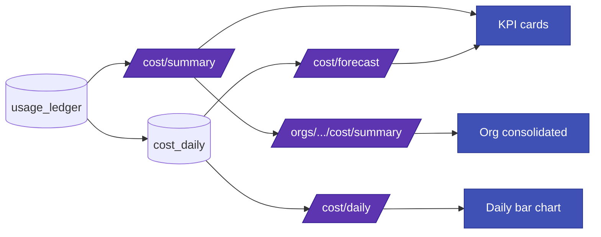

# Cost & FinOps

Every call that Geodesia G-1 logs also lands a **cost row**. The platform meters tokens into money at call time, rolls them up per day, tracks them against a monthly budget, and projects where you'll end the month — all per Application, with a consolidated view per organization.

This page explains how metering works, the three tables behind it, how budgets and alerts behave, the forecasting methods, the Cost API, and the **Cost & FinOps** UI.

!!! info "Where cost configuration lives"
    Rates, currency, budget and the over-budget policy are fields of an Application's `cost` config block. See [Applications → cost config fields](applications.md) for how to set them, and the [Control-Plane API](control-plane-api.md) for the full surface.

---

## How cost is metered

The data plane runs one **CostMeter** computation per logged gateway call, then writes a row through `CostStore.record_usage`. Two design choices make the numbers durable and reproducible.

### Rates are snapshotted at call time

The CostMeter is **stateless**. It reads the €/Mtok rates straight from the Application's `cost` config at the moment the call is metered and stores both the **rate** and the **resulting cost** on the ledger row.

!!! tip "Why snapshotting matters"
    Because the rate that applied to a call is frozen on its ledger row, **changing a price later never rewrites history**. Last month's spend stays exactly what it cost last month; only calls metered *after* the change pick up the new rate.

### Token counts: real usage first, estimate as fallback

Token counts come from the **upstream's reported usage** whenever the provider returns it:

- **OpenAI-compatible** upstreams (OpenAI, vLLM, SGLang, Azure OpenAI, internal) via `stream_options.include_usage` — the final stream chunk carries the real `prompt_tokens` / `completion_tokens`.
- **Ollama** via its `eval` counts.
- **Bedrock** and **Vertex** via provider usage metadata in the streamed response.

When the upstream returns no usage block, the gateway falls back to a transparent **~4-characters-per-token estimate** (`len(text) // 4`) for both prompt+context and the answer.

!!! note "Coverage is partial today"
    OpenAI / Ollama / Bedrock / Vertex report real usage; everything else uses the estimate. Estimated rows are still correct in structure — only the token counts are approximate.

### The cost formula

For a single call the CostMeter computes:

```text
cost_input  = prompt_tokens     / 1e6 * input_per_mtok
cost_output = completion_tokens  / 1e6 * output_per_mtok
cost_glad   = glad_tokens        / 1e6 * glad_compute_per_mtok   # optional
cost_total  = cost_input + cost_output + cost_glad
```

| Term | Source |
|---|---|
| `input_per_mtok` | App `cost.input_per_mtok` (€/Mtok for prompt tokens) |
| `output_per_mtok` | App `cost.output_per_mtok` (€/Mtok for completion tokens) |
| `glad_compute_per_mtok` | App `cost.glad_compute_per_mtok` — optional charge for Geodesia scoring compute (defaults to `0`) |
| `currency` | App `cost.currency` (default `EUR`) |
| `glad_tokens` | The gateway records `prompt_tokens + completion_tokens` as the GLAD-compute basis |

Negative rates are rejected at config validation; missing rates default to `0`, so an Application with no rates configured simply accumulates token counts at zero cost.

---

## The three tables

The cost engine adds three additive, idempotent SQLite/Postgres tables (DDL is `CREATE … IF NOT EXISTS`, safe to re-apply on an existing deployment).

### `usage_ledger` — one row per call

The immutable record of what each call cost, including the **rate snapshot**.

| Column | Type | Meaning |
|---|---|---|
| `call_id` | TEXT (PK) | Gateway call id; upsert key (re-recording the same call updates token/cost/blocked fields) |
| `application_id` | TEXT | Owning Application |
| `org_id` | TEXT | Owning organization |
| `ts` | TEXT | ISO-8601 UTC timestamp of the call |
| `model` | TEXT | Upstream model name |
| `upstream_type` | TEXT | `openai` \| `ollama` \| `bedrock` \| `vertex` \| … |
| `kind` | TEXT | Call kind (default `chat`) |
| `prompt_tokens` | INT | Input tokens (real or estimated) |
| `completion_tokens` | INT | Output tokens (real or estimated) |
| `glad_tokens` | INT | Tokens charged to GLAD compute |
| `rate_input` / `rate_output` / `rate_glad` | REAL | **Snapshotted** €/Mtok rates |
| `cost_input` / `cost_output` / `cost_glad` | REAL | Per-component cost |
| `cost_total` | REAL | Sum of the three |
| `currency` | TEXT | Currency for this row (default `EUR`) |
| `blocked` | INT | `1` if the call was blocked by any axis |
| `block_reason` | TEXT | Dominant block reason, if any |

Two indexes — `(application_id, ts)` and `(org_id, ts)` — keep per-app and per-org range scans fast.

### `cost_daily` — materialized per-day roll-up

Updated in the same transaction as the ledger insert, via an upsert that increments counters. One row per `(application_id, day)`.

| Column | Meaning |
|---|---|
| `application_id`, `day` | Primary key |
| `currency` | Currency of the day's spend |
| `calls`, `blocked` | Call and blocked-call counters |
| `tokens_in`, `tokens_out`, `tokens_glad` | Summed token counts |
| `cost_total` | Summed cost for the day |

This is the table the daily trend chart and the forecaster read from.

### `budget_state` — running monthly spend

One row per `(application_id, period)` where `period` is `YYYY-MM`. The `spent` field is incremented on every call.

| Column | Meaning |
|---|---|
| `application_id`, `period` | Primary key |
| `budget_month` | Budget for the period |
| `spent` | Running spend this period |
| `last_alert_pct` | Highest alert threshold already fired (so each band fires once) |
| `blocked` | Whether the budget gate has tripped |
| `updated_at` | Last update timestamp |

---

## Budget & alerts

Four `cost` config fields drive budgeting:

| Field | Default | Meaning |
|---|---|---|
| `budget_month` | `0` (no budget) | Monthly spend cap in the app's currency |
| `alert_pct` | `[0.8, 1.0]` | Ascending list of fractions of `budget_month` at which to fire an alert |
| `on_budget_exceeded` | `alert` | What to do when over budget: `alert` (notify only) or `block` (refuse new requests) |
| `alert_recipients` | `[]` | Addresses carried **inside** the alert/block webhook payload (see below) — never SMTP, never a URL |

!!! warning "`alert_pct` must be ascending"
    Config validation rejects a non-ascending `alert_pct`. Each band fires **once per period** — `CostStore` tracks the highest band already crossed in `budget_state.last_alert_pct` (via `CostStore.mark_alert`) and only reports a new `alert_crossed` when spend passes a higher band than before.

`CostStore.budget_status` is the pre-flight helper that turns the running `budget_state` into a decision:

```json
{
  "application_id": "app_billing_copilot",
  "period": "2026-06",
  "budget_month": 500.0,
  "spent": 412.77,
  "pct": 0.8255,
  "alert_crossed": 0.8,
  "over_budget": false,
  "last_alert_pct": 0.0
}
```

---

## Budget alerts & enforcement

Budget events are evaluated by `cost/alerts.py::evaluate_and_notify_budget`, which the gateway calls **right after** each call's usage is recorded (and, under a `block` policy, as a pre-flight gate — see below). When a *new* threshold is crossed it fires exactly one event.

### Delivery is an outbound webhook (no SMTP in the product)

Geodesia G-1 never holds mail credentials and never sends email itself. Delivery is a single **outbound webhook**:

- Set the server env var **`GEODESIA_ALERT_WEBHOOK`** to a URL. Every budget event is `POST`ed there as JSON.
- The per-Application **`cost.alert_recipients`** list rides *inside* the payload. Your own relay at the other end of the webhook turns those addresses into email / Slack / PagerDuty / whatever you run.

!!! info "Air-gap safe by default"
    With **no** webhook configured, the event is still recorded in the `notification_log` table (visible in-app) — **nothing leaves the network**. The webhook URL is server-side only; it is never stored per-Application and never persisted in the DB.

The POST carries two headers and a JSON body:

| Header | Value |
|---|---|
| `X-GLAD-Event` | the notification's `event_type` (`budget_alert`) |
| `X-GLAD-Notification-ID` | the `notification_log` row id (`NTF-…`) |

```json
{
  "event": "alert",
  "application_id": "app_billing_copilot",
  "org_id": "default",
  "app_name": "Billing Copilot",
  "period": "2026-06",
  "spent": 412.77,
  "budget": 500.0,
  "pct": 0.8255,
  "threshold_pct": 0.8,
  "currency": "EUR",
  "recipients": ["finops@acme.example", "oncall@acme.example"],
  "on_budget_exceeded": "alert",
  "message": "Application 'Billing Copilot' budget ALERT: spent 412.77 / 500.0 EUR (82.6% of the monthly budget)."
}
```

!!! note "What `notify_budget` adds"
    The `notification_log` record is the payload above plus `feature: "finops_budget"`, a `notification_id` (`NTF-…`) and a `timestamp`. The same envelope is what the webhook receives.

### `alert` vs `block`

The `event` field is `"alert"` unless the Application is **over budget** *and* its policy is `on_budget_exceeded: "block"`, in which case it is `"block"`. Note that a `block` event is also forced at 100% even if `1.0` isn't an explicit `alert_pct` entry.

=== "`on_budget_exceeded: "alert"` (default)"

    Spend continues unimpeded. Crossing each `alert_pct` band fires one `alert` event (webhook + `notification_log`). The projection chart turns red when projected spend exceeds budget, but **nothing is ever withheld**.

=== "`on_budget_exceeded: "block"`"

    Once the Application is over budget for the period, the gateway **refuses new chat requests** before they reach the upstream — the same HTTP-level refusal shape as the free-tier daily-quota refusal: `glad_decision: "quota_exceeded"`, `entitlement.tier: "budget"`, with a budget message. A `block` event also fires (deduped, once per period).

    ```text
    [Geodesia — Monthly budget exceeded for this Application (512.40/500.0 EUR).
     New requests are blocked by the budget policy until the budget is raised or
     the billing period rolls over.]
    ```

!!! warning "`block` is enforced at the gateway"
    Unlike earlier builds where `block` was only an accounting signal, the gateway now hard-refuses over-budget requests up front (mirroring the entitlement gate). Set `on_budget_exceeded: "block"` only where a runaway month must hard-stop rather than merely warn; the failure mode is a refused chat, not a degraded answer.

---

## Budget projection chart

In **Applications → Cost & Budget**, `CostBudgetChart.vue` renders cumulative spend vs. budget for the current month. It is **pure SVG, computed client-side, with no network calls** — air-gap safe.

| Element | Meaning |
|---|---|
| **Solid indigo line** | Cumulative spend so far this month (one running total per day with usage) |
| **Dashed line** | A **client-side linear-regression** (least-squares) projection of cumulative spend out to the last day of the month — green normally, red when it overshoots the budget |
| **Red dashed line** | The **budget threshold** — the `cost.budget_month` field; edit it and the chart updates live |
| **Red marker** | The day the projection is expected to cross the budget (`a·d + b = budget`), shown only when that day falls within the month and spend is rising |
| **End-of-month dot** | Projected month-end spend |

The fit falls back to a run-rate-through-origin line when there is only one day of data, and the panel shows an empty-state message until the first call of the month is logged. A legend underneath restates spent-to-date, projected month-end and (when crossing) the projected crossing day.

!!! tip "Edit the budget line live — it auto-saves"
    The **budget threshold is the `budget_month` cost field**. The Cost & Budget settings have **no Save button**: editing `budget_month`, `on_budget_exceeded`, `alert_pct`, `alert_recipients` (or any other Application setting) **auto-saves** after a short debounce, and the projection chart redraws against the new threshold immediately.

---

## Forecasting

The forecaster answers one question: **given what you've spent so far this month, where will you land by month-end?** It reads the `cost_daily` series for the current period and projects the remaining days.

Two properties make it trustworthy:

- **Deterministic** — `today` is injected explicitly (no hidden `Date.now()`), so the same inputs always produce the same projection. This is what makes it testable and reproducible.
- **Air-gapped, numpy-only** — no external service, no network.

### Methods

Pick a method with `?method=` (default `run_rate`):

| Method | What it does |
|---|---|
| `run_rate` | Simplest: average daily spend so far × remaining days, added to spend-MTD. The fallback when there's too little data for a regression. |
| `moving_avg` | Projects from the average of the last `window` days (default 7) — responsive to a recent change in traffic. |
| `linreg` | Fits a least-squares line to the per-day spend and extends it across the remaining days (captures a trend up or down). |
| `linreg_dow` | `linreg` with a **day-of-week** adjustment: scales each future day by that weekday's observed spend factor (captures weekday-vs-weekend patterns). |

`linreg` / `linreg_dow` also return an **80% confidence interval** (`ci80`) derived from the regression residuals when there's enough spread in the data.

### Response shape

```json
{
  "period": "2026-06",
  "currency": "EUR",
  "spent_mtd": 412.77,
  "days_elapsed": 18,
  "days_in_month": 30,
  "projected_month": 687.95,
  "budget": 500.0,
  "projected_pct": 1.376,
  "over_budget": true,
  "method": "linreg_dow",
  "ci80": [612.40, 763.50]
}
```

- **`spent_mtd`** — money-to-date this period (sum of the daily series).
- **`projected_month`** — `spent_mtd` plus the projected spend for the remaining days.
- **`projected_pct`** / **`over_budget`** — projection as a fraction of `budget_month`, and whether that fraction exceeds `1.0`.

---

## Cost API

All cost routes are mounted under `/v1/glad` (next to the rest of the control plane). Reads are open; writes go through RBAC when `GEODESIA_ADMIN_TOKEN` is set. See the [Control-Plane API](control-plane-api.md) for auth details.

### Per-Application

| Method | Path | Purpose |
|---|---|---|
| `GET` | `/apps/{id}/cost` | Read the cost config block |
| `PUT` | `/apps/{id}/cost` | Merge-update the cost config (rates, budget, alerts, policy) |
| `GET` | `/apps/{id}/cost/summary` | Current-period totals (override with `?period=YYYY-MM`) |
| `GET` | `/apps/{id}/cost/daily` | Daily roll-up series (`?since=` / `?until=`) |
| `GET` | `/apps/{id}/cost/forecast` | Month-end projection (`?method=` / `?today=`) |

#### Read & update the cost config

```bash
curl -s http://localhost:8080/v1/glad/apps/app_billing_copilot/cost
```

```json
{
  "cost": {
    "currency": "EUR",
    "input_per_mtok": 0.15,
    "output_per_mtok": 0.60,
    "glad_compute_per_mtok": 0.0,
    "budget_month": 500.0,
    "alert_pct": [0.8, 1.0],
    "on_budget_exceeded": "alert",
    "alert_recipients": ["finops@acme.example"]
  }
}
```

```bash
curl -s -X PUT http://localhost:8080/v1/glad/apps/app_billing_copilot/cost \
  -H 'Content-Type: application/json' \
  -H 'X-Geodesia-Admin-Key: $GEODESIA_ADMIN_TOKEN' \
  -d '{"cost": {"budget_month": 750.0, "on_budget_exceeded": "block"}}'
```

The body is **merged** into the existing cost block, so you can patch a single field. The response echoes the merged `cost` and the new `config_version`.

#### Summary

```bash
curl -s "http://localhost:8080/v1/glad/apps/app_billing_copilot/cost/summary?period=2026-06"
```

```json
{
  "application_id": "app_billing_copilot",
  "period": "2026-06",
  "calls": 1842,
  "blocked": 37,
  "tokens_in": 4120000,
  "tokens_out": 980000,
  "tokens_glad": 5100000,
  "cost_input": 0.618,
  "cost_output": 0.588,
  "cost_glad": 0.0,
  "cost_total": 1.206,
  "avg_cost_per_call": 0.000655,
  "currency": "EUR"
}
```

#### Daily series

```bash
curl -s "http://localhost:8080/v1/glad/apps/app_billing_copilot/cost/daily?since=2026-06-01&until=2026-06-30"
```

```json
{
  "series": [
    {"application_id": "app_billing_copilot", "day": "2026-06-16", "currency": "EUR",
     "calls": 121, "blocked": 2, "tokens_in": 280000, "tokens_out": 64000,
     "tokens_glad": 344000, "cost_total": 0.0804},
    {"application_id": "app_billing_copilot", "day": "2026-06-17", "currency": "EUR",
     "calls": 143, "blocked": 1, "tokens_in": 331000, "tokens_out": 71000,
     "tokens_glad": 402000, "cost_total": 0.0923}
  ]
}
```

#### Forecast

The budget and currency for the projection are read from the Application's cost config automatically.

```bash
curl -s "http://localhost:8080/v1/glad/apps/app_billing_copilot/cost/forecast?method=linreg_dow"
```

(Response: the forecast object shown in [Forecasting](#forecasting) above. Pass `&today=YYYY-MM-DD` to reproduce a projection for a fixed day.)

### Per-organization

| Method | Path | Purpose |
|---|---|---|
| `GET` | `/orgs/{id}/cost/summary` | Consolidated spend across all Applications in the org |
| `GET` | `/orgs/{id}/cost/forecast` | Consolidated month-end projection (`?method=`) |

```bash
curl -s http://localhost:8080/v1/glad/orgs/default/cost/summary
```

```json
{
  "period": "2026-06",
  "total": 3.41,
  "by_app": [
    {"application_id": "app_billing_copilot", "cost_total": 1.21, "calls": 1842, "blocked": 37},
    {"application_id": "app_support_rag",     "cost_total": 1.40, "calls": 2210, "blocked": 12},
    {"application_id": "default",             "cost_total": 0.80, "calls":  640, "blocked":  4}
  ]
}
```

The org forecast sums each Application's projection (using each app's own budget/currency) and returns per-app detail plus org-wide `spent_mtd` and `projected_month`.

---

## Cost & FinOps UI

The **Cost & FinOps** view (`CostView`) renders the active Application's spend and the consolidated organization view.



**KPI cards** (top row):

- **Spent MTD** — `cost_total` from the summary, with the period.
- **Projected EOM** — `projected_month` from the forecast; turns **red** when `over_budget` is true, and shows the projection as a percentage of budget.
- **Calls (blocked)** — total calls and how many were blocked.
- **Tokens (in / out / glad)** — token counts in thousands, plus average cost per call.

**Daily spend trend** — a bar chart over the `cost_daily` series for the active Application; each bar's tooltip shows the day, cost and call count. A dropdown switches the forecast **method** (run rate / moving avg / linear reg / linreg + weekday) and re-runs the projection live.

**Organization consolidated spend** — a single-pane-of-glass list of every Application in the organization with its cost and call count, sorted by spend, with the active Application highlighted.

!!! note "Budget projection lives in Applications → Cost & Budget"
    The cumulative-spend-vs-budget projection (`CostBudgetChart`, described in [Budget projection chart](#budget-projection-chart)) renders in each Application's **Cost & Budget** settings tab — next to the editable budget/policy/recipients fields — not in this consolidated FinOps view.

---

## See also

- [Applications](applications.md) — where the `cost` config (rates, budget, alerts, recipients) is set per Application, and where the budget projection chart lives.
- [Control-Plane API](control-plane-api.md) — the full `/v1/glad` surface and RBAC.
- [Detection Axes](../gateway/detection-axes.md) — what the `blocked` flag on a ledger row reflects.
