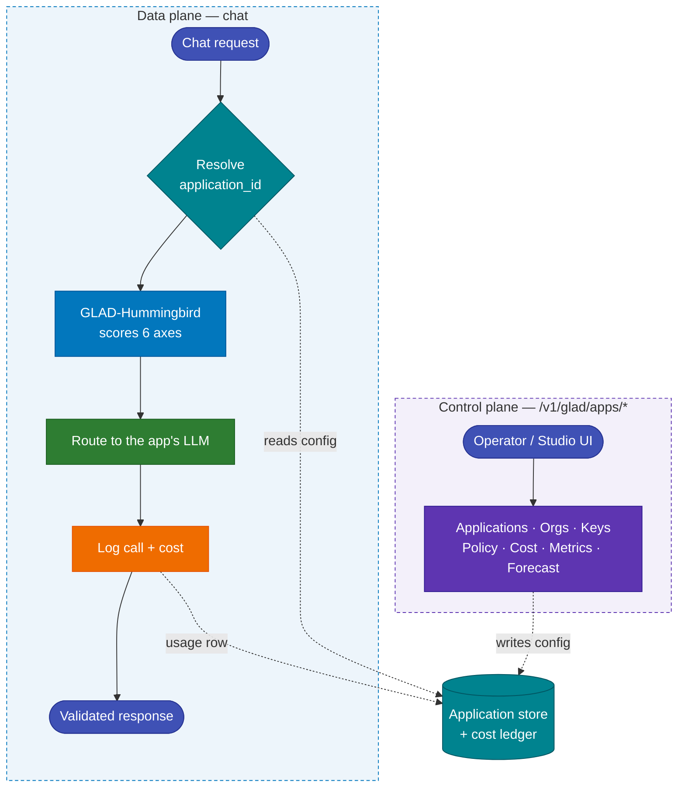

# G-1 Studio

**G-1 Studio** turns the single-upstream Geodesia gateway into an **Application-oriented platform**. Instead of one gateway wrapping one LLM, you now run many self-contained **Applications**, each with its own model, policy, thresholds, knowledge base, compliance posture, and cost center — all managed from one control plane and served from one engine.

!!! note "Backward-compatible by design"
    Everything in Studio is **additive**. An existing single-upstream deployment surfaces as the `default` Application with **zero behaviour change** — the same chat endpoint, the same detection, the same compliance ledger. You opt into multi-Application features when you need them.

---

## What is an Application?

An **Application** is **1 LLM + GLAD-Hummingbird in the middle**, owning everything that makes that LLM safe, compliant, and accountable:

🔌
<h3>Binding</h3>

The upstream LLM it routes to — <code>openai</code>, <code>ollama</code>, <code>vllm</code>, <code>sglang</code>, <code>trtllm</code>, <code>bedrock</code>, <code>vertex</code>, <code>azure-openai</code>, or <code>internal</code>.

🛡️
<h3>Policy</h3>

Per-axis thresholds and enforcement modes across the 6 detection axes, plus <code>block_input</code>, system-prompt injection, and the streaming brake.

🎯
<h3>Threshold profile</h3>

A named <code>calibration_profile</code> binding the app to its model-specific detection thresholds.

📚
<h3>RAG knowledge base</h3>

Its own isolated document collection. Cross-app reads are refused — one app can never see another's documents.

⚖️
<h3>Governance</h3>

FRIA record, applicable laws, retention window, risk classification, and human-oversight triggers — scoped to this app.

💶
<h3>Cost center</h3>

Token pricing, monthly budget, alert percentages, and an <code>alert</code>-or-<code>block</code> policy when the budget is exceeded.

The full configuration lives in a single `AppConfig` (binding · policy · cost · governance). See [Applications](applications.md) for the field-by-field reference.

---

## Organizations

Applications are grouped under **Organizations**. An organization carries the license entitlement `max_applications` — the maximum number of Applications it may create. A free-tier organization is limited to **1 Application**; higher tiers raise the limit (see [Licensing](licensing.md)).

| Concept | What it holds |
|---|---|
| **Organization** | `org_id`, name, country, `license_type`, `max_applications` |
| **Application** | `app_id`, `org_id`, status, `config_json` (the `AppConfig`), `config_version` |
| **API key** | `g1k_live_*` invoke key, sha256-hashed, scoped to one Application |

---

## Two planes, one engine

G-1 Studio cleanly separates **management** from **serving**:

- **Control plane** — `/v1/glad/apps/*`. Create and configure Applications and Organizations, mint API keys, edit policy, read cost / metrics / forecast. See [Control-Plane API](control-plane-api.md).
- **Data plane** — the chat path. Each request resolves its Application, GLAD-Hummingbird scores the 6 axes, the request is routed to that app's LLM, and the call is logged with its cost.

The control plane writes Application config; the data plane reads it on every chat request to score, route, and bill against the right Application.

---

## The 6 detection axes

GLAD-Hummingbird scores every request across **six** independent axes, grouped by **where** in the request lifecycle they run. Each axis has its own threshold and enforcement mode in the app's policy.

| Region | Axes | Runs |
|---|---|---|
| **Prompt / context** | `prompt_safety`, `jailbreak`, `rag_jailbreak` | Before the LLM is called |
| **Answer** | `halluc_context`, `halluc_closedbook`, `answer_safety` | After the answer is generated |

The `rag_jailbreak` axis is the context-injection firewall: it catches adversarial instructions smuggled in through retrieved documents or tool outputs.

!!! tip "Per-axis defaults"
    Studio ships serving-calibrated defaults (gemma4-e2b, FPR≈0.07): `prompt_safety` 0.70, `jailbreak` 0.50, `rag_jailbreak` 0.05, `halluc_context` 0.32, `halluc_closedbook` 0.58, `answer_safety` 0.90. Prompt-region axes default to `block`; answer-region axes default to `annotate`. Missing axes are always backfilled so the 6-axis contract holds downstream.

For the full behaviour of each axis, see [Detection Axes](../gateway/detection-axes.md).

---

## The App switcher

The Studio topbar carries an **App switcher** that selects the **active Application**. The active app determines which configuration the UI edits and which data the app-scoped views display.

On the **data plane**, the Application for a chat request is resolved from, in order:

1. an **explicit** `application_id` (or `app_id`) field in the request body, or the `X-Geodesia-App` request header — this **always wins**;
2. failing that, an **Application API key** sent as `Authorization: Bearer g1k_live_…` — the gateway looks up the key and routes the request to the Application it belongs to.

Only `g1k_`-prefixed bearers are looked up (other bearers, including `GW_API_TOKEN`, are ignored); a revoked, expired, or unknown key, and an unknown `application_id`, all fall back to the `default` Application — which is why an existing single-upstream deployment keeps working unchanged.

---

## Per-Application scoping

When an Application is active, the following UI areas **scope to that app** — they show only that Application's data and edit only that Application's configuration:

| Area | What scopes |
|---|---|
| **Dashboard** | Call metrics (passed / blocked / hallucinated / unsafe) filtered to the active app |
| **Human Oversight** | Pending reviews for the active app |
| **Kill Switch** | Acts on the active app |
| **FRIA** | The active app's risk record |
| **Reports** | Compliance reports for the active app |
| **Knowledge Base** | The active app's isolated RAG collection |
| **Chat** | Sends `application_id` so messages route to and bill against the active app |

The following areas are **global and not app-scoped**:

| Area | Why it is global |
|---|---|
| **Legal Frameworks** | Shows the **full catalog of all frameworks** regardless of the selected Application |
| **API Docs** | Reference material, not per-app data |
| **Documentation** | This site — not per-app data |
| **Causal / AgentFlow** | Operate on an **explicitly-selected call**, not per-app aggregates — so no misleading "scoped" banner is shown |

---

## Free tier limits

!!! warning "Free tier"
    The free tier is limited to **1 Application** and **20 chats/day**. Raising the Application limit (`max_applications`) and the daily chat allowance requires a licensed entitlement. See [Licensing](licensing.md) for the details.

---

## Where to next

| I want to… | Go to… |
|---|---|
| Configure an Application end-to-end | [Applications](applications.md) |
| Set budgets and read cost / forecast | [Cost & FinOps](cost.md) |
| Call the management endpoints | [Control-Plane API](control-plane-api.md) |
| Understand tiers and `max_applications` | [Licensing](licensing.md) |
| Bind a cloud LLM (Bedrock, Vertex, Azure) | [Cloud Upstreams](cloud-upstreams.md) |
| Understand the 6 detection axes | [Detection Axes](../gateway/detection-axes.md) |
